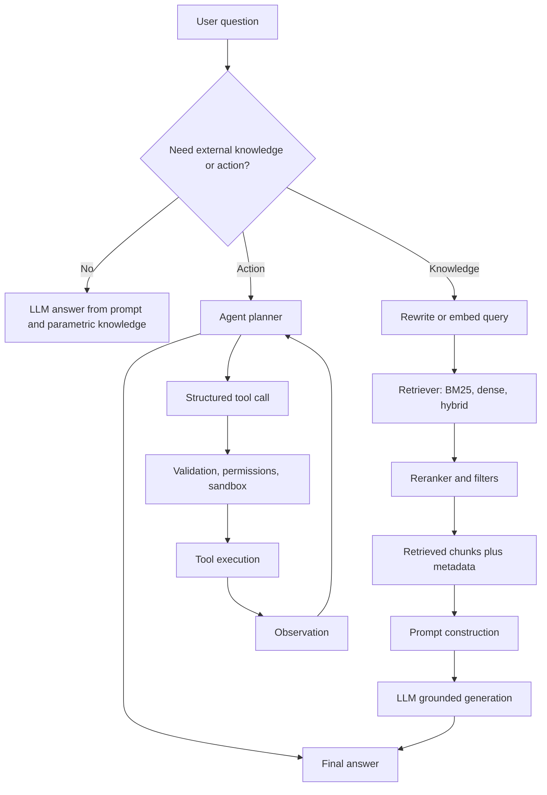

# RAG Long Context and Agents

Source: `DL_exam.pdf`, Question 45

Original question:

> RAG, длинный контекст и агенты. Как добавлять внешнее знание без переобучения, retrieval, tools, ограничения агентных схем.

## Интуиция

LLM хранит часть знаний в параметрах, но эти знания ограничены обучающими данными, могут устаревать и плохо подходят для точных ссылок на документы. Чтобы добавить внешнее знание без переобучения, модель можно не менять, а подать ей нужную информацию во входной контекст: найти релевантные документы, вставить выдержки в prompt и попросить ответить с опорой на них. Это называется `retrieval-augmented generation`, или RAG.

Длинный контекст решает похожую задачу грубее: можно положить в prompt много текста и надеяться, что модель найдет нужное место сама. Это удобно, когда весь материал уже известен и помещается в окно контекста, но дорого по latency и памяти, а качество может падать из-за нерелевантного шума и эффекта `lost in the middle`.

Tools и agentic схемы расширяют LLM еще дальше: модель может не только читать найденные фрагменты, но и вызывать поисковик, базу данных, калькулятор, интерпретатор кода или API. Агент - это обычно LLM в цикле `plan -> act -> observe -> revise`, где она выбирает действия и использует результаты. Главная идея: знания и действия выносятся наружу, а LLM становится интерфейсом рассуждения и управления. Главная опасность: ошибки retrieval, неправильные tool calls, prompt injection, накопление ошибок и отсутствие строгих гарантий.

## Что нужно сказать на экзамене

- RAG добавляет внешнее знание без изменения весов: `query -> retrieval -> context construction -> generation`.
- Веса LLM остаются фиксированными; меняется входной prompt и внешняя база знаний.
- Типичный RAG pipeline:
  - ingest документов;
  - chunking;
  - embeddings или sparse representation;
  - индексирование;
  - retrieval top-$k$;
  - reranking/filtering;
  - prompt assembly;
  - generation с опорой на найденный context.
- Retrieval бывает:
  - sparse: TF-IDF, BM25, lexical match;
  - dense: embedding search по semantic similarity;
  - hybrid: комбинация lexical и dense;
  - reranking: cross-encoder или LLM оценивает пары `query-document`.
- Условная формула RAG:
  $$p(y \mid x) \approx \sum_{d \in \mathcal{D}_k(x)} p_\eta(d \mid x)\,p_\theta(y \mid x,d),$$
  где $p_\eta$ - retriever, $p_\theta$ - generator, $\mathcal{D}_k(x)$ - top-$k$ документов.
- Длинный контекст - альтернатива или дополнение к RAG: больше информации кладется в prompt, но стоимость attention/KV-cache и риск шумового context растут.
- Tools позволяют LLM выполнять внешние операции: поиск, SQL, calculator, code execution, browser, domain APIs. Обычно tool call должен быть structured и проверяемым.
- Агентная схема - LLM plus loop plus tools plus memory/state; пример: `Thought/Plan -> Tool call -> Observation -> Answer`.
- Ограничения agentic систем:
  - ошибки и галлюцинации на каждом шаге;
  - compounding errors в длинных траекториях;
  - prompt injection через внешние документы;
  - неверный выбор tool или неверные аргументы;
  - высокая latency и cost;
  - сложность evaluation;
  - нет гарантии оптимального плана или фактической корректности;
  - нужны permissions, sandboxing, validation и human-in-the-loop для рискованных действий.

## Подробный ответ

### Зачем нужно внешнее знание

Параметрические знания LLM зашиты в веса после pretraining и fine-tuning. Это удобно для общих закономерностей языка и мира, но плохо для задач, где нужны:

- свежая информация;
- точные факты из конкретной документации;
- корпоративная база знаний;
- ссылки на источники;
- проверяемость ответа;
- работа с данными, которые не входили в training set.

Переобучать модель ради каждого обновления базы знаний дорого, медленно и рискованно: можно испортить старые способности, столкнуться с catastrophic forgetting, утечкой приватных данных или плохой контролируемостью. RAG решает это иначе: знания хранятся во внешнем хранилище, а LLM получает релевантные фрагменты во время inference.

### RAG pipeline

RAG обычно делят на offline indexing и online inference.

Offline часть:

1. Собрать документы: статьи, инструкции, tickets, страницы wiki, code snippets.
2. Разбить их на chunks. Chunk должен быть достаточно малым, чтобы помещаться в prompt, но достаточно большим, чтобы сохранять смысл.
3. Для каждого chunk сохранить metadata: источник, заголовок, дата, раздел, права доступа.
4. Посчитать representation:
   - sparse признаки для lexical search;
   - dense embedding $e_d = g_\phi(d)$ для semantic search.
5. Построить индекс: inverted index для BM25 или vector index для approximate nearest neighbor search.

Online часть:

1. Пользователь задает вопрос $x$.
2. Система формирует retrieval query. Иногда query переписывают или расширяют.
3. Retriever выбирает кандидаты $\mathcal{D}_k(x)$.
4. Reranker уточняет порядок и отбрасывает слабые фрагменты.
5. Context constructor собирает prompt: instruction, user question, retrieved chunks, metadata, правила цитирования.
6. LLM генерирует ответ $y$:
   $$y \sim p_\theta(\cdot \mid x, d_1,\dots,d_k).$$
7. Система может проверить groundedness: действительно ли утверждения ответа поддержаны найденными источниками.

Важная идея: generator не обязан "знать" факт в весах. Он должен уметь прочитать retrieved context и корректно использовать его.

### Retrieval

Retrieval - это поиск релевантных объектов по запросу. В RAG ищут не обязательно целые документы, а часто небольшие chunks.

Sparse retrieval использует совпадение слов. Классический пример - BM25. Он хорошо работает, когда важны точные термины, имена функций, артикулы, ошибки, юридические формулировки. Недостаток: плохо ловит синонимы и парафразы.

Dense retrieval переводит query и documents в embedding space:

$$q = g_\phi(x), \quad e_i = g_\phi(d_i).$$

Затем ищет ближайшие chunks по cosine similarity или dot product:

$$s(x,d_i) = \frac{q^\top e_i}{\|q\|\|e_i\|}.$$

Dense retrieval лучше ловит semantic similarity, но может пропускать точные lexical constraints и иногда возвращать правдоподобные, но нерелевантные фрагменты.

Hybrid retrieval комбинирует sparse и dense scores:

$$s_{\text{hybrid}}(x,d) = \alpha s_{\text{dense}}(x,d) + (1-\alpha)s_{\text{sparse}}(x,d).$$

После первого поиска часто применяют reranking. Bi-encoder быстро ищет кандидатов, потому что embeddings документов уже посчитаны. Cross-encoder медленнее, но точнее: он получает пару `(query, chunk)` и оценивает релевантность совместно. Поэтому практичная схема: быстро взять top-$N$, затем reranker оставить top-$k$.

### Chunking и context construction

Качество RAG сильно зависит от chunking. Слишком маленькие chunks теряют контекст: ответ может требовать определения из соседнего абзаца. Слишком большие chunks забивают окно контекста и добавляют шум. Часто используют overlap между chunks, hierarchical retrieval, metadata filtering и parent-document retrieval: ищут маленький chunk, но в prompt кладут более широкий section.

Context construction - это не простая конкатенация. Нужно учитывать:

- лимит context window;
- порядок фрагментов;
- дубли;
- права доступа;
- metadata и ссылки;
- конфликтующие источники;
- инструкцию отвечать только по найденному context, если задача требует grounded answer.

Если relevant documents не найдены, хорошая система должна уметь сказать "не найдено достаточной информации", а не заполнять пробелы hallucination.

### RAG vs fine-tuning

| Подход | Что меняется | Когда подходит | Основной риск |
|---|---|---|---|
| RAG | Внешний context и индекс | Факты, документация, свежие и частные знания | Плохой retrieval или неверное использование context |
| Fine-tuning | Веса модели | Стиль, формат, устойчивые навыки, domain behavior | Стоимость, forgetting, сложнее обновлять факты |
| Long context | Prompt содержит много материала | Разовый анализ большого документа или небольшого корпуса | Cost, latency, lost in the middle, context pollution |
| Tools | Модель вызывает внешние функции | Вычисления, поиск, базы данных, действия через API | Неверные вызовы, security, side effects |

RAG не заменяет fine-tuning полностью. Если модель не умеет следовать формату, плохо рассуждает или не знает языка домена, retrieval не всегда спасет. Но для обновляемых фактов RAG обычно естественнее, чем переобучение.

### Длинный контекст

Long-context LLM расширяет максимальную длину входа $T$. Это полезно для чтения длинных документов, анализа больших логов, code review или multi-document QA. Но увеличение контекста не означает, что модель идеально использует все токены.

Проблемы длинного контекста:

- attention и KV-cache растут с длиной последовательности;
- prefill длинного prompt увеличивает `time to first token`;
- нерелевантные фрагменты мешают модели;
- важная информация может быть проигнорирована, особенно если она находится в середине;
- модель может смешивать конфликтующие документы;
- чем больше context, тем больше поверхность для prompt injection.

Упрощенная стоимость self-attention в prefill:

$$O(T^2 d),$$

где $T$ - число токенов, $d$ - hidden dimension. В decode с KV-cache каждый новый токен attends к уже накопленному контексту, поэтому длина context влияет на memory bandwidth и latency.

Практически RAG и long context часто комбинируют: retrieval выбирает релевантные документы, а long context позволяет положить больше chunks, исходный раздел, таблицу или историю диалога.

### Tools и function calling

Tool-use означает, что LLM может запросить внешнюю операцию вместо того, чтобы отвечать только текстом. Примеры:

- поиск по web или внутренней базе;
- SQL query к базе данных;
- calculator для арифметики;
- code interpreter для вычислений и графиков;
- API заказа, календаря, CRM;
- retriever как отдельный tool.

Надежная tool-интеграция обычно требует structured output. Модель не просто пишет "я бы вызвала поиск", а возвращает, например:

```json
{
  "tool": "search_docs",
  "arguments": {
    "query": "RAG retrieval reranking",
    "top_k": 5
  }
}
```

Система валидирует JSON/schema, проверяет permissions, выполняет tool, возвращает observation в context, и модель продолжает ответ. Для опасных действий нужны confirmation, sandboxing, rate limits и audit log.

### Agents

Агентная схема - это не отдельная архитектура Transformer, а orchestration вокруг LLM. У агента есть цель, текущее состояние, доступные tools, иногда memory и цикл принятия решений.

Простой agent loop:

1. Получить user goal.
2. Сформировать plan или next action.
3. Если нужен внешний результат, вызвать tool.
4. Получить observation.
5. Обновить state.
6. Повторять до ответа, лимита шагов, ошибки или запроса подтверждения.

Популярная идея `ReAct` совмещает рассуждение и действия: модель рассуждает, выбирает действие, видит observation и корректирует следующий шаг. В production внутренние reasoning traces обычно не показывают пользователю полностью, но логика цикла остается: планирование, действие, наблюдение, проверка.

Агенты полезны, когда задача не решается одним prompt: нужно искать, сравнивать, считать, писать код, проверять результат, обращаться к нескольким API. Однако чем длиннее траектория, тем выше вероятность ошибки.

### Ограничения агентных схем

Главное ограничение - LLM не становится надежным планировщиком с формальными гарантиями. Она может выбрать неправильный tool, вызвать правильный tool с неправильными аргументами, неверно интерпретировать observation или уверенно продолжить после ошибки.

Типичные проблемы:

- `compounding errors`: маленькая ошибка на раннем шаге портит весь план;
- `hallucinated tools`: модель ссылается на несуществующую функцию или capability;
- `prompt injection`: retrieved document просит игнорировать системные инструкции или украсть данные;
- `context poisoning`: в память агента попадает неверная информация;
- `over-planning`: агент делает лишние шаги вместо прямого ответа;
- `tool overuse`: вызывает search/calculator/API там, где это не нужно;
- `latency`: каждый tool call и LLM step добавляет задержку;
- `cost`: длинные context и много шагов быстро увеличивают стоимость;
- `evaluation`: трудно оценивать не только финальный текст, но и траекторию действий;
- `side effects`: API может отправить письмо, изменить запись или провести платеж, поэтому нужны права и подтверждения.

Поэтому агентные системы строят с ограничениями: bounded number of steps, explicit tool schemas, deterministic validators, retrieval filters, permission checks, sandboxing, human approval для irreversible actions, logging и fallback behavior.

## Формулы / алгоритмы

### RAG как условная генерация с найденными документами

Пусть $x$ - вопрос, $\mathcal{C}$ - корпус, $d$ - документ или chunk, $y$ - ответ.

Retriever задает оценку релевантности:

$$p_\eta(d \mid x) \propto \exp(s_\eta(x,d)).$$

Генератор отвечает с учетом найденного context:

$$p_\theta(y \mid x, d_1,\dots,d_k).$$

Идеализированная RAG-факторизация:

$$p(y \mid x) = \sum_{d \in \mathcal{C}} p_\eta(d \mid x)\,p_\theta(y \mid x,d).$$

На практике сумму по всему корпусу заменяют top-$k$:

$$p(y \mid x) \approx \sum_{d \in \mathcal{D}_k(x)} p_\eta(d \mid x)\,p_\theta(y \mid x,d).$$

### Dense retrieval

**Objective:** найти chunks, близкие к query в embedding space.

**Inputs:** query $x$, corpus chunks $\{d_i\}_{i=1}^{N}$, embedding model $g_\phi$, top-$k$.

**Output:** список релевантных chunks $\mathcal{D}_k(x)$.

**Procedure:**

1. Offline: посчитать $e_i = g_\phi(d_i)$ для всех chunks.
2. Offline: сохранить embeddings в vector index.
3. Online: посчитать query embedding $q = g_\phi(x)$.
4. Найти кандидатов по similarity:
   $$s_i = q^\top e_i$$
   или cosine similarity.
5. Вернуть top-$N$ кандидатов.
6. Optional: применить metadata filters и reranker.
7. Передать top-$k$ chunks в prompt.

**Complexity и caveats:**

- Точный поиск по всем векторам стоит $O(Nd)$ на query.
- ANN index ускоряет поиск, но может вернуть приближенный top-$k$.
- Embedding model задает геометрию поиска; если embeddings не подходят домену, RAG будет слабым.
- Retrieval recall важен: если нужный факт не найден, generator почти не может дать grounded answer.

### Agent loop with tools

**Objective:** решить задачу пользователя с помощью LLM и внешних tools.

**Inputs:** user goal $g$, model $f_\theta$, tool schemas $\mathcal{T}$, state $S_0$, step limit $M$.

**Output:** final answer или request for human confirmation.

**Procedure:**

1. Initialize state $S \leftarrow S_0 \cup \{g\}$.
2. For $t = 1,\dots,M$:
   - model receives goal, state, tool schemas and observations;
   - model chooses either `final_answer` or structured `tool_call`;
   - validate tool name, arguments, permissions and safety constraints;
   - if validation fails, return error observation or ask user;
   - execute tool if allowed;
   - append observation to state;
   - stop if task is complete, uncertain, unsafe, or requires confirmation.
3. If step limit is reached, return best partial result or explain limitation.

**Practical caveats:**

- Нет гарантированной convergence: agent loop завершается по heuristic stop condition.
- Для irreversible actions нужно human approval.
- Внешние observations считаются untrusted input и должны быть защищены от prompt injection.
- Логи нужны для debugging и evaluation траектории.

## Диаграмма или изображение



Внешние изображения не использовались.

## Быстрая устная версия

RAG - это способ добавить LLM внешнее знание без переобучения: мы храним документы отдельно, по вопросу делаем retrieval релевантных chunks, вставляем их в context и генерируем ответ с опорой на эти источники. Retrieval может быть sparse, dense или hybrid; часто нужен reranking. Формально можно думать о генерации как о $p(y \mid x,d)$, где $d$ - найденные документы, а в идеале мы суммируем по релевантным документам.

Длинный контекст позволяет положить больше информации прямо в prompt, но это дорого по prefill, KV-cache и attention, а модель не всегда хорошо использует весь контекст. Поэтому long context часто комбинируют с RAG: retrieval отбирает важное, а большое окно дает больше места для evidence.

Tools и agents расширяют LLM действиями: модель может вызвать поиск, SQL, калькулятор, code interpreter или API. Агент - это LLM в цикле выбора действий и обработки observations. Ограничения: ошибки retrieval, hallucinations, неправильные tool calls, prompt injection, накопление ошибок, высокая latency/cost и отсутствие строгих гарантий. Для production нужны schemas, validation, permissions, sandboxing, лимиты шагов и подтверждение опасных действий.

## Возможные уточняющие вопросы

- Чем RAG отличается от fine-tuning? RAG меняет внешние документы и prompt на inference, а fine-tuning меняет веса. RAG лучше для обновляемых фактов, fine-tuning - для устойчивого поведения, стиля и навыков.
- Почему dense retrieval может быть хуже BM25? Dense retrieval ловит смысл, но может пропустить точные имена, коды ошибок или редкие термины. BM25 сильнее там, где важно lexical match.
- Зачем нужен reranker? Первый retriever оптимизирован на быстрый recall. Reranker медленнее, но точнее оценивает пары query-document и улучшает precision top-$k$.
- Что делать, если retrieval ничего не нашел? Ответить, что информации недостаточно, попробовать query reformulation или запросить уточнение. Не надо выдумывать unsupported facts.
- Почему длинный контекст не заменяет RAG полностью? Он дороже, добавляет шум, ограничен window size и не гарантирует, что модель использует нужный фрагмент.
- Что такое prompt injection в RAG? Внешний документ может содержать инструкцию для модели, например игнорировать правила или раскрыть секреты. Retrieved text надо считать untrusted input.
- Что такое tool calling? Модель выдает structured request к внешней функции, система валидирует и выполняет его, а результат возвращает модели как observation.
- Почему agents ненадежны на длинных задачах? Каждый шаг может ошибиться, а ошибки накапливаются. Также растут context, latency, cost и сложность контроля.
- Как оценивать RAG? Отдельно measuring retrieval recall/precision, reranking quality, groundedness, answer correctness, citation accuracy и latency.
- Как уменьшить hallucinations в RAG? Улучшить retrieval, использовать reranking, явно требовать answer only from context, проверять citations и применять post-generation verification.

## Частые ошибки

- Говорить, что RAG "обучает модель на документах". В базовой схеме веса не меняются; документы добавляются через retrieval и context.
- Считать, что если документ есть в базе, модель обязательно его использует. Нужен хороший retrieval, reranking и context construction.
- Путать retrieval и generation quality. Плохой ответ может быть из-за retriever, reranker, prompt или самой LLM.
- Считать long context бесплатным. Длинный prompt увеличивает prefill, память KV-cache, latency и стоимость.
- Игнорировать `lost in the middle`: информация внутри длинного context может использоваться хуже, чем начало и конец.
- Класть в prompt слишком много нерелевантных chunks. Это может ухудшить groundedness и привести к смешению фактов.
- Забывать про metadata и access control. RAG над private data должен учитывать права пользователя.
- Доверять retrieved text как системной инструкции. Внешний текст является данными, а не правилами поведения модели.
- Разрешать agent tools без validation и permissions. Особенно опасны tools с side effects.
- Оценивать агента только по финальному ответу и не смотреть траекторию tool calls, ошибки, retries, latency и cost.
