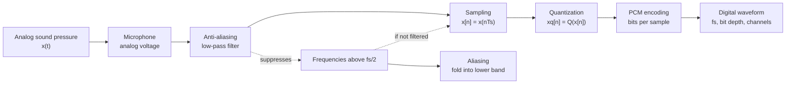

# Audio Signals Sampling and PCM

Source: `DL_exam.pdf`, Question 46

Original question:

> Звук как сигнал. Waveform, sampling, quantization, PCM, теорема Найквиста-Шеннона, aliasing.

## Интуиция

Звук в физике - это колебания давления воздуха во времени. Микрофон превращает эти колебания в аналоговый электрический сигнал, а цифровая система должна представить его конечным набором чисел. Для этого сигнал сначала измеряют через равные промежутки времени (`sampling`), затем каждое измерение округляют до одного из конечных уровней (`quantization`), после чего уровни кодируют битами. Такой простой цифровой формат называется `PCM` (`Pulse Code Modulation`).

Главная опасность при оцифровке - потерять информацию так, что ее уже нельзя восстановить. Теорема Найквиста-Шеннона говорит: если сигнал ограничен по частоте до $B$ Гц, то его можно идеально восстановить по отсчетам при частоте дискретизации $f_s > 2B$ при идеальных условиях. Если брать отсчеты слишком редко, высокие частоты маскируются под низкие - возникает `aliasing`.

## Что нужно сказать на экзамене

- `Waveform` - временная форма звукового сигнала: амплитуда как функция времени $x(t)$ или последовательность отсчетов $x[n]$.
- `Sampling` переводит непрерывное время в дискретное: $x[n] = x(nT_s)$, где $T_s = 1/f_s$.
- `Quantization` переводит непрерывную амплитуду в конечное число уровней; при $b$ битах обычно доступно $2^b$ уровней на отсчет.
- `PCM` - несжатое представление: каждый квантованный отсчет записывается двоичным кодом; типичные параметры - sample rate, bit depth, число каналов.
- Теорема Найквиста-Шеннона: band-limited сигнал с максимальной частотой $B$ можно восстановить, если $f_s > 2B$; величина $f_N = f_s/2$ называется частотой Найквиста.
- Перед sampling нужен analog low-pass `anti-aliasing filter`, который подавляет частоты выше $f_s/2$.
- `Aliasing` - наложение спектральных копий после sampling: частоты выше $f_N$ отражаются в слышимый диапазон и становятся неотличимы от других частот.
- Quantization дает ошибку округления; для равномерного квантования шаг $\Delta$, ошибка обычно ограничена $|e[n]| \le \Delta/2$, а модель шума имеет дисперсию $\Delta^2/12$ при стандартных предположениях.
- Битрейт PCM: $\text{bitrate} = f_s \cdot b \cdot C$, где $C$ - число каналов.

## Подробный ответ

### Звук и waveform

Звуковой сигнал можно рассматривать как функцию давления воздуха от времени:

$$
p(t) = p_0 + \Delta p(t),
$$

где $p_0$ - среднее атмосферное давление, а полезный сигнал - малая переменная часть $\Delta p(t)$. В аудио обычно работают не с абсолютным давлением, а с нормированной амплитудой $x(t)$.

`Waveform` показывает сигнал во временной области: по оси времени - секунды, по оси амплитуды - давление, напряжение микрофона или нормированное значение. В задачах deep learning аудио после оцифровки часто хранится как тензор формы `[channels, samples]` или `[batch, channels, samples]`.

Важные параметры waveform:

| Параметр | Смысл |
|---|---|
| Амплитуда | Насколько велико колебание; связана с громкостью, но не тождественна воспринимаемой громкости |
| Частота | Число колебаний в секунду, Гц; связана с высотой тона |
| Фаза | Сдвиг колебания во времени |
| Спектр | Какие частоты присутствуют в сигнале |
| Каналы | Mono, stereo или многоканальная запись |

### Sampling: дискретизация по времени

Аналоговый сигнал $x(t)$ имеет значение в любой момент времени. Компьютер хранит конечную последовательность, поэтому выбирают частоту дискретизации $f_s$ и период $T_s$:

$$
T_s = \frac{1}{f_s}.
$$

Отсчеты:

$$
x[n] = x(nT_s), \quad n \in \mathbb{Z}.
$$

Например, при $f_s = 16000$ Гц один отсчет берется каждые $1/16000$ секунды. Для речи часто используют 16 kHz, потому что для многих ASR-задач достаточно речевого диапазона. Для музыки распространены 44.1 kHz и 48 kHz.

Sampling не обязан портить сигнал сам по себе. Проблема появляется, если в исходном аналоговом сигнале есть частоты выше $f_s/2$: после дискретизации они становятся неотличимыми от некоторых низких частот.

### Теорема Найквиста-Шеннона

Условия важны:

- сигнал должен быть `band-limited`: его спектр равен нулю для частот выше $B$;
- sampling должен быть равномерным;
- восстановление предполагает идеальный sinc/interpolation low-pass фильтр;
- в реальных системах используют запас, потому что идеальных фильтров нет.

Теорема:

$$
f_s > 2B.
$$

Если максимальная частота сигнала $B$, то минимальная теоретическая частота дискретизации чуть больше $2B$. Частота

$$
f_N = \frac{f_s}{2}
$$

называется частотой Найквиста. Она является верхней частотой, которую можно однозначно представить при данном $f_s$.

Важно не говорить, что "частота дискретизации равна частоте Найквиста". Частота Найквиста - это половина sample rate.

### Aliasing

При sampling спектр непрерывного сигнала периодически копируется с шагом $f_s$. Если копии спектра перекрываются, высокие частоты накладываются на низкие. Это и есть `aliasing`.

Для синусоиды с частотой $f$ после дискретизации наблюдаемая alias-частота может быть записана как расстояние до ближайшего кратного $f_s$:

$$
f_{\text{alias}} = |f - k f_s|,
$$

где $k$ выбирают так, чтобы $f_{\text{alias}} \in [0, f_s/2]$.

Пример: если $f_s = 16000$ Гц, то $f_N = 8000$ Гц. Тон 9000 Гц после дискретизации может проявиться как

$$
|9000 - 16000| = 7000 \text{ Гц}.
$$

Поэтому перед АЦП ставят `anti-aliasing filter`: аналоговый low-pass фильтр, подавляющий частоты выше $f_s/2$. После того как aliasing произошел, цифровым фильтром нельзя надежно восстановить исходные частоты, потому что они уже смешались с допустимым диапазоном.

### Quantization: дискретизация по амплитуде

Sampling делает время дискретным, но значения $x[n]$ все еще могут быть вещественными. `Quantization` заменяет каждое значение ближайшим уровнем из конечного набора.

При равномерном квантовании диапазона $[x_{\min}, x_{\max}]$ с $b$ битами:

$$
L = 2^b,
$$

$$
\Delta = \frac{x_{\max} - x_{\min}}{L}.
$$

Квантованный отсчет можно записать как

$$
x_q[n] = Q(x[n]).
$$

Ошибка квантования:

$$
e[n] = x_q[n] - x[n].
$$

Если нет clipping и ошибка примерно равномерно распределена на $[-\Delta/2, \Delta/2]$, то

$$
\mathbb{E}[e] \approx 0, \quad \mathrm{Var}(e) \approx \frac{\Delta^2}{12}.
$$

Чем больше `bit depth`, тем меньше шаг $\Delta$ и тем ниже quantization noise. Для идеального равномерного PCM часто используют приближение для отношения сигнал-шум:

$$
\mathrm{SQNR}_{\mathrm{dB}} \approx 6.02b + 1.76.
$$

Например, 16-bit PCM дает примерно 96 dB теоретического динамического диапазона при стандартных предположениях.

Практические эффекты:

- слишком малый bit depth дает слышимый шум квантования;
- слишком высокий входной уровень дает `clipping`, то есть амплитуда обрезается по максимуму;
- нормализация и gain меняют масштаб сигнала, но не восстанавливают информацию, потерянную при clipping;
- floating-point audio может хранить значения удобнее для обработки, но физическая запись с АЦП все равно имеет конечную точность.

### PCM

`PCM` (`Pulse Code Modulation`) - стандартный способ несжатого цифрового представления waveform. Он хранит последовательность квантованных амплитуд. В простейшем случае каждый отсчет кодируется как integer фиксированной разрядности.

Параметры PCM:

| Параметр | Пример | Что задает |
|---|---:|---|
| Sample rate $f_s$ | 16 kHz, 44.1 kHz, 48 kHz | Сколько отсчетов в секунду |
| Bit depth $b$ | 16-bit, 24-bit | Сколько уровней амплитуды |
| Channels $C$ | 1, 2 | Mono, stereo и т.д. |
| Endianness / signedness | signed int16 little-endian | Как байты интерпретируются |
| Normalization | int16 to float in $[-1, 1]$ | Как данные подаются в модель |

Битрейт несжатого PCM:

$$
R = f_s \cdot b \cdot C.
$$

Например, stereo 44.1 kHz 16-bit:

$$
44100 \cdot 16 \cdot 2 = 1411200 \text{ bit/s} \approx 1.411 \text{ Mbit/s}.
$$

В deep learning waveform часто переводят из PCM integer в float:

$$
x_{\text{float}}[n] = \frac{x_{\text{int}}[n]}{32768}
$$

для signed 16-bit PCM с диапазоном примерно от $-32768$ до $32767$. Нужно помнить, что это изменение масштаба, а не увеличение точности.

## Формулы / алгоритмы

### Основные формулы

Sampling:

$$
T_s = \frac{1}{f_s}, \quad x[n] = x(nT_s).
$$

Условие Найквиста-Шеннона:

$$
f_s > 2B, \quad f_N = \frac{f_s}{2}.
$$

Равномерное квантование:

$$
L = 2^b, \quad \Delta = \frac{x_{\max} - x_{\min}}{L}.
$$

Ошибка квантования:

$$
e[n] = x_q[n] - x[n], \quad |e[n]| \le \frac{\Delta}{2}
$$

при отсутствии clipping и округлении к ближайшему уровню.

Дисперсия idealized quantization noise:

$$
\mathrm{Var}(e) \approx \frac{\Delta^2}{12}.
$$

Битрейт PCM:

$$
R = f_s \cdot b \cdot C.
$$

Alias-частота:

$$
f_{\text{alias}} = |f - k f_s|, \quad f_{\text{alias}} \in [0, f_s/2].
$$

### Pipeline оцифровки звука

1. Вход: аналоговый звуковой сигнал $x(t)$.
2. Применить analog `anti-aliasing low-pass filter`, чтобы подавить частоты выше $f_s/2$.
3. Выбрать sample rate $f_s$ и получить отсчеты $x[n] = x(nT_s)$.
4. Выбрать bit depth $b$ и диапазон амплитуды.
5. Квантовать каждый отсчет: $x_q[n] = Q(x[n])$.
6. Закодировать уровни битами в PCM.
7. Выход: цифровая последовательность с параметрами $f_s$, $b$, $C$.

Практическая сложность линейна по числу отсчетов: $O(N)$ для sampling/quantization и хранения PCM. Главные ограничения - полоса аналогового фильтра, шум АЦП, clipping, bit depth и объем данных.

## Диаграмма или изображение

## Быстрая устная версия

Звук - это непрерывный сигнал во времени, обычно колебания давления, которые микрофон превращает в waveform. Чтобы хранить его в компьютере, мы делаем sampling: берем отсчеты $x[n] = x(nT_s)$ с частотой $f_s$, затем quantization: округляем амплитуду до одного из $2^b$ уровней, и записываем эти уровни в PCM. Теорема Найквиста-Шеннона говорит, что band-limited сигнал с максимальной частотой $B$ можно восстановить, если $f_s > 2B$; $f_s/2$ - частота Найквиста. Если в сигнале есть частоты выше $f_s/2$, они после sampling превращаются в ложные низкие частоты, то есть возникает aliasing. Поэтому перед АЦП нужен anti-aliasing low-pass filter. Quantization добавляет шум округления, а битрейт PCM равен $f_s \cdot b \cdot C$.

## Возможные уточняющие вопросы

**Почему для человеческого слуха часто используют 44.1 kHz?**  
Человек примерно слышит до 20 kHz, а 44.1 kHz дает частоту Найквиста 22.05 kHz и небольшой запас для фильтрации.

**Чем sampling отличается от quantization?**  
Sampling дискретизирует время, quantization дискретизирует амплитуду.

**Что такое частота Найквиста?**  
Это $f_N = f_s/2$, максимальная частота, которую можно однозначно представить при sample rate $f_s$ при выполнении условий теоремы.

**Можно ли убрать aliasing после записи?**  
Полностью и надежно - нет, потому что высокие частоты уже стали неотличимы от низких. Поэтому фильтр нужен до sampling.

**Почему $f_s = 2B$ часто формулируют как минимум, но в теореме пишут $f_s > 2B$?**  
На границе возникают тонкости с идеальными условиями и частотами ровно на границе полосы. Практически используют частоту выше $2B$ и оставляют переходную полосу для фильтра.

**Что дает увеличение bit depth?**  
Уменьшает quantization noise и увеличивает динамический диапазон, но не расширяет частотную полосу. За полосу отвечает sample rate.

**Что дает увеличение sample rate?**  
Повышает верхнюю представимую частоту и облегчает фильтрацию, но не уменьшает ошибку квантования амплитуды напрямую.

**Что такое clipping?**  
Это обрезание амплитуды, когда сигнал выходит за допустимый диапазон квантования. Clipping создает нелинейные искажения и не исправляется простой нормализацией.

## Частые ошибки

- Путать sample rate и частоту Найквиста: частота Найквиста равна $f_s/2$, а не $f_s$.
- Говорить, что sampling всегда теряет информацию. При band-limited сигнале и $f_s > 2B$ идеальное восстановление теоретически возможно.
- Забывать условия теоремы Найквиста-Шеннона: band-limited сигнал, равномерный sampling, идеальная фильтрация/interpolation.
- Думать, что цифровой low-pass после sampling исправит aliasing. После наложения частот исходные компоненты уже неразделимы.
- Смешивать quantization noise и aliasing: первое связано с округлением амплитуды, второе - с недостаточной частотой дискретизации и спектральным наложением.
- Считать, что больше bit depth повышает максимальную представимую частоту. Частотная граница задается $f_s/2$.
- Игнорировать anti-aliasing filter перед АЦП.
- Называть PCM сжатием. PCM - обычно несжатое кодирование отсчетов.
- Забывать число каналов в формуле битрейта $R = f_s \cdot b \cdot C$.
- Считать float-нормализацию улучшением качества. Она меняет масштаб представления, но не возвращает потерянные биты или clipped samples.
