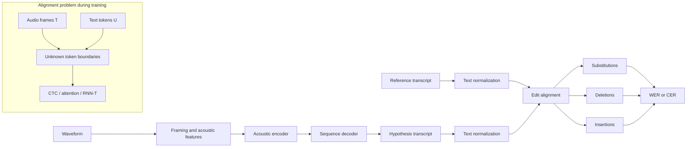

# Automatic Speech Recognition Task and Metrics

Source: `DL_exam.pdf`, Question 48

Original question:

> Automatic Speech Recognition. Постановка STT-задачи, уровни токенизации, WER/CER, alignment problem.

## Интуиция

`Automatic Speech Recognition` (`ASR`) решает задачу `speech-to-text` (`STT`): по звуковому сигналу нужно восстановить текст, который произнес человек. Сложность в том, что вход - длинная непрерывная временная последовательность аудио-фреймов, а выход - дискретная последовательность слов, символов или subword-токенов. Между ними нет заранее известного соответствия: мы обычно знаем полную расшифровку фразы, но не знаем, в какие миллисекунды был произнесен каждый символ или каждое слово.

Главная идея ASR: преобразовать аудио в признаки, закодировать временной контекст, а затем предсказать текстовую последовательность. Уровень токенизации определяет, какие единицы модель предсказывает: фонемы, символы, subword-токены или слова. Метрики `WER` и `CER` измеряют, насколько предсказанная строка отличается от эталонной, через операции редактирования: замены, удаления и вставки.

`Alignment problem` - центральная трудность ASR: длина акустической последовательности обычно на порядки больше длины текстовой, а границы токенов неизвестны. Поэтому нужны модели и loss-функции, которые умеют обучаться без точной frame-level разметки: например `CTC`, attention-based encoder-decoder или `RNN-T`.

## Что нужно сказать на экзамене

- STT-задача: по аудиосигналу $x(t)$ или последовательности акустических признаков $X=(x_1,\dots,x_T)$ предсказать текстовую последовательность $Y=(y_1,\dots,y_U)$.
- Обычно $T \gg U$: аудио содержит много фреймов, а текст - меньше токенов.
- ASR можно формулировать как поиск наиболее вероятной транскрипции:

$$
\hat{Y}=\arg\max_Y P(Y \mid X).
$$

- Типичный pipeline: waveform $\rightarrow$ фреймы $\rightarrow$ log-mel spectrogram/MFCC $\rightarrow$ acoustic encoder $\rightarrow$ decoder/language model $\rightarrow$ transcript.
- Уровни токенизации выхода:
  - `phoneme` - ближе к произношению, но нужен словарь произношений;
  - `character`/grapheme - простой открытый словарь, но длинные последовательности;
  - `subword` (`BPE`, unigram) - компромисс между символами и словами;
  - `word` - короткие последовательности, но большой словарь и проблема out-of-vocabulary.
- `WER` (`Word Error Rate`) считает edit distance на уровне слов:

$$
\operatorname{WER}=\frac{S+D+I}{N},
$$

где $S$ - substitutions, $D$ - deletions, $I$ - insertions, $N$ - число слов в reference.

- `CER` (`Character Error Rate`) - та же формула, но единицы сравнения - символы.
- `WER` лучше отражает пользовательскую ошибку в обычной диктовке; `CER` полезен для языков без явных пробелов, для коротких фраз, имен, кодов и диагностики.
- Alignment problem: во время обучения дана пара `(audio, transcript)`, но неизвестно, какой фрейм соответствует какому выходному токену.
- Основные способы обхода alignment problem: `CTC` суммирует вероятности по всем допустимым alignment; attention-decoder учится мягкому alignment; `RNN-T` моделирует совместную временную и текстовую прогрессию.
- При оценке WER/CER тоже решается alignment, но уже текстовый: через Levenshtein distance между reference и hypothesis.

## Подробный ответ

### Постановка STT-задачи

Пусть аудиозапись представлена waveform:

$$
x = (x_1,\dots,x_L),
$$

где $x_i$ - отсчеты амплитуды после дискретизации, например с частотой 16 kHz. Обычно waveform сначала переводят в последовательность акустических признаков:

$$
X=(\mathbf{x}_1,\dots,\mathbf{x}_T), \quad \mathbf{x}_t \in \mathbb{R}^d,
$$

например `log-mel features`, где один фрейм покрывает короткое окно аудио. Целевая транскрипция:

$$
Y=(y_1,\dots,y_U), \quad y_u \in \mathcal{V},
$$

где $\mathcal{V}$ - выходной словарь: символы, subword-токены, слова или фонемы.

ASR-модель оценивает условную вероятность $P_\theta(Y \mid X)$. В inference выбирается транскрипция:

$$
\hat{Y}=\arg\max_Y P_\theta(Y \mid X).
$$

В практических системах часто учитывают не только acoustic model, но и language model:

$$
\hat{Y}=\arg\max_Y \left[\log P_{\text{AM}}(Y \mid X)+\lambda \log P_{\text{LM}}(Y)+\beta |Y|\right],
$$

где $\lambda$ задает вес language model, а $\beta$ может регулировать длину или insertion penalty. Современные end-to-end ASR часто включают языковую информацию внутри decoder, но внешняя LM все еще может использоваться при beam search.

### Что делает ASR-система

Минимальный end-to-end pipeline:

1. `Preprocessing`: нормализация громкости, ресэмплинг, иногда voice activity detection.
2. `Feature extraction`: waveform превращается в фреймы, например log-mel spectrogram.
3. `Acoustic encoder`: CNN/RNN/Transformer/Conformer строит contextual representations для аудио.
4. `Sequence modeling`: CTC decoder, attention decoder или transducer предсказывает выходные токены.
5. `Decoding`: greedy decoding или beam search, иногда с language model.
6. `Postprocessing`: восстановление пробелов, пунктуации, регистра, чисел и специальных обозначений.
7. `Evaluation`: сравнение hypothesis с reference через WER/CER после согласованной нормализации текста.

Важно различать `ASR core` и postprocessing. Если reference содержит пунктуацию и регистр, а модель выдает только lowercase words без пунктуации, метрика будет штрафовать такие различия, если они не удалены нормализацией.

### Уровни токенизации

Выходная токенизация определяет словарь $\mathcal{V}$ и длину последовательности $U$.

| Уровень | Пример токенов | Плюсы | Минусы |
|---|---|---|---|
| `Phoneme` | `/k/`, `/a/`, `/t/` | ближе к акустике и произношению | нужен pronunciation lexicon; неоднозначность grapheme-to-phoneme |
| `Character` / grapheme | `к`, `о`, `т` | маленький словарь; нет OOV | длинные последовательности; слабее языковые единицы |
| `Subword` | `авто`, `мат`, `изация` | баланс длины и открытого словаря | токены не всегда совпадают с акустическими границами |
| `Word` | `автоматическое`, `распознавание` | короткие выходные последовательности; удобно для WER | огромный словарь; out-of-vocabulary; хуже для редких слов |

`Phoneme`-уровень исторически важен в hybrid ASR: акустическая модель предсказывала фонетические состояния, затем использовались pronunciation lexicon и language model. В end-to-end ASR чаще применяют characters или subwords, потому что они позволяют обучаться напрямую на парах `(audio, text)` без ручного словаря произношений.

`Character`-токены удобны для CTC: модель может предсказывать символы и специальный `blank`. Но для длинных предложений decoding становится длиннее, а языковые зависимости сложнее. `Subword`-токены уменьшают число шагов и лучше захватывают морфемы и частые куски слов, поэтому часто используются в Transformer/Conformer ASR.

`Word`-токенизация редко является лучшим end-to-end выбором для открытой диктовки: словарь слишком большой, редкие слова и имена становятся проблемой. Однако WER как метрика все равно обычно считается на уровне слов, независимо от того, какие токены предсказывала модель.

### Alignment problem

В supervised ASR обычно есть обучающая пара:

$$
(X, Y),
$$

где $X$ - последовательность аудио-фреймов длины $T$, а $Y$ - текстовая последовательность длины $U$. Проблема: нет разметки вида "фреймы $t_1,\dots,t_2$ соответствуют токену $y_u$". Это и есть `alignment problem`.

Почему это нетривиально:

- речь имеет переменный темп: один и тот же текст может занимать разное число фреймов;
- звуки растягиваются и сливаются;
- паузы, шум, дыхание и фоновые звуки не соответствуют текстовым токенам;
- текстовые единицы не всегда совпадают с акустическими границами, особенно для subword-токенов;
- $T$ обычно значительно больше $U$.

Есть два разных смысла alignment, которые важно не смешивать.

Первый - `acoustic-text alignment` при обучении: как связать аудио-фреймы с выходными токенами без frame-level labels. Его решают специальные модели:

- `CTC`: вводит `blank` и суммирует вероятности по всем монотонным alignment, которые после collapse дают целевую строку.
- `Attention encoder-decoder`: decoder на каждом шаге смотрит на разные части encoder states через attention weights; alignment получается мягким и обучаемым.
- `RNN-T`: строит вероятностную модель, где есть движение по времени аудио и по выходной текстовой последовательности; подходит для streaming ASR.
- `Forced alignment`: если модель уже обучена, можно найти наиболее вероятные границы слов/фонем в аудио; это скорее инструмент разметки и анализа.

Второй - `edit alignment` при подсчете WER/CER: нужно сопоставить reference и hypothesis, чтобы посчитать substitutions, deletions и insertions. Это решается динамическим программированием для Levenshtein distance и не требует аудио.

### WER

Пусть reference:

```text
я люблю глубокое обучение
```

а hypothesis:

```text
я люблю обучение
```

Тогда слово `глубокое` удалено: $D=1$, $S=0$, $I=0$, $N=4$, поэтому:

$$
\operatorname{WER}=\frac{0+1+0}{4}=0.25.
$$

Общая формула:

$$
\operatorname{WER}=\frac{S+D+I}{N_{\text{ref}}},
$$

где:

- $S$ (`substitutions`) - слово из reference заменено другим словом;
- $D$ (`deletions`) - слово из reference пропущено;
- $I$ (`insertions`) - в hypothesis есть лишнее слово;
- $N_{\text{ref}}$ - число слов в reference.

WER может быть больше $1$, если вставок очень много. Поэтому WER - не accuracy и не обязан лежать в диапазоне $[0,1]$, хотя на хороших системах обычно меньше $1$.

WER чувствителен к правилам нормализации. Перед сравнением часто приводят текст к lowercase, удаляют пунктуацию, нормализуют числа и пробелы. Нормализация должна быть одинаковой для reference и hypothesis и заранее определенной, иначе сравнение моделей становится некорректным.

### CER

`Character Error Rate` считается аналогично, но на уровне символов:

$$
\operatorname{CER}=\frac{S_{\text{char}}+D_{\text{char}}+I_{\text{char}}}{N_{\text{char, ref}}}.
$$

CER полезен, когда:

- язык не имеет надежного разделения на слова;
- нужно оценивать распознавание имен, артикулов, серийных номеров, команд;
- важно понять, насколько близко модель попала в написание слова;
- WER слишком грубая метрика для коротких строк.

Например, если reference `кот`, а hypothesis `код`, то на уровне слов это одна substitution и WER равен $1$, но на уровне символов одна substitution из трех и CER равен $1/3$.

### Ограничения WER/CER

WER и CER удобны и стандартны, но они не полностью отражают смысловую полезность ASR:

- все слова имеют одинаковый вес, хотя ошибка в имени лекарства важнее ошибки в частице;
- синонимичные или допустимые варианты записи могут штрафоваться;
- пунктуация, регистр и числовые форматы зависят от нормализации;
- WER не показывает, где именно модель ошибается акустически: в шуме, на редких словах, на длинном контексте или на speaker accents;
- низкий WER не гарантирует хорошую diarization, punctuation restoration или streaming latency.

Поэтому в прикладных ASR-задачах кроме WER/CER смотрят latency, real-time factor, устойчивость к шуму, качество пунктуации, speaker adaptation, domain-specific errors и human evaluation.

## Формулы / алгоритмы

### Целевая функция STT

Objective: найти наиболее вероятную текстовую последовательность по аудио.

Inputs: акустические признаки $X=(\mathbf{x}_1,\dots,\mathbf{x}_T)$, словарь $\mathcal{V}$, ASR-модель $P_\theta(Y \mid X)$.

Output: транскрипция $\hat{Y}$.

$$
\hat{Y}=\arg\max_{Y \in \mathcal{V}^*} P_\theta(Y \mid X).
$$

С language model:

$$
\hat{Y}=\arg\max_Y
\left[
\log P_{\text{AM}}(Y \mid X)
+\lambda \log P_{\text{LM}}(Y)
+\beta |Y|
\right].
$$

Практический caveat: точный поиск по всем $Y$ невозможен, поэтому используют greedy decoding, beam search или transducer decoding.

### WER/CER через edit distance

Для последовательностей reference $R=(r_1,\dots,r_N)$ и hypothesis $H=(h_1,\dots,h_M)$ строится матрица динамического программирования $D \in \mathbb{R}^{(N+1)\times(M+1)}$:

$$
D_{0,j}=j, \quad D_{i,0}=i.
$$

Переход:

$$
D_{i,j}=
\min
\begin{cases}
D_{i-1,j}+1, & \text{deletion},\\
D_{i,j-1}+1, & \text{insertion},\\
D_{i-1,j-1}+\mathbb{1}[r_i \ne h_j], & \text{match/substitution}.
\end{cases}
$$

Минимальное число edit operations равно $D_{N,M}=S+D+I$. Тогда:

$$
\operatorname{WER}=\frac{D_{N,M}}{N}
$$

для word-токенов, а для character-токенов:

$$
\operatorname{CER}=\frac{D_{N,M}}{N_{\text{char}}}.
$$

Сложность алгоритма Levenshtein distance: $O(NM)$ по времени и $O(NM)$ по памяти, либо $O(\min(N,M))$ по памяти, если нужен только score без восстановления alignment.

### Операционный pipeline оценки ASR

1. Получить hypothesis от ASR-системы.
2. Применить одинаковую text normalization к reference и hypothesis.
3. Разбить строки на слова для WER или символы для CER.
4. Найти минимальный edit alignment через dynamic programming.
5. Посчитать $S$, $D$, $I$.
6. Вычислить WER/CER.
7. Анализировать не только среднее значение, но и типы ошибок: substitutions, deletions, insertions.

## Диаграмма или изображение



Внешние изображения не использовались.

## Быстрая устная версия

ASR или STT - это задача преобразовать аудио в текст. Формально есть последовательность акустических фреймов $X$ и нужно найти транскрипцию $\hat{Y}=\arg\max_Y P(Y \mid X)$. Вход намного длиннее выхода, поэтому главная трудность - alignment problem: во время обучения известен весь текст, но неизвестно, какие фреймы соответствуют каким токенам. Это решают CTC, attention encoder-decoder или RNN-T.

Выходные токены могут быть фонемами, символами, subword-токенами или словами. Символы дают маленький словарь, но длинные последовательности; слова дают короткую последовательность, но большой словарь и OOV; subwords - практический компромисс.

Основные метрики - WER и CER. WER считается как $(S+D+I)/N$ на уровне слов, где $S$ - замены, $D$ - удаления, $I$ - вставки, $N$ - число слов в reference. CER - то же самое на уровне символов. Для подсчета ошибок между reference и hypothesis строится edit alignment через Levenshtein distance.

## Возможные уточняющие вопросы

- Чем ASR отличается от speech classification? ASR предсказывает последовательность текста переменной длины, а speech classification обычно выдает один класс или небольшой набор классов.
- Почему нельзя обучать обычную frame-wise классификацию? Потому что нет разметки токена для каждого аудио-фрейма, а длительность произнесения токенов переменна.
- Почему $T \gg U$? Аудио нарезается на короткие фреймы, например каждые 10 ms, а текст содержит гораздо меньше слов, символов или subword-токенов.
- Что такое insertion в WER? Лишнее слово в hypothesis, которого нет в reference alignment.
- Может ли WER быть больше 100%? Да, если модель добавляет много лишних слов, число insertions может сделать $(S+D+I)>N$.
- Когда CER информативнее WER? Для коротких строк, имен, кодов, языков без пробелов и анализа частичных ошибок внутри слова.
- Что важнее: токенизация модели или токенизация метрики? Это разные вещи: модель может предсказывать subwords, а оцениваться по WER на словах после detokenization.
- Почему language model помогает ASR? Она повышает вероятность лингвистически правдоподобных транскрипций и помогает выбирать между акустически похожими вариантами.
- Что такое forced alignment? По известному аудио и тексту найти временные границы слов или фонем с помощью уже обученной модели.
- Почему normalization важна для WER? Различия в регистре, пунктуации, числах и пробелах могут искусственно увеличить или уменьшить ошибку.

## Частые ошибки

- Смешивать acoustic alignment при обучении и edit alignment при подсчете WER/CER.
- Называть WER accuracy; WER - это нормированный edit distance, он может быть больше $1$.
- Забывать insertion term $I$ в формуле WER/CER.
- Делить WER на число слов в hypothesis вместо числа слов в reference.
- Считать, что output-токены модели обязаны быть словами, раз метрика называется Word Error Rate.
- Игнорировать text normalization и сравнивать системы с разными правилами обработки пунктуации, регистра и чисел.
- Утверждать, что word-level tokenization всегда лучше, потому что WER считается по словам; на практике большой словарь и OOV делают ее неудобной.
- Описывать CTC как выбор одного alignment, хотя CTC loss суммирует вероятности по всем допустимым alignment.
- Забывать, что ASR-качество зависит не только от WER/CER, но и от latency, шума, домена, акцента, пунктуации и postprocessing.
