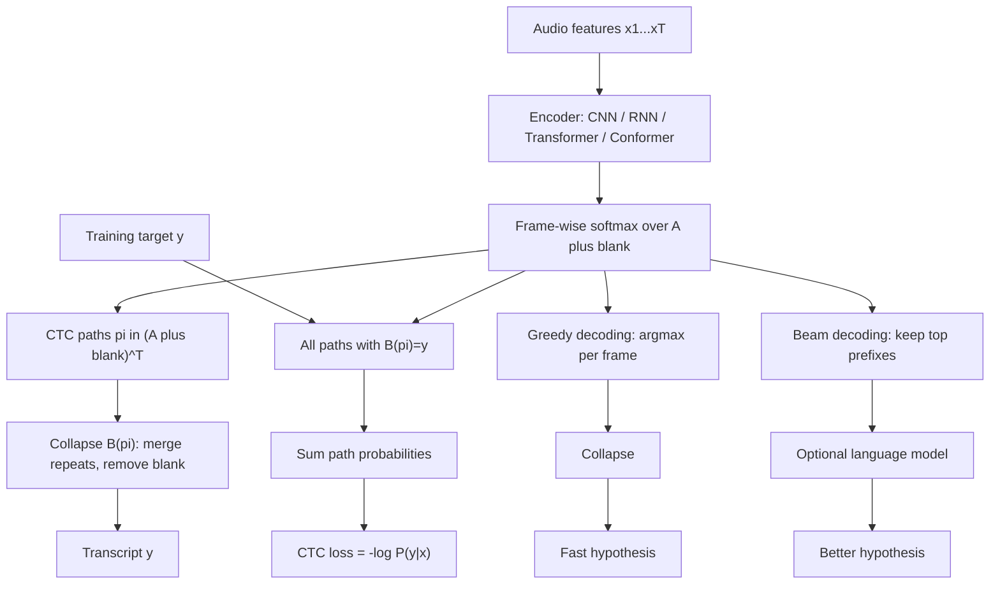

# CTC for Speech Recognition

Source: `DL_exam.pdf`, Question 49

Original question:

> CTC для распознавания речи. Blank token, collapse operation, CTC loss, greedy/beam decoding.

## Интуиция

В распознавании речи вход - длинная последовательность акустических фреймов, а выход - более короткая последовательность символов, сабслов или слов. Главная трудность: в обучающей выборке обычно есть аудио и итоговая транскрипция, но нет точного выравнивания, какой фрейм соответствует какому символу. `CTC` (`Connectionist Temporal Classification`) решает именно эту задачу: учит модель по парам "аудио - текст" без frame-level разметки.

Идея CTC: модель на каждом временном шаге предсказывает распределение по алфавиту плюс специальный `blank token`. Затем рассматриваются все возможные frame-level пути, которые после простой операции `collapse` дают нужную строку. Вероятность правильной транскрипции - это сумма вероятностей всех таких путей, а `CTC loss` максимизирует эту суммарную вероятность.

`Blank` нужен, чтобы модель могла говорить "на этом фрейме нового символа нет", растягивать символы на много фреймов и корректно различать повторяющиеся символы. Например, путь `c - a t` и путь `c c - a - t` могут соответствовать слову `cat`, если `-` обозначает blank. А чтобы получить две одинаковые буквы подряд, например `ll`, между ними обычно нужен blank: `l - l`.

## Что нужно сказать на экзамене

- `CTC` применяется для sequence labeling без известного выравнивания: ASR, handwriting recognition, OCR-like задачи.
- Вход: последовательность признаков $x = (x_1,\dots,x_T)$, например log-mel фреймы. Выход: целевая последовательность $y = (y_1,\dots,y_U)$, где $U \le T$.
- Модель выдает на каждом шаге распределение $p_t(k) = P(\pi_t = k \mid x)$ по расширенному алфавиту $\mathcal{A}' = \mathcal{A} \cup \{\varnothing\}$, где $\varnothing$ - `blank`.
- Путь $\pi = (\pi_1,\dots,\pi_T)$ - последовательность frame-level меток из $\mathcal{A}'$.
- `Collapse operation` $\mathcal{B}$: сначала схлопнуть подряд идущие одинаковые метки, затем удалить blank. Все пути с одинаковым результатом $\mathcal{B}(\pi)=y$ являются допустимыми выравниваниями для $y$.
- CTC предполагает условную независимость frame-level меток при данном входе:

$$
P(\pi \mid x) = \prod_{t=1}^{T} p_t(\pi_t).
$$

- Вероятность транскрипции суммируется по всем допустимым путям:

$$
P(y \mid x) = \sum_{\pi:\mathcal{B}(\pi)=y} P(\pi \mid x).
$$

- `CTC loss`:

$$
\mathcal{L}_{\text{CTC}}(x,y) = -\log P(y \mid x).
$$

- Сумму по экспоненциальному числу путей считают динамическим программированием `forward-backward` по расширенной целевой строке с blanks.
- `Greedy decoding`: взять $\arg\max$ по каждому фрейму, затем применить collapse. Быстро, но не гарантирует самый вероятный текст, потому что CTC суммирует вероятности многих путей.
- `Beam decoding` хранит несколько наиболее вероятных префиксов, отдельно учитывает вероятности префикса, заканчивающегося blank и non-blank; может подключать language model.
- Ограничения CTC: монотонное выравнивание, условная независимость выходов на уровне фреймов, слабое моделирование языкового контекста без LM, не подходит для сильно немонотонных seq2seq-задач.

## Подробный ответ

### Постановка задачи

Пусть аудио после feature extraction представлено последовательностью:

$$
x = (x_1, x_2, \dots, x_T),
$$

где $T$ - число акустических фреймов. Например, $x_t$ может быть вектором log-mel признаков. Нужно получить текст:

$$
y = (y_1, y_2, \dots, y_U), \quad y_u \in \mathcal{A},
$$

где $\mathcal{A}$ - алфавит выходных токенов: символы, graphemes, phonemes, BPE/subword units или слова. Обычно $U \ll T$: один символ или сабслово покрывает несколько акустических фреймов.

В обычной классификации для каждого входного шага нужна правильная метка. В ASR такой разметки обычно нет: известна только итоговая транскрипция. CTC вводит скрытое выравнивание $\pi$ и суммирует по всем выравниваниям, которые совместимы с текстом.

### Архитектура модели с CTC

Типичный ASR-пайплайн:

1. Waveform переводится в акустические признаки: spectrogram, log-mel, MFCC или признаки из front-end модели.
2. Encoder, например BiLSTM, convolutional encoder, Transformer/Conformer, строит контекстные представления $h_t$.
3. Linear layer и softmax на каждом шаге дают распределение по $\mathcal{A}'$:

$$
p_t(k) = \operatorname{softmax}(W h_t + b)_k, \quad k \in \mathcal{A}'.
$$

Здесь

$$
\mathcal{A}' = \mathcal{A} \cup \{\varnothing\},
$$

где $\varnothing$ - `blank token`. Blank не является пробелом между словами. Это специальная техническая метка "ничего не emit-ить на этом фрейме".

### Blank token

`Blank` решает три проблемы.

Во-первых, аудио длиннее текста. Если фреймов $T=500$, а символов $U=40$, большинство фреймов не должны создавать новый символ. Blank позволяет модели ставить "нет нового токена".

Во-вторых, символ может длиться несколько фреймов. Например, звук, соответствующий `a`, может занимать много временных шагов. Путь `a a a` после collapse может дать один `a`.

В-третьих, blank позволяет различать повторяющиеся символы. Без blank путь `l l` схлопнулся бы в один `l`. Чтобы получить `ll`, нужен путь вроде `l \varnothing l`.

Важно:

| Путь $\pi$ | Collapse $\mathcal{B}(\pi)$ | Комментарий |
|---|---|---|
| `c c blank a t t` | `cat` | Повторы `c` и `t` схлопываются, blank удаляется |
| `c blank a blank t` | `cat` | Blank разделяет моменты emission |
| `l l` | `l` | Подряд идущие одинаковые метки дают один символ |
| `l blank l` | `ll` | Blank разделяет одинаковые символы |
| `blank blank a blank` | `a` | Blank не входит в итоговый текст |

### Collapse operation

CTC использует отображение:

$$
\mathcal{B}: (\mathcal{A}')^T \to \mathcal{A}^{\le T}.
$$

Операция $\mathcal{B}$ обычно описывается двумя шагами:

1. Схлопнуть подряд идущие одинаковые метки.
2. Удалить все blank tokens.

Пример:

$$
\pi = (\varnothing, c, c, \varnothing, a, a, t, \varnothing)
$$

Сначала схлопываем повторы:

$$
(\varnothing, c, \varnothing, a, t, \varnothing)
$$

Удаляем blanks:

$$
\mathcal{B}(\pi) = (c,a,t).
$$

Порядок операций важен. Если сначала удалить blanks, можно неправильно обработать повторяющиеся символы. Например:

$$
\mathcal{B}(l,\varnothing,l) = ll,
$$

потому что `l` не были соседними до удаления blank.

### Вероятность пути

Модель задает распределение независимо по временным шагам при условии всего входа $x$. Это не означает, что encoder не видит контекст: $h_t$ может зависеть от всего аудио. Независимость относится к факторизации вероятности пути после encoder:

$$
P(\pi \mid x) = \prod_{t=1}^{T} P(\pi_t \mid x) = \prod_{t=1}^{T} p_t(\pi_t).
$$

Это сильное предположение. Поэтому CTC-модель сама по себе хуже учитывает зависимости между выходными токенами, чем autoregressive decoder. На практике это компенсируют мощным encoder и внешним или встроенным language model при decoding.

### Вероятность транскрипции и CTC loss

Одна и та же транскрипция $y$ может соответствовать многим путям $\pi$. Множество допустимых путей:

$$
\mathcal{B}^{-1}(y) = \{\pi \in (\mathcal{A}')^T : \mathcal{B}(\pi)=y\}.
$$

Вероятность целевой строки:

$$
P(y \mid x) = \sum_{\pi \in \mathcal{B}^{-1}(y)} P(\pi \mid x)
= \sum_{\pi \in \mathcal{B}^{-1}(y)} \prod_{t=1}^{T} p_t(\pi_t).
$$

Loss для одного примера:

$$
\mathcal{L}_{\text{CTC}}(x,y) = -\log P(y \mid x).
$$

Для batch усредняют или суммируют loss по объектам. В реализации обычно работают в log-space, чтобы избежать underflow:

$$
\log P(y \mid x) = \operatorname{logsumexp}_{\pi \in \mathcal{B}^{-1}(y)}
\sum_{t=1}^{T} \log p_t(\pi_t).
$$

Наивно суммировать по всем путям невозможно: число путей растет экспоненциально по $T$. Поэтому используют динамическое программирование.

### Forward recursion

Для target $y=(y_1,\dots,y_U)$ строят расширенную последовательность с blanks:

$$
z = (\varnothing, y_1, \varnothing, y_2, \dots, \varnothing, y_U, \varnothing).
$$

Ее длина:

$$
S = 2U + 1.
$$

Обозначим $\alpha_t(s)$ - суммарную вероятность всех путей длины $t$, которые к моменту $t$ находятся в позиции $s$ расширенной строки $z$. Индексы $s$ идут от $1$ до $S$.

Инициализация:

$$
\alpha_1(1) = p_1(\varnothing),
$$

$$
\alpha_1(2) = p_1(y_1),
$$

$$
\alpha_1(s) = 0 \quad \text{для } s > 2.
$$

Переходы:

$$
\alpha_t(s) =
p_t(z_s)
\cdot
\left(
\alpha_{t-1}(s)
+ \alpha_{t-1}(s-1)
+ \mathbf{1}_{\text{skip}(s)} \alpha_{t-1}(s-2)
\right).
$$

Здесь отсутствующие индексы считаются нулем. Переходы означают:

- остаться на той же позиции $s$;
- перейти с предыдущей позиции $s-1$;
- перескочить через blank с позиции $s-2$.

Skip разрешен только если текущий символ не blank и не совпадает с символом через одну позицию:

$$
\text{skip}(s) =
\left[
z_s \ne \varnothing
\right]
\land
\left[
z_s \ne z_{s-2}
\right].
$$

Запрет $z_s = z_{s-2}$ нужен, чтобы не слить два одинаковых символа без blank между ними. Например, для target `ll` переход с первого `l` сразу на второй `l` через blank запрещен, иначе путь мог бы быть неверно интерпретирован.

Итоговая вероятность целевой строки:

$$
P(y \mid x) = \alpha_T(S) + \alpha_T(S-1),
$$

потому что корректный путь может закончиться либо на последнем blank, либо на последнем целевом символе.

На практике forward считают в log-space:

$$
\log \alpha_t(s) =
\log p_t(z_s) +
\operatorname{logsumexp}
\left(
\log \alpha_{t-1}(s),
\log \alpha_{t-1}(s-1),
\log \alpha_{t-1}(s-2) \text{ if skip}
\right).
$$

Backward recursion строится аналогично с конца последовательности. Forward-backward позволяет получить posterior вероятности того, что на фрейме $t$ была метка $k$, и через них вычислить градиенты по logits. Современные фреймворки реализуют это автоматически, например `torch.nn.CTCLoss`.

### Почему CTC дифференцируем

Хотя decoding с collapse дискретен, loss не выбирает один лучший путь. Он суммирует вероятности всех путей, совместимых с target. Эта сумма вычисляется через differentiable операции: сложение, умножение, `logsumexp`, softmax. Поэтому параметры encoder и классификатора обучаются обычным `backpropagation`.

Интуитивно градиент увеличивает вероятности тех frame-level меток, которые часто встречаются в вероятных выравниваниях для правильной строки, и уменьшает вероятности конкурирующих меток.

### Greedy decoding

`Greedy decoding` выбирает наиболее вероятную метку независимо на каждом фрейме:

$$
\hat{\pi}_t = \arg\max_{k \in \mathcal{A}'} p_t(k).
$$

Затем применяется collapse:

$$
\hat{y}_{\text{greedy}} = \mathcal{B}(\hat{\pi}).
$$

Пример:

$$
\hat{\pi} = (\varnothing, c, c, \varnothing, a, t, t, \varnothing)
$$

После collapse:

$$
\hat{y}_{\text{greedy}} = cat.
$$

Плюсы greedy decoding:

- очень быстрый: $O(T|\mathcal{A}'|)$ для поиска argmax после получения softmax;
- не требует language model;
- часто является baseline для ASR.

Минусы:

- выбирает самый вероятный путь, а не самую вероятную строку;
- CTC score строки - сумма по многим путям, поэтому строка с менее вероятным single best path может иметь большую суммарную вероятность;
- плохо использует языковой контекст.

Пример концептуальной ошибки: если один путь к `cat` имеет вероятность $0.20$, а два пути к `cap` имеют вероятности $0.15$ и $0.14$, то суммарно `cap` вероятнее, хотя greedy может выбрать путь к `cat`.

### Beam decoding

`Beam search` приближенно ищет строки с высокой CTC-вероятностью. Вместо хранения всех путей он хранит top-$B$ префиксов, где $B$ - `beam width`.

Для CTC важно различать два состояния одного и того же префикса:

- $p_b(\ell)$ - вероятность всех путей, которые дают префикс $\ell$ и заканчиваются blank;
- $p_{nb}(\ell)$ - вероятность всех путей, которые дают префикс $\ell$ и заканчиваются non-blank.

Это различие нужно из-за повторов. Если последний символ префикса $\ell$ равен новому символу $c$, то добавление $c$ зависит от того, был ли предыдущий frame blank. Например, из `l` можно получить `ll` через blank, но путь `l l` без blank останется `l` после collapse.

Общий принцип prefix beam search:

1. Начать с пустого префикса $\epsilon$: $p_b(\epsilon)=1$, $p_{nb}(\epsilon)=0$.
2. Для каждого time step $t$ обновить вероятности префиксов по всем символам $c \in \mathcal{A}$ и blank.
3. Blank не меняет префикс, но переводит массу в $p_b$.
4. Non-blank либо расширяет префикс, либо обновляет тот же префикс при повторе последнего символа.
5. После каждого шага оставить top-$B$ префиксов по суммарному score:

$$
P(\ell) = p_b(\ell) + p_{nb}(\ell).
$$

6. В конце выбрать лучший префикс.

С language model часто используют score:

$$
\operatorname{score}(y \mid x) =
\log P_{\text{CTC}}(y \mid x)
+ \lambda \log P_{\text{LM}}(y)
+ \beta |y|,
$$

где $\lambda$ - вес LM, $\beta$ - insertion bonus или length penalty, $|y|$ - длина гипотезы в токенах или словах. Эти коэффициенты подбирают на validation set.

Beam decoding лучше greedy, но дороже:

- greedy примерно линейный по $T$ после softmax;
- beam decoding примерно $O(T \cdot B \cdot |\mathcal{A}|)$, если расширять каждый beam всеми токенами;
- с большим алфавитом применяют pruning по вероятным токенам.

### CTC и языковые единицы

CTC может работать с разными выходными единицами:

| Единица | Плюсы | Минусы |
|---|---|---|
| Characters | Малый словарь, нет OOV | Длинные последовательности, слабее языковой контекст |
| Phonemes | Ближе к произношению | Нужен лексикон или phonemizer |
| BPE/subwords | Компромисс длины и словаря | Нужна токенизация, сложнее повторы |
| Words | Короткий output | Большой словарь, OOV, много данных |

В ASR часто используют characters или subwords. Пробел между словами может быть обычным символом алфавита, например `space` или специальный word boundary token. Его нельзя путать с CTC blank.

### Практические условия и ограничения

CTC хорошо подходит, когда существует монотонное выравнивание: порядок output-токенов соответствует порядку во входе. Для речи это естественно: слово, произнесенное позже, должно распознаваться позже. Поэтому CTC не требует attention decoder.

Ограничения:

- если $U > T$, CTC не может выдать target, потому что за один time step можно emit-ить не более одного символа;
- для повторяющихся соседних символов нужно достаточно фреймов, чтобы вставить blank между ними;
- модель склонна к peaky outputs: основная масса вероятности часто концентрируется на небольшом числе фреймов, остальные становятся blank;
- без LM CTC хуже исправляет омонимы, похожие звучания и грамматически маловероятные строки;
- CTC не моделирует явно duration и pronunciation lexicon, хотя encoder может частично выучить эти зависимости.

CTC часто сравнивают с attention-based encoder-decoder и RNN Transducer:

| Метод | Выравнивание | Decoding | Особенность |
|---|---|---|---|
| CTC | Монотонное, latent | Greedy/beam, часто с LM | Простое обучение без frame labels |
| Attention seq2seq | Мягкое attention-выравнивание | Autoregressive beam | Лучше моделирует зависимости, но может нарушать монотонность |
| RNN-T | Монотонное, streaming-friendly | Beam по acoustic и prediction network | Учитывает историю output через prediction network |

## Формулы / алгоритмы

### Основные определения

Расширенный алфавит:

$$
\mathcal{A}' = \mathcal{A} \cup \{\varnothing\}.
$$

Frame-level путь:

$$
\pi = (\pi_1,\dots,\pi_T), \quad \pi_t \in \mathcal{A}'.
$$

Collapse:

$$
\mathcal{B}(\pi) = \text{remove blanks after merging consecutive repeats}.
$$

Вероятность пути:

$$
P(\pi \mid x) = \prod_{t=1}^{T} p_t(\pi_t).
$$

Вероятность target:

$$
P(y \mid x) = \sum_{\pi:\mathcal{B}(\pi)=y} \prod_{t=1}^{T} p_t(\pi_t).
$$

CTC loss:

$$
\mathcal{L}_{\text{CTC}} = -\log P(y \mid x).
$$

### Forward algorithm для CTC loss

Вход:

- матрица вероятностей $p_t(k)$ или log-probabilities размера $T \times |\mathcal{A}'|$;
- target $y=(y_1,\dots,y_U)$.

Выход:

- $\mathcal{L}_{\text{CTC}}(x,y)$.

Шаги:

1. Построить $z=(\varnothing,y_1,\varnothing,y_2,\dots,\varnothing,y_U,\varnothing)$.
2. Инициализировать $\alpha_1(1)=p_1(\varnothing)$, $\alpha_1(2)=p_1(y_1)$, остальные $\alpha_1(s)=0$.
3. Для $t=2,\dots,T$ и $s=1,\dots,S$ посчитать:

$$
\alpha_t(s) =
p_t(z_s)
\cdot
\left(
\alpha_{t-1}(s)
+ \alpha_{t-1}(s-1)
+ \mathbf{1}_{z_s \ne \varnothing \land z_s \ne z_{s-2}} \alpha_{t-1}(s-2)
\right).
$$

4. Получить:

$$
P(y \mid x) = \alpha_T(S) + \alpha_T(S-1).
$$

5. Вернуть:

$$
\mathcal{L}_{\text{CTC}} = -\log(\alpha_T(S) + \alpha_T(S-1)).
$$

Сложность после вычисления сетевых выходов:

$$
O(TU)
$$

по времени и $O(U)$ или $O(TU)$ по памяти, в зависимости от того, нужно ли хранить всю таблицу для backward. На практике для устойчивости используют log-space и `logsumexp`.

### Greedy decoding

Вход:

- вероятности $p_t(k)$ для всех фреймов;
- collapse operation $\mathcal{B}$.

Алгоритм:

1. Для каждого $t$ выбрать:

$$
\hat{\pi}_t = \arg\max_k p_t(k).
$$

2. Сформировать путь $\hat{\pi}=(\hat{\pi}_1,\dots,\hat{\pi}_T)$.
3. Вернуть:

$$
\hat{y} = \mathcal{B}(\hat{\pi}).
$$

Это оптимизирует лучший individual path:

$$
\hat{\pi} = \arg\max_\pi P(\pi \mid x),
$$

но не обязательно:

$$
\hat{y} = \arg\max_y P(y \mid x).
$$

### Prefix beam search

Вход:

- вероятности $p_t(k)$;
- beam width $B$;
- опционально language model $P_{\text{LM}}$.

Выход:

- top hypotheses $\hat{y}$.

Схема:

```text
beam = {epsilon: (p_blank=1, p_nonblank=0)}

for t in 1..T:
    new_beam = empty
    for prefix in beam:
        update same prefix with blank probability p_t(blank)
        for each token c in alphabet:
            if c == last(prefix):
                update prefix using nonblank continuation
                update prefix+c mainly from blank-ending paths
            else:
                update prefix+c from blank and nonblank paths
    beam = top_B prefixes by p_blank(prefix) + p_nonblank(prefix)

return best prefix
```

Практические caveats:

- вероятности считают в log-space;
- при большом словаре расширяют только top-k токенов на каждом фрейме;
- LM score и length penalty нужно настраивать на validation set;
- beam search является приближением, а не точным перебором всех строк.

## Диаграмма или изображение



## Быстрая устная версия

CTC - это loss для sequence labeling, когда у нас есть входная последовательность, например акустические фреймы, и целевая строка, но нет точного выравнивания фреймов с символами. Модель на каждом фрейме предсказывает распределение по алфавиту плюс специальный blank token. Путь - это последовательность таких frame-level меток. Collapse operation сначала схлопывает подряд идущие одинаковые метки, потом удаляет blanks. Например, `blank c c blank a t t` превращается в `cat`, а `l blank l` превращается в `ll`.

Вероятность target в CTC - это сумма вероятностей всех путей, которые после collapse дают эту target-строку:

$$
P(y \mid x)=\sum_{\pi:\mathcal{B}(\pi)=y}\prod_t p_t(\pi_t).
$$

Loss равен $-\log P(y \mid x)$. Сумму по путям считают не перебором, а forward-backward динамическим программированием по расширенной строке `blank y1 blank y2 ... blank`. Greedy decoding берет argmax на каждом фрейме и потом применяет collapse; это быстро, но не всегда дает самую вероятную строку. Beam decoding хранит несколько лучших префиксов, отдельно учитывает окончания blank и non-blank, и может добавлять language model.

## Возможные уточняющие вопросы

**Зачем нужен blank?** Чтобы обозначать фреймы без нового символа, растягивать символы на несколько фреймов и разделять одинаковые символы подряд, например `l blank l` для `ll`.

**Blank - это пробел между словами?** Нет. Blank - техническая метка CTC. Пробел в тексте, если он нужен, является обычным символом или токеном алфавита.

**Почему нельзя просто обучать cross-entropy по фреймам?** Потому что нет истинной frame-level разметки. CTC маргинализует неизвестное выравнивание.

**Почему greedy decoding не оптимален?** Greedy выбирает самый вероятный путь, а CTC выбирает строку по сумме вероятностей всех путей. Самая вероятная строка может иметь много умеренно вероятных путей.

**Что делает forward-backward?** Он эффективно суммирует вероятности всех допустимых выравниваний target с входом, используя динамическое программирование по расширенной target-последовательности с blanks.

**Когда CTC применим?** Когда output монотонно соответствует input: речь, handwriting recognition, OCR-подобные задачи. Для немонотонного перевода CTC в базовом виде не подходит.

**Какая сложность CTC loss?** После получения вероятностей от модели динамическое программирование имеет сложность $O(TU)$, где $T$ - длина входа, $U$ - длина target.

**Почему при повторяющихся символах нужен blank?** Collapse схлопывает соседние одинаковые метки. Поэтому `l l` даст `l`, а `l blank l` даст `ll`.

**Можно ли использовать CTC для streaming ASR?** Да, CTC хорошо совместим с online/streaming encoder, если encoder не требует будущего контекста или использует ограниченный right context. Но bidirectional encoder делает систему нестриминговой.

**Чем CTC отличается от attention decoder?** CTC использует монотонные latent alignments и frame-wise distributions, а attention seq2seq авторегрессионно генерирует выход и учит soft alignment, часто лучше моделируя языковые зависимости.

## Частые ошибки

- Путать blank token с пробелом между словами. Blank удаляется collapse-операцией и не является частью текста.
- Говорить, что CTC выбирает одно лучшее выравнивание. На обучении CTC суммирует вероятности всех допустимых выравниваний.
- Забывать, что collapse сначала схлопывает повторы, а потом удаляет blanks; это важно для повторяющихся символов.
- Считать greedy decoding оптимальным для $P(y \mid x)$. Он оптимален только как локальный argmax по фреймам и часто приближает лучший путь.
- Не упоминать условную независимость frame-level меток при данном входе. Это ключевое ограничение CTC.
- Применять CTC к задачам с немонотонным соответствием input-output без дополнительных модификаций.
- Игнорировать численную устойчивость: произведения многих вероятностей нужно считать в log-space через `logsumexp`.
- Не учитывать, что $U$ не должен превышать доступное число временных шагов, особенно при downsampling encoder.
- Думать, что CTC сам по себе является language model. Для языковых зависимостей часто добавляют external LM или используют другой decoder.
- Забывать различать $p_b$ и $p_{nb}$ в prefix beam search; без этого неправильно обрабатываются повторы символов.
