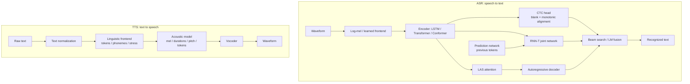

# ASR and TTS Architectures

Source: `DL_exam.pdf`, Question 50

Original question:

> Архитектуры ASR и TTS. RNN-T/LAS как альтернативы CTC; TTS pipeline: text normalization, acoustic model, vocoder.

## Интуиция

`ASR` решает задачу "звук $\rightarrow$ текст": по последовательности акустических признаков нужно восстановить последовательность символов, subword-токенов или слов. Главная сложность в том, что вход и выход имеют разную длину, а точное соответствие между кадрами аудио и токенами текста обычно неизвестно. Поэтому архитектуры ASR отличаются прежде всего тем, как они моделируют alignment: `CTC` суммирует монотонные выравнивания с blank, `RNN-T` делает монотонное потоковое выравнивание с зависимостью от уже выданного текста, а `LAS` использует encoder-decoder attention и явно декодирует текст авторегрессионно.

`TTS` решает обратную задачу "текст $\rightarrow$ звук". Ее удобно думать как pipeline: сначала текст приводят к произносимой форме (`text normalization`, токены, фонемы, ударения), затем `acoustic model` предсказывает акустическое представление речи, чаще всего mel-spectrogram или дискретные acoustic tokens, а `vocoder` превращает это представление в waveform. В ASR модель ищет текст, который лучше всего объясняет аудио; в TTS модель строит акустическую траекторию и затем синтезирует сигнал.

## Что нужно сказать на экзамене

- ASR pipeline: waveform $\rightarrow$ признаки или learned front-end $\rightarrow$ encoder $\rightarrow$ loss/decoder $\rightarrow$ текст.
- Типичные признаки: log-mel spectrogram, MFCC реже в современных end-to-end системах; современные encoder-блоки: BiLSTM, Transformer, Conformer.
- `CTC`: предполагает conditional independence выходов по кадрам при фиксированном encoder; вводит blank и свертку повторов; хорошо подходит для простого end-to-end ASR и потоковых/почти потоковых систем, но слабее моделирует языковую зависимость.
- `RNN-T`: состоит из acoustic encoder, prediction network и joint network; моделирует $P(y_u \mid x_{\le t}, y_{<u})$, поддерживает streaming и учитывает историю предсказанных токенов.
- `LAS` (`Listen, Attend and Spell`): encoder слушает аудио, attention выбирает релевантные encoder states, decoder авторегрессионно генерирует символы/subwords; обычно offline, потому что attention может смотреть на весь вход.
- Отличия: `CTC` и `RNN-T` обычно монотонны по времени; `LAS` гибче, но менее естественен для streaming; `RNN-T` дороже CTC, но лучше совмещает acoustic и language modeling.
- TTS pipeline: `text normalization` $\rightarrow$ linguistic frontend $\rightarrow$ acoustic model $\rightarrow$ vocoder $\rightarrow$ waveform.
- `Text normalization`: числа, даты, аббревиатуры, символы и неоднозначные записи переводятся в произносимый текст.
- `Acoustic model`: предсказывает mel-spectrogram, duration/pitch/energy или acoustic tokens; примеры семейств: Tacotron-like autoregressive attention, FastSpeech-like non-autoregressive duration-based, VITS/flow/diffusion-based.
- `Vocoder`: генерирует waveform из mel/acoustic tokens; примеры принципов: autoregressive WaveNet, GAN-vocoder, diffusion-vocoder, neural codec decoder.
- Метрики и риски: ASR оценивают через WER/CER; TTS через MOS, intelligibility, naturalness, speaker similarity; важны latency, robustness, pronunciation, prosody и hallucinations/omissions.

## Подробный ответ

### ASR: общая архитектура

В автоматическом распознавании речи входом является аудиосигнал $x$, обычно представленный как последовательность кадров:

$$
X = (x_1, x_2, \dots, x_T),
$$

а выходом является текстовая последовательность:

$$
Y = (y_1, y_2, \dots, y_U), \quad U \ll T.
$$

Классический end-to-end ASR строится из нескольких частей:

1. `Frontend`: waveform преобразуется в log-mel spectrogram или признаки извлекаются learned-модулем. Часто применяют нормализацию, voice activity detection, SpecAugment.
2. `Encoder`: сжимает акустическую последовательность и извлекает контекст. Используются LSTM/BLSTM, Transformer, Conformer; Conformer сочетает self-attention для глобального контекста и convolution для локальных акустических паттернов.
3. `Output model`: CTC, RNN-T, attention decoder или их комбинации.
4. `Decoder/search`: greedy decoding, beam search, shallow fusion с language model, rescoring.

Главная проблема ASR: неизвестно, какой токен текста соответствует какому фрагменту аудио. Слова и фонемы имеют разную длительность, паузы нерегулярны, а частота кадров обычно намного выше частоты текстовых токенов. Поэтому loss должен либо суммировать возможные выравнивания, либо учить attention, либо использовать внешнюю разметку forced alignment.

### CTC как базовая точка сравнения

`Connectionist Temporal Classification` решает alignment через расширенный алфавит $\mathcal{V} \cup \{\varnothing\}$, где $\varnothing$ -- blank. Модель на каждом кадре выдает распределение по токенам и blank. Путь $\pi = (\pi_1, \dots, \pi_T)$ после удаления blank и схлопывания повторов отображается функцией $B(\pi)$ в итоговую строку.

Вероятность целевой строки:

$$
P_{\text{CTC}}(Y \mid X) =
\sum_{\pi: B(\pi)=Y} \prod_{t=1}^{T} P(\pi_t \mid h_t),
$$

где $h_t$ -- encoder state. CTC эффективен, потому что сумма по alignment считается dynamic programming. Но CTC имеет важное допущение: выходы по кадрам условно независимы при заданном encoder. То есть зависимость между символами и словами в основном должна быть закодирована encoder-ом или внешней language model.

Плюсы CTC: простота, устойчивость, понятное монотонное выравнивание, быстрый inference. Минусы: слабое внутреннее language modeling, проблемы с длинными зависимостями и иногда с повторяющимися токенами; для хорошего качества часто нужен beam search с LM.

### RNN-T как альтернатива CTC

`RNN Transducer` сохраняет идею монотонного выравнивания, но добавляет зависимость от уже предсказанных токенов. Архитектура состоит из трех частей:

- `Encoder` или `transcription network`: обрабатывает акустический вход и выдает $h_t$.
- `Prediction network`: получает предыдущие выходные токены $y_{<u}$ и выдает состояние $g_u$, похожее на внутреннюю language model.
- `Joint network`: объединяет $h_t$ и $g_u$ и выдает распределение по следующему символу или blank.

В RNN-T вероятности определены на двумерной решетке $(t, u)$: индекс $t$ показывает позицию во входных кадрах, индекс $u$ -- сколько выходных токенов уже сгенерировано. Blank продвигает модель по времени $t \rightarrow t+1$, а обычный токен продвигает выход $u \rightarrow u+1$ без обязательного продвижения по времени.

Вероятность:

$$
P_{\text{RNN-T}}(Y \mid X) =
\sum_{a \in \mathcal{A}(X,Y)}
\prod_{(t,u) \in a} P(k_{t,u} \mid h_t, g_u),
$$

где $\mathcal{A}(X,Y)$ -- множество допустимых монотонных alignment-путей, а $k_{t,u}$ -- blank или очередной выходной токен. Сумма также считается dynamic programming.

RNN-T полезен для streaming ASR: encoder может быть causal или chunked, а decoder генерирует токены по мере поступления аудио. По сравнению с CTC RNN-T лучше моделирует зависимости между выходными токенами, потому что prediction network видит историю распознавания. Цена -- более сложное обучение, более дорогой beam search и риск задержки из-за ожидания акустического контекста.

### LAS как альтернатива CTC

`Listen, Attend and Spell` -- encoder-decoder architecture with attention для ASR:

- `Listen`: encoder преобразует последовательность акустических кадров в скрытые состояния $H=(h_1,\dots,h_T)$, часто с subsampling.
- `Attend`: attention на каждом шаге декодирования строит контекст $c_u$ как взвешенную сумму encoder states.
- `Spell`: autoregressive decoder генерирует следующий токен по предыдущим токенам и контексту.

Факторизация:

$$
P_{\text{LAS}}(Y \mid X) =
\prod_{u=1}^{U} P(y_u \mid y_{<u}, c_u),
$$

где

$$
c_u = \sum_{t=1}^{T} \alpha_{u,t} h_t,
\quad
\alpha_{u,t} = \operatorname{softmax}(e_{u,t}).
$$

LAS не требует CTC blank и напрямую учит soft alignment через attention. Он хорошо моделирует языковые зависимости, потому что decoder авторегрессионный. Однако классический LAS обычно offline: attention может смотреть на весь вход, поэтому latency хуже для потокового распознавания. Кроме того, attention может давать ошибки пропуска или повторения фрагментов, если alignment неустойчив. На практике используют monotonic attention, chunkwise attention или гибридные CTC/attention losses.

### Сравнение CTC, RNN-T и LAS

| Свойство | CTC | RNN-T | LAS |
|---|---|---|---|
| Alignment | Монотонный, через blank | Монотонный, решетка $(t,u)$ | Soft attention |
| История выходов | Слабо, через encoder/LM | Да, prediction network | Да, autoregressive decoder |
| Streaming | Хорошо | Очень хорошо | Обычно хуже, нужны ограничения |
| Сложность | Ниже | Выше | Средняя/выше, зависит от attention |
| Типичная ошибка | Слабая LM-зависимость | Latency, search complexity | Пропуски/повторы attention |
| Когда выбирать | Простая и быстрая ASR | Production streaming ASR | Offline ASR, seq2seq постановка |

Современные ASR-системы часто комбинируют подходы: encoder обучают с CTC auxiliary loss для стабилизации alignment, а decoding выполняют через attention decoder или transducer. Это не меняет экзаменационную суть: CTC, RNN-T и LAS -- разные способы справиться с неизвестным соответствием между аудио и текстом.

### TTS: общий pipeline

В `Text-to-Speech` входом является текст $S$, а выходом -- waveform $w = (w_1,\dots,w_N)$. Полный pipeline обычно делится на frontend, acoustic model и vocoder.

`Text normalization` переводит письменный текст в произносимую форму. Например, "12.05.2026", "Dr.", "100 кг", "$3.50" должны быть раскрыты как слова с учетом языка и контекста. Это критично: acoustic model не должна сама угадывать, как читать даты, числа, валюты, сокращения и неоднозначные символы.

После normalization лингвистический frontend может выполнять:

- sentence splitting и tokenization;
- grapheme-to-phoneme conversion (`G2P`);
- постановку ударений;
- обработку punctuation и пауз;
- speaker/style/language conditioning;
- построение prosody features, если они задаются явно.

`Acoustic model` преобразует нормализованный текст, graphemes или phonemes в акустическое представление. В классических neural TTS это mel-spectrogram:

$$
\hat{M} = f_\theta(\text{text or phonemes}, \text{speaker/style controls}),
$$

где $\hat{M}$ -- предсказанный mel-spectrogram. В FastSpeech-like моделях дополнительно предсказываются duration, pitch и energy:

$$
(\hat{d}, \hat{p}, \hat{e}, \hat{M}) =
f_\theta(\text{phonemes}).
$$

Duration model особенно важна для non-autoregressive TTS: она растягивает последовательность фонем до длины акустических кадров. В autoregressive Tacotron-like моделях alignment между текстом и mel-кадрами учится через attention, но это может давать пропуски, повторы и нестабильность на длинных предложениях.

`Vocoder` превращает акустическое представление в waveform:

$$
\hat{w} = v_\phi(\hat{M})
$$

или моделирует распределение:

$$
P(w \mid \hat{M}) = \prod_{n=1}^{N} P(w_n \mid w_{<n}, \hat{M})
$$

для autoregressive vocoder. Современные vocoder-ы часто используют GAN, diffusion или neural codec decoder, потому что напрямую генерировать waveform сложно: нужна высокая частота дискретизации, фазовая согласованность, отсутствие шумов и естественная тембральная структура.

### Практические trade-offs в TTS

Autoregressive acoustic models обычно дают хорошую естественность, но медленнее и менее устойчивы на длинном тексте. Non-autoregressive модели быстрее и стабильнее по latency, но требуют хорошего duration/prosody modeling. End-to-end TTS может объединять acoustic model и vocoder, но pipeline остается полезным концептуально: frontend отвечает за произношение, acoustic model -- за акустические признаки и просодию, vocoder -- за качество waveform.

Качество TTS оценивается не только по reconstruction loss. Важны:

- `intelligibility`: можно ли понять текст;
- `naturalness`: звучит ли речь естественно;
- `speaker similarity`: похож ли голос на целевого диктора;
- `prosody`: правильны ли паузы, интонация, ударения;
- `latency`: можно ли использовать систему в реальном времени.

## Формулы / алгоритмы

### ASR decoding objective

Цель ASR -- найти наиболее вероятную текстовую последовательность:

$$
\hat{Y} = \arg\max_Y P(Y \mid X).
$$

При использовании внешней language model часто применяют log-linear decoding:

$$
\hat{Y} =
\arg\max_Y
\left[
\log P_{\text{ASR}}(Y \mid X)
+ \lambda \log P_{\text{LM}}(Y)
+ \beta |Y|
\right],
$$

где $\lambda$ -- вес language model, $\beta$ -- insertion penalty или length reward.

### CTC algorithm

Вход: acoustic features $X$, target tokens $Y$.

Выход: loss $-\log P_{\text{CTC}}(Y \mid X)$.

1. Encoder строит $H=(h_1,\dots,h_T)$.
2. Для каждого кадра считается распределение по $\mathcal{V} \cup \{\varnothing\}$.
3. Target $Y$ расширяется blank-состояниями.
4. Forward-backward dynamic programming суммирует вероятности всех путей, которые схлопываются в $Y$.
5. Модель обучается через backpropagation по negative log-likelihood.

Практическая caveat: CTC требует, чтобы $T$ после subsampling был достаточно длинным для целевой последовательности; слишком сильное сжатие времени ломает alignment.

### RNN-T algorithm

Вход: acoustic features $X$, target tokens $Y$.

Выход: loss $-\log P_{\text{RNN-T}}(Y \mid X)$.

1. Encoder вычисляет acoustic states $h_t$.
2. Prediction network вычисляет states $g_u$ по префиксам $y_{<u}$.
3. Joint network выдает $P(k \mid h_t, g_u)$ для blank или следующего токена.
4. Dynamic programming по решетке $(t,u)$ суммирует все монотонные пути.
5. На inference используется greedy или beam search; blank продвигает время, non-blank добавляет токен.

Сложность обучения примерно связана с размером решетки $T \times U$, поэтому RNN-T дороже CTC.

### LAS algorithm

Вход: acoustic features $X$, target tokens $Y$.

Выход: autoregressive cross-entropy loss.

1. Encoder получает $X$ и строит $H$.
2. На шаге $u$ decoder использует $y_{<u}$.
3. Attention считает веса $\alpha_{u,t}$ по encoder states.
4. Context $c_u$ передается decoder-у.
5. Модель оптимизирует:

$$
\mathcal{L}_{\text{LAS}} =
- \sum_{u=1}^{U} \log P(y_u \mid y_{<u}, c_u).
$$

Практическая caveat: teacher forcing при обучении и autoregressive decoding на inference могут давать exposure bias.

### TTS pipeline

Вход: raw text $S$.

Выход: waveform $\hat{w}$.

1. `Text normalization`: $S \rightarrow S_{\text{spoken}}$.
2. `Linguistic frontend`: $S_{\text{spoken}} \rightarrow$ graphemes/phonemes, punctuation, stress, pauses.
3. `Acoustic model`: text/phonemes $\rightarrow \hat{M}$, где $\hat{M}$ -- mel-spectrogram или acoustic tokens.
4. `Vocoder`: $\hat{M} \rightarrow \hat{w}$.
5. Optional postprocessing: loudness normalization, denoising, streaming chunk assembly.

Типичный acoustic loss для mel-based TTS:

$$
\mathcal{L}_{\text{mel}} =
\|M - \hat{M}\|_1
+ \gamma \|M - \hat{M}\|_2^2,
$$

а для duration-based моделей добавляют:

$$
\mathcal{L} =
\mathcal{L}_{\text{mel}}
+ \alpha \mathcal{L}_{\text{duration}}
+ \eta \mathcal{L}_{\text{pitch}}
+ \rho \mathcal{L}_{\text{energy}}.
$$

## Диаграмма или изображение

Внешние изображения не использовались.

## Быстрая устная версия

ASR переводит аудио в текст и главная проблема там -- неизвестное выравнивание между кадрами аудио и токенами. CTC решает это через blank и суммирование монотонных alignment-путей, но почти не моделирует зависимость между выходными токенами. RNN-T тоже суммирует монотонные пути, но добавляет prediction network, которая видит предыдущие токены, поэтому хорошо подходит для streaming ASR. LAS -- это encoder-decoder attention: encoder слушает аудио, attention выбирает релевантные кадры, decoder авторегрессионно пишет текст; качество хорошее, но streaming сложнее и возможны ошибки attention.

TTS делает обратное: raw text сначала нормализуют, раскрывая числа, даты и сокращения, затем frontend строит токены или фонемы, acoustic model предсказывает mel-spectrogram, durations, pitch или acoustic tokens, а vocoder генерирует waveform. В TTS важно разделять произношение, акустическую модель и синтез сигнала, потому что ошибки на каждом этапе разные: неправильная нормализация ломает смысл, acoustic model ломает просодию, vocoder ломает качество звука.

## Возможные уточняющие вопросы

- Чем RNN-T отличается от CTC?
  - CTC предсказывает распределение по кадрам и предполагает условную независимость выходов, а RNN-T добавляет prediction network по предыдущим токенам и joint network на решетке $(t,u)$.

- Почему RNN-T удобен для streaming?
  - Он использует монотонное продвижение по времени и может работать с causal/chunked encoder: blank означает ожидание следующего акустического фрагмента, token означает выдачу символа.

- Почему LAS хуже подходит для streaming?
  - Классический attention смотрит на всю encoder-последовательность, то есть требует доступ к полному или большому контексту аудио. Для streaming нужны monotonic или chunkwise variants.

- Что такое blank в CTC и RNN-T?
  - Специальный символ "ничего не выводить". В CTC он помогает отделять повторы и паузы; в RNN-T blank обычно продвигает модель по временной оси.

- Зачем TTS нужен text normalization?
  - Письменная форма не равна произнесенной: числа, даты, валюты, сокращения и символы нужно раскрыть в слова до акустического синтеза.

- Чем acoustic model отличается от vocoder?
  - Acoustic model предсказывает промежуточное представление речи, например mel-spectrogram и просодические признаки; vocoder преобразует это представление в waveform.

- Что такое duration model в TTS?
  - Модуль, который предсказывает длительность фонем или токенов в акустических кадрах; он нужен non-autoregressive TTS для выравнивания текста и mel-spectrogram.

- Как оценивают ASR и TTS?
  - ASR обычно оценивают WER/CER. TTS оценивают MOS, intelligibility, naturalness, speaker similarity и latency; объективные losses не всегда хорошо совпадают с восприятием.

## Частые ошибки

- Говорить, что CTC "не имеет alignment". Alignment есть, но он латентный и суммируется по всем допустимым путям.
- Забывать про blank и схлопывание повторов в CTC.
- Считать RNN-T просто CTC с RNN. Существенное отличие -- prediction network и зависимость от предыдущих output tokens.
- Путать LAS attention с CTC: LAS не использует blank и не требует CTC-style collapse.
- Не упоминать streaming trade-off: CTC/RNN-T естественнее для онлайн-распознавания, LAS обычно offline без специальных ограничений.
- Смешивать acoustic model и vocoder в TTS. Acoustic model не генерирует финальный waveform в обычном pipeline; vocoder отвечает за сигнал.
- Пропускать text normalization. Без нее модель может неправильно читать числа, даты, единицы измерения и аббревиатуры.
- Думать, что хороший mel loss гарантирует хорошую речь. Perceptual quality зависит от vocoder-а, prosody, pronunciation и данных.
- Описывать TTS как "просто обратный ASR". Задачи связаны, но TTS должен генерировать натуральную просодию и waveform, а не только восстановить дискретный текст.
- Не различать grapheme-based и phoneme-based TTS: фонемы часто улучшают произношение, но требуют G2P и языковых правил.
