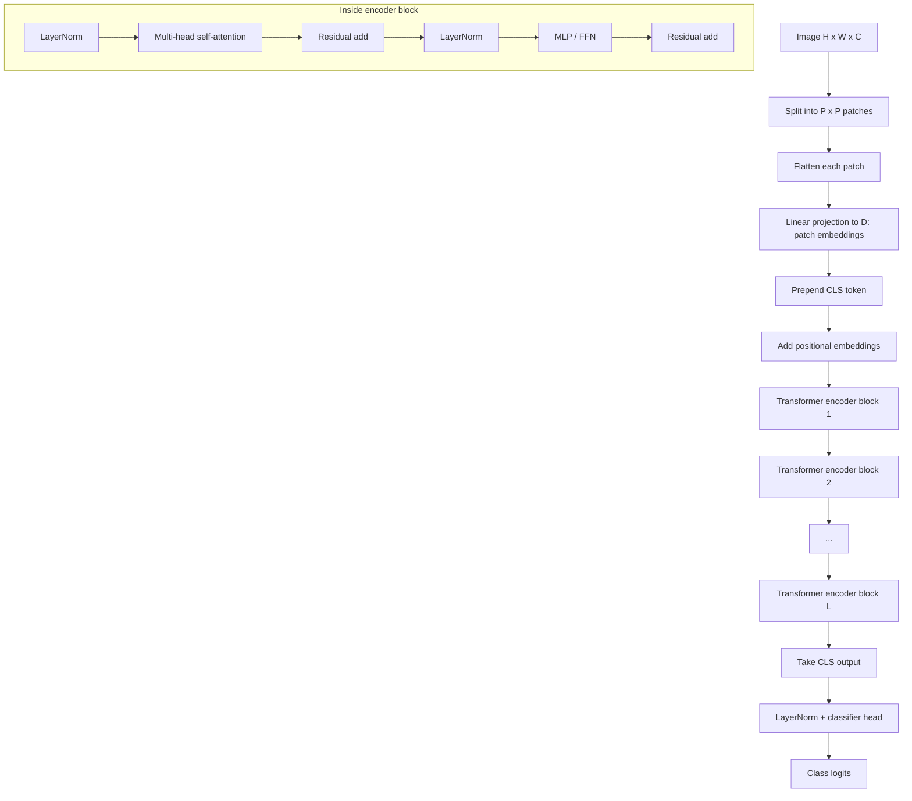

# Vision Transformer ViT

Source: `DL_exam.pdf`, Question 51

Original question:

> Vision Transformer. Patch embedding, positional encoding, self-attention для изображений, сравнение ViT и CNN.

## Интуиция

`Vision Transformer` переносит идею Transformer encoder на изображения. Картинку не обрабатывают скользящими свертками, а разбивают на фиксированные патчи, превращают каждый патч в вектор-токен и дальше работают с изображением как с последовательностью токенов.

Главная идея: `self-attention` позволяет каждому патчу сразу смотреть на все остальные патчи, поэтому модель может строить глобальные связи уже в одном слое. Но у ViT почти нет встроенного знания о том, что изображение локально и трансляционно структурировано. В CNN это знание задано архитектурой через локальные ядра и разделение весов, а в ViT его нужно выучить из данных. Поэтому классический ViT особенно силен при большом pretraining и хорошей регуляризации, но обычно менее data-efficient на малых выборках.

## Что нужно сказать на экзамене

- Изображение $x \in \mathbb{R}^{H \times W \times C}$ режется на $N = HW/P^2$ неперекрывающихся патчей размера $P \times P$, если $H$ и $W$ кратны $P$.
- Каждый патч flatten-ится в вектор длины $P^2C$ и линейно проецируется в embedding размерности $D$: это `patch embedding`.
- К последовательности патчей добавляют обучаемый `[CLS]` token для классификации.
- Добавляют `positional embeddings`, потому что чистый self-attention не знает исходного порядка и 2D-расположения патчей.
- Основной блок ViT - это `Transformer encoder`: `LayerNorm`, `multi-head self-attention`, residual connection, затем `LayerNorm`, `MLP/FFN`, residual connection.
- `Self-attention` для изображений строит матрицу попарного внимания между патчами и дает глобальный контекст, но имеет сложность $O(N^2)$ по числу токенов.
- В классификации берут выходной embedding `[CLS]` token и подают его в `MLP head` или линейный классификатор.
- По сравнению с CNN, ViT слабее использует локальные индуктивные смещения, но лучше масштабируется на больших данных и естественно моделирует дальние зависимости.

## Подробный ответ

`Vision Transformer` - архитектура для компьютерного зрения, в которой изображение представляется как последовательность токенов, а обработка выполняется стеком Transformer encoder blocks. Базовая постановка ближе всего к задаче `image classification`, но тот же принцип используется как backbone для детекции, сегментации и multimodal-моделей.

### Patch embedding

Пусть входное изображение имеет форму $H \times W \times C$, где $H$ - высота, $W$ - ширина, $C$ - число каналов. Выбираем размер патча $P \times P$. Если патчи не перекрываются и размеры кратны $P$, число патчей:

$$
N = \frac{H}{P} \cdot \frac{W}{P} = \frac{HW}{P^2}.
$$

Каждый патч разворачивается в вектор:

$$
x_p^i \in \mathbb{R}^{P^2C}, \quad i = 1,\ldots,N.
$$

Затем используется одна и та же линейная проекция в пространство модели размерности $D$:

$$
z_i = x_p^i E, \quad E \in \mathbb{R}^{P^2C \times D}.
$$

В реализации этот шаг часто записывают как `Conv2d` с `kernel_size=P` и `stride=P`: это эквивалентно линейной проекции каждого неперекрывающегося патча с разделяемыми весами.

### Class token и positional encoding

Для классификации к началу последовательности добавляют обучаемый `[CLS]` token:

$$
z_{\mathrm{cls}} \in \mathbb{R}^{D}.
$$

Начальная последовательность токенов:

$$
\hat Z_0 = [z_{\mathrm{cls}}; z_1; z_2; \ldots; z_N] \in \mathbb{R}^{(N+1) \times D}.
$$

`Self-attention` сам по себе перестановочно-эквивариантен: если переставить токены, он не узнает, где патч находился в исходной картинке. Поэтому добавляют позиционные эмбеддинги:

$$
Z_0 = \hat Z_0 + E_{\mathrm{pos}}, \quad E_{\mathrm{pos}} \in \mathbb{R}^{(N+1) \times D}.
$$

В классическом ViT обычно используют обучаемые 1D positional embeddings для линейного порядка патчей. В других vision transformer-архитектурах могут использовать 2D, relative или factorized positional encodings.

### Self-attention для изображений

На каждом слое для последовательности $Z \in \mathbb{R}^{(N+1) \times D}$ строятся матрицы запросов, ключей и значений:

$$
Q = ZW_Q, \quad K = ZW_K, \quad V = ZW_V.
$$

Для одной головы внимания:

$$
\mathrm{Attention}(Q,K,V)
= \mathrm{softmax}\left(\frac{QK^\top}{\sqrt{d_k}}\right)V.
$$

Элемент матрицы $QK^\top$ показывает совместимость пары токенов. Для изображения это означает, что патч может получать информацию от любого другого патча: например, отдаленные части одного объекта могут быть связаны без глубокого стека сверток.

В `multi-head self-attention` несколько голов учат разные подпространства признаков:

$$
\mathrm{head}_j = \mathrm{Attention}(ZW_Q^{(j)}, ZW_K^{(j)}, ZW_V^{(j)}),
$$

$$
\mathrm{MHA}(Z) = \mathrm{Concat}(\mathrm{head}_1,\ldots,\mathrm{head}_h)W_O.
$$

Типичный ViT-блок в варианте `pre-LN`:

$$
Z'_{\ell} = Z_{\ell} + \mathrm{MHA}(\mathrm{LayerNorm}(Z_{\ell})),
$$

$$
Z_{\ell+1} = Z'_{\ell} + \mathrm{MLP}(\mathrm{LayerNorm}(Z'_{\ell})).
$$

`MLP` обычно состоит из двух линейных слоев с нелинейностью `GELU` и расширением внутренней размерности, например в несколько раз относительно $D$.

### Классификация

После $L$ encoder blocks берут выходной вектор `[CLS]`:

$$
h = Z_L[0].
$$

Логиты классов:

$$
o = W_{\mathrm{head}}\mathrm{LayerNorm}(h) + b_{\mathrm{head}},
$$

а вероятности при обычной многоклассовой классификации:

$$
\hat y = \mathrm{softmax}(o).
$$

Обучение обычно идет по cross-entropy:

$$
\mathcal{L} = -\sum_{k=1}^{K} y_k \log \hat y_k.
$$

### Сравнение ViT и CNN

| Критерий | ViT | CNN |
|---|---|---|
| Базовая единица | Патч-токен | Локальное окно свертки |
| Индуктивные смещения | Слабые: порядок задается positional embeddings, локальность не навязана жестко | Сильные: локальность, разделение весов, трансляционная эквивариантность |
| Глобальный контекст | Доступен сразу через attention между всеми патчами | Нарастает через глубину, pooling, dilation или большие receptive fields |
| Сложность | Attention стоит $O(N^2D)$ по числу токенов | Свертка обычно линейна по числу пикселей и размеру ядра |
| Data efficiency | Часто требует большого pretraining, augmentation, regularization | Обычно лучше на малых и средних датасетах |
| Масштабирование | Хорошо масштабируется при больших данных и моделях | Тоже масштабируется, но сильнее ограничен локальной природой стандартных сверток |
| Интерпретация признаков | Attention maps показывают связи токенов, но не являются полной интерпретацией | Feature maps и receptive fields проще связать с локальными признаками |

Практический вывод: CNN дает сильный встроенный prior для изображений и часто легче обучается с нуля. ViT делает меньше архитектурных предположений, поэтому может выигрывать при крупном pretraining, больших моделях и задачах, где важны дальние зависимости.

## Формулы / алгоритмы

Вход:

- изображение $x \in \mathbb{R}^{H \times W \times C}$;
- размер патча $P$;
- embedding dimension $D$;
- число encoder blocks $L$;
- число attention heads $h$;
- число классов $K$.

Выход:

- logits $o \in \mathbb{R}^{K}$ или вероятности $\hat y$.

Алгоритм ViT для классификации:

1. Разбить изображение на $N = HW/P^2$ патчей.
2. Развернуть каждый патч в вектор длины $P^2C$.
3. Применить линейную проекцию $E \in \mathbb{R}^{P^2C \times D}$ и получить patch tokens.
4. Добавить `[CLS]` token.
5. Добавить positional embeddings.
6. Повторить $L$ раз:
   - применить `LayerNorm`;
   - вычислить `multi-head self-attention`;
   - добавить residual connection;
   - применить `LayerNorm`;
   - применить `MLP/FFN`;
   - добавить residual connection.
7. Взять выходной `[CLS]` token.
8. Применить classifier head и получить logits.

Ключевые формулы:

$$
N = \frac{HW}{P^2}.
$$

$$
Z_0 = [z_{\mathrm{cls}}; x_p^1E; x_p^2E; \ldots; x_p^NE] + E_{\mathrm{pos}}.
$$

$$
\mathrm{Attention}(Q,K,V)
= \mathrm{softmax}\left(\frac{QK^\top}{\sqrt{d_k}}\right)V.
$$

$$
Z'_{\ell} = Z_{\ell} + \mathrm{MHA}(\mathrm{LayerNorm}(Z_{\ell})),
\quad
Z_{\ell+1} = Z'_{\ell} + \mathrm{MLP}(\mathrm{LayerNorm}(Z'_{\ell})).
$$

$$
\hat y = \mathrm{softmax}(W_{\mathrm{head}}\mathrm{LayerNorm}(Z_L[0]) + b_{\mathrm{head}}).
$$

Псевдокод:

```text
patches = split_image_into_non_overlapping_patches(x, P)
tokens = linear(flatten(patches))
sequence = concat(cls_token, tokens)
sequence = sequence + positional_embeddings

for layer in transformer_encoder_blocks:
    sequence = sequence + mha(layer_norm(sequence))
    sequence = sequence + mlp(layer_norm(sequence))

cls = layer_norm(sequence[0])
logits = classifier(cls)
```

Практические замечания:

- При фиксированном размере изображения уменьшение $P$ увеличивает $N$ и резко удорожает attention.
- Если входное разрешение меняется, positional embeddings часто нужно интерполировать.
- Для малых датасетов важны augmentation, weight decay, dropout/stochastic depth, distillation или предобученный backbone.

## Диаграмма или изображение



Внешние изображения не использовались.

## Быстрая устная версия

ViT разбивает изображение на патчи, превращает каждый патч в embedding и рассматривает картинку как последовательность токенов. К токенам добавляют `[CLS]` и positional embeddings, затем последовательность проходит через Transformer encoder с multi-head self-attention. Attention строит глобальные связи между всеми патчами, а выход `[CLS]` используется для классификации. В отличие от CNN, ViT почти не имеет встроенной локальности и трансляционной инвариантности, поэтому хуже обучается на малых данных, но хорошо масштабируется при большом pretraining.

## Возможные уточняющие вопросы

- Зачем нужен patch embedding?  
  Чтобы перевести 2D-изображение в последовательность векторов фиксированной размерности $D$, с которой может работать Transformer.

- Почему нужны positional embeddings?  
  Без них self-attention не знает, какой патч был сверху, снизу, слева или справа; порядок и геометрия изображения теряются.

- Почему добавляют `[CLS]` token?  
  Это обучаемый агрегатор: через attention он собирает информацию от всех патчей, а затем используется для классификации.

- Чем self-attention в ViT отличается от свертки в CNN?  
  Attention динамически взвешивает все пары патчей в зависимости от содержимого, а свертка применяет локальное ядро с разделяемыми весами.

- Почему ViT дорогой на больших разрешениях?  
  Число патчей растет пропорционально площади изображения, а матрица attention имеет размер примерно $(N+1) \times (N+1)$.

- Можно ли применять ViT не только для классификации?  
  Да. ViT-подобные backbones используют в сегментации, детекции, self-supervised learning и vision-language моделях, но часто добавляют специальные heads или иерархические модификации.

## Частые ошибки

- Забывать positional embeddings и говорить, что Transformer сам знает 2D-положение патчей.
- Называть patch embedding обычной сверткой без уточнения: математически это линейная проекция flattened patch, хотя ее можно реализовать как `Conv2d` с `kernel_size=P` и `stride=P`.
- Путать число пикселей и число токенов: attention строится по патчам, а не по всем пикселям, если используется обычный ViT.
- Игнорировать `[CLS]` token или ошибочно усреднять токены, когда описывается классическая схема ViT.
- Говорить, что ViT всегда лучше CNN. Корректнее: ViT особенно силен при больших данных и pretraining, а CNN часто устойчивее и эффективнее при ограниченных данных.
- Забывать квадратичную стоимость self-attention по числу токенов.
- Считать attention maps строгим объяснением решения модели; это полезная визуализация связей, но не полная причинная интерпретация.
