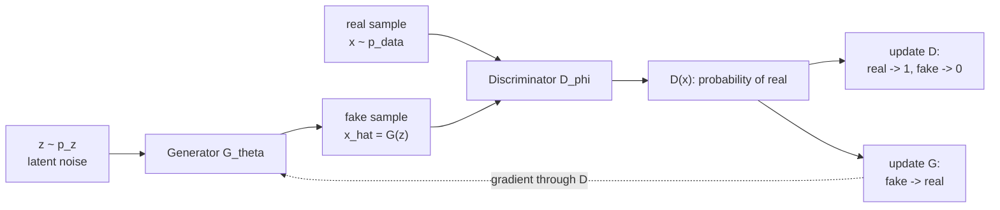

# Generative Adversarial Networks GAN

Source: `DL_exam.pdf`, Question 52

Original question:

> GAN. Генератор, дискриминатор, adversarial objective, min-max игра, основные проблемы обучения.

## Интуиция

`GAN` учит генеративную модель не через явную формулу правдоподобия $p_\theta(x)$, а через соревнование двух нейросетей. `Generator` $G$ берет случайный шум $z$ из простого распределения и превращает его в синтетический объект $\hat{x}=G(z)$. `Discriminator` $D$ смотрит на объект и оценивает вероятность, что он настоящий, а не сгенерированный.

Идея похожа на экзаменатора и фальсификатора: дискриминатор учится отличать реальные данные от подделок, а генератор учится делать подделки, которые дискриминатор принимает за реальные данные. В идеале распределение генератора $p_g$ становится неотличимым от распределения данных $p_{\text{data}}$, и лучший дискриминатор уже не может дать ответ лучше случайного: $D(x)=0.5$.

Главная сложность: это не обычная минимизация одного устойчивого loss, а динамическая min-max игра. Градиенты генератора зависят от текущего качества дискриминатора, поэтому обучение может быть нестабильным, сходиться к плохим равновесиям или терять разнообразие сэмплов.

## Что нужно сказать на экзамене

- `GAN` состоит из генератора $G_\theta: z \mapsto x$ и дискриминатора $D_\phi: x \mapsto [0,1]$.
- Вход генератора: шум $z \sim p_z$, обычно нормальное или равномерное распределение; выход: объект в пространстве данных.
- Дискриминатор решает бинарную классификацию: real sample $x \sim p_{\text{data}}$ против fake sample $G(z)$.
- Классический `adversarial objective`:

$$
\min_G \max_D V(D,G)
=
\mathbb{E}_{x \sim p_{\text{data}}}[\log D(x)]
+
\mathbb{E}_{z \sim p_z}[\log(1-D(G(z)))].
$$

- Дискриминатор максимизирует правильную классификацию, генератор минимизирует способность дискриминатора распознавать fake samples.
- При фиксированном $G$ оптимальный дискриминатор:

$$
D^*(x)=\frac{p_{\text{data}}(x)}{p_{\text{data}}(x)+p_g(x)}.
$$

- При оптимальном $D$ исходная игра эквивалентна минимизации $JS(p_{\text{data}} \Vert p_g)$ с точностью до константы.
- На практике для генератора часто используют `non-saturating loss`:

$$
L_G^{NS}=-\mathbb{E}_{z \sim p_z}[\log D(G(z))],
$$

потому что исходный minimax loss может давать слабые градиенты, когда дискриминатор слишком хорошо отличает fake.

- Основные проблемы обучения: `mode collapse`, vanishing gradients, нестабильность min-max dynamics, отсутствие надежного критерия сходимости, чувствительность к архитектуре и гиперпараметрам, сложная оценка качества и разнообразия.

## Подробный ответ

Пусть реальные данные имеют неизвестное распределение $p_{\text{data}}(x)$. Мы хотим научиться сэмплировать объекты, похожие на реальные, но не обязательно явно вычислять плотность $p_\theta(x)$. Для этого вводят латентный шум $z \sim p_z(z)$, например $z \sim \mathcal{N}(0,I)$, и параметризованный генератор $G_\theta(z)$. Он индуцирует распределение $p_g$ в пространстве данных.

Дискриминатор $D_\phi(x)$ является бинарным классификатором. Его целевое значение равно $1$ для реальных объектов и $0$ для сгенерированных. Если $D$ обучается отдельно при фиксированном $G$, его loss совпадает с binary cross-entropy:

$$
L_D(\phi)
=
-\mathbb{E}_{x \sim p_{\text{data}}}[\log D_\phi(x)]
-\mathbb{E}_{z \sim p_z}[\log(1-D_\phi(G_\theta(z)))].
$$

Дискриминатор минимизирует $L_D$, что эквивалентно максимизации $V(D,G)$. Генератор, наоборот, хочет сделать $D(G(z))$ большим, то есть заставить дискриминатор считать fake samples реальными.

Классическая формулировка Goodfellow GAN:

$$
\min_{\theta}\max_{\phi}
\left[
\mathbb{E}_{x \sim p_{\text{data}}}[\log D_\phi(x)]
+
\mathbb{E}_{z \sim p_z}[\log(1-D_\phi(G_\theta(z)))]
\right].
$$

Здесь важно не перепутать роли: $D$ максимизирует весь функционал, а $G$ влияет только на второй член, потому что реальные данные от него не зависят.

### Оптимальный дискриминатор

Предположим, что $G$ фиксирован, а $D$ достаточно выразителен. Тогда функционал можно записать как интеграл по $x$:

$$
V(D,G)
=
\int p_{\text{data}}(x)\log D(x)\,dx
+
\int p_g(x)\log(1-D(x))\,dx.
$$

Для каждой точки $x$ максимизируем выражение

$$
a\log y + b\log(1-y),
$$

где $a=p_{\text{data}}(x)$, $b=p_g(x)$, $y=D(x)$. Производная:

$$
\frac{a}{y}-\frac{b}{1-y}=0.
$$

Отсюда:

$$
D^*(x)=\frac{a}{a+b}
=
\frac{p_{\text{data}}(x)}{p_{\text{data}}(x)+p_g(x)}.
$$

Если $p_g=p_{\text{data}}$, то $D^*(x)=\frac{1}{2}$ для всех $x$ в поддержке распределения. Это и есть желаемое равновесие: генератор производит данные, статистически неотличимые от реальных.

### Связь с дивергенцией

При подстановке $D^*$ в $V(D,G)$ получается:

$$
V(D^*,G)
=
-\log 4
+
2\,JS(p_{\text{data}} \Vert p_g).
$$

Значит, в идеализированном случае генератор минимизирует Jensen-Shannon divergence между реальным и сгенерированным распределениями. Минимум достигается при $p_g=p_{\text{data}}$, где $JS=0$ и значение игры равно $-\log 4$.

Эта красивая теория опирается на сильные предположения: бесконечная емкость моделей, оптимальный дискриминатор на каждом шаге и хорошее перекрытие распределений. В реальном deep learning эти условия обычно нарушены.

### Min-max игра и практическое обучение

Обучение GAN обычно чередует обновления $D$ и $G$:

1. Сэмплировать minibatch реальных объектов $x_i \sim p_{\text{data}}$.
2. Сэмплировать minibatch шумов $z_i \sim p_z$ и получить fake samples $\hat{x}_i=G_\theta(z_i)$.
3. Обновить $D_\phi$, чтобы $D(x_i)$ было ближе к $1$, а $D(\hat{x}_i)$ ближе к $0$.
4. Снова сэмплировать $z_i$.
5. Обновить $G_\theta$, чтобы $D(G_\theta(z_i))$ было ближе к $1$.

В классическом minimax варианте генератор минимизирует:

$$
L_G^{MM}
=
\mathbb{E}_{z \sim p_z}[\log(1-D_\phi(G_\theta(z)))].
$$

Но если $D$ быстро становится сильным, то $D(G(z)) \approx 0$, и градиент для генератора может стать малоинформативным. Поэтому часто используют `non-saturating` objective:

$$
L_G^{NS}
=
-\mathbb{E}_{z \sim p_z}[\log D_\phi(G_\theta(z))].
$$

Он имеет тот же желаемый смысл для генератора: увеличить вероятность, что fake sample будет классифицирован как real. Но градиенты обычно сильнее на ранних этапах, когда дискриминатор уверенно отвергает fake samples.

### Основные проблемы обучения

| Проблема | Что происходит | Почему это важно |
|---|---|---|
| `Mode collapse` | Генератор производит малое число типов объектов, игнорируя часть мод распределения | Качество отдельных примеров может быть хорошим, но разнообразие плохое |
| Vanishing gradients | Слишком сильный дискриминатор дает генератору слабый или бесполезный градиент | Генератор перестает эффективно учиться |
| Нестабильная динамика | $G$ и $D$ постоянно меняют друг другу objective | Loss может осциллировать, а не монотонно убывать |
| Нет простой метрики сходимости | Значения $L_D$ и $L_G$ не являются прямым показателем качества сэмплов | Нужны визуальная проверка и метрики качества/разнообразия |
| Чувствительность к настройкам | Баланс шагов, learning rate, batch size, нормализация и архитектура сильно влияют на результат | Малые изменения могут ломать обучение |
| Плохое покрытие распределения | $p_g$ может не покрывать все области $p_{\text{data}}$ | Модель кажется реалистичной, но неполной |

Важно подчеркнуть: если дискриминатор слишком слабый, он не дает полезного обучающего сигнала; если слишком сильный, генератору трудно получить хороший градиент. Практическое обучение GAN требует баланса между игроками.

## Формулы / алгоритмы

Классическая objective:

$$
\min_G \max_D V(D,G)
=
\mathbb{E}_{x \sim p_{\text{data}}}[\log D(x)]
+
\mathbb{E}_{z \sim p_z}[\log(1-D(G(z)))].
$$

Loss дискриминатора для минимизации:

$$
L_D
=
-\mathbb{E}_{x \sim p_{\text{data}}}[\log D(x)]
-\mathbb{E}_{z \sim p_z}[\log(1-D(G(z)))].
$$

Классический minimax loss генератора:

$$
L_G^{MM}
=
\mathbb{E}_{z \sim p_z}[\log(1-D(G(z)))].
$$

Практический non-saturating loss генератора:

$$
L_G^{NS}
=
-\mathbb{E}_{z \sim p_z}[\log D(G(z))].
$$

Оптимальный дискриминатор при фиксированном генераторе:

$$
D^*(x)=\frac{p_{\text{data}}(x)}{p_{\text{data}}(x)+p_g(x)}.
$$

Связь с Jensen-Shannon divergence:

$$
V(D^*,G)
=
-\log 4
+
2\,JS(p_{\text{data}} \Vert p_g).
$$

Алгоритм обучения:

```text
Input: dataset X, noise distribution p_z, generator G_theta, discriminator D_phi
Output: trained generator G_theta

repeat
    sample real minibatch {x_i} from X
    sample noise minibatch {z_i} from p_z
    generate fake minibatch {G_theta(z_i)}

    update phi by descending grad_phi L_D

    sample new noise minibatch {z_i} from p_z
    update theta by descending grad_theta L_G
until stopping criterion
```

Практические caveats:

- Число обновлений $D$ на один шаг $G$ является гиперпараметром.
- Хороший loss не гарантирует визуально или семантически хорошие сэмплы.
- Сходимость в игре не эквивалентна сходимости обычной supervised optimization.
- Для устойчивости часто нужны архитектурные и loss-level приемы, но их детали относятся к вариантам и стабилизации GAN.

## Диаграмма или изображение



Внешние изображения не использовались.

## Быстрая устная версия

GAN -- это генеративная модель из двух сетей: генератор $G$ преобразует шум $z$ в объект $G(z)$, а дискриминатор $D$ пытается отличить реальные данные от сгенерированных. Их обучают как adversarial min-max игру:

$$
\min_G \max_D
\mathbb{E}_{x \sim p_{\text{data}}}[\log D(x)]
+
\mathbb{E}_{z \sim p_z}[\log(1-D(G(z)))].
$$

При фиксированном генераторе оптимальный дискриминатор равен
$D^*(x)=\frac{p_{\text{data}}(x)}{p_{\text{data}}(x)+p_g(x)}$. Если $p_g=p_{\text{data}}$, дискриминатор выдает $0.5$, то есть fake и real неотличимы. Теоретически GAN минимизирует Jensen-Shannon divergence, но на практике обучение нестабильно: бывают mode collapse, vanishing gradients, осцилляции, чувствительность к гиперпараметрам и трудная оценка качества.

## Возможные уточняющие вопросы

- Почему GAN не требует явной likelihood?
  - Потому что генератор обучается через градиент от дискриминатора, а не через вычисление $p_\theta(x)$.

- Что означает равновесие в GAN?
  - В идеале $p_g=p_{\text{data}}$, а оптимальный дискриминатор не может отличить real от fake и выдает $D(x)=0.5$.

- Почему используют non-saturating loss?
  - Он дает генератору более полезные градиенты, когда дискриминатор уже уверенно классифицирует fake samples как fake.

- Что такое mode collapse?
  - Ситуация, когда генератор покрывает только часть распределения данных и производит мало разнообразных типов объектов.

- Почему loss GAN трудно интерпретировать?
  - Потому что $G$ и $D$ обучаются в игре: улучшение одного игрока меняет objective другого, поэтому loss не обязан монотонно отражать качество сэмплов.

- Что будет, если дискриминатор слишком сильный?
  - Генератор может получать слабые или бесполезные градиенты, и обучение замедлится или остановится.

- Что будет, если дискриминатор слишком слабый?
  - Он не сможет давать информативную обратную связь, и генератор не научится приближать $p_{\text{data}}$.

## Частые ошибки

- Говорить, что GAN явно оценивает плотность $p(x)$. В классической GAN плотность обычно не вычисляется.
- Путать направления оптимизации: дискриминатор максимизирует $V(D,G)$, генератор минимизирует его по своим параметрам.
- Забывать, что генератор влияет только на fake term, а не на реальные данные.
- Считать, что хороший discriminator loss автоматически означает хороший генератор.
- Называть $D(G(z))$ вероятностью того, что сэмпл "качественный"; точнее, это оценка вероятности класса real по текущему дискриминатору.
- Игнорировать проблему баланса: слишком сильный и слишком слабый дискриминатор оба вредят обучению.
- Сводить mode collapse к "плохим картинкам"; проблема именно в потере разнообразия и неполном покрытии распределения.
- Использовать формулы с неправильным знаком, например минимизировать $-\log(1-D(G(z)))$ для классического minimax generator loss.
