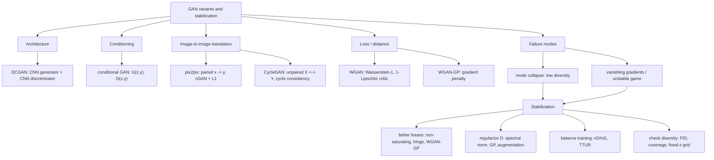

# GAN Variants and Stabilization

Source: `DL_exam.pdf`, Question 53

Original question:

> Варианты и стабилизация GAN. Mode collapse, DCGAN, conditional GAN, pix2pix, CycleGAN, WGAN/WGAN-GP.

## Интуиция

`GAN` обучает генератор $G$ создавать объекты, похожие на реальные данные, через соревнование с дискриминатором $D$. Генератор превращает шум, условие или входное изображение в сэмпл, а дискриминатор пытается отличить реальные данные от сгенерированных. Если обучение устойчиво, $G$ постепенно приближает распределение $p_g$ к распределению данных $p_{\text{data}}$.

Главная трудность GAN - это не идея, а динамика обучения. Здесь оптимизируется не обычная фиксированная функция потерь, а игра двух сетей. Если $D$ слишком силен, у $G$ может пропасть полезный градиент. Если $G$ находит один удачный способ обмануть $D$, он может генерировать однотипные объекты и игнорировать разнообразие данных: это `mode collapse`.

Варианты GAN меняют архитектуру, условие или функцию потерь. `DCGAN` сделал GAN практичными для изображений через сверточные архитектуры. `conditional GAN` управляет генерацией через метку или другой сигнал. `pix2pix` решает paired image-to-image translation, например контур -> фото. `CycleGAN` решает unpaired translation, например лошадь <-> зебра, через cycle consistency. `WGAN` и `WGAN-GP` заменяют исходную JS-divergence-like игру на Wasserstein distance, чтобы градиенты были информативнее и обучение стабильнее.

## Что нужно сказать на экзамене

- Базовый GAN задает игру:

$$
\min_G \max_D V(D, G) =
\mathbb{E}_{x \sim p_{\text{data}}}[\log D(x)] +
\mathbb{E}_{z \sim p_z}[\log(1 - D(G(z)))].
$$

- На практике генератор часто обучают non-saturating loss:

$$
L_G = -\mathbb{E}_{z \sim p_z}[\log D(G(z))],
$$

чтобы избежать слабого градиента, когда $D(G(z))$ близко к нулю.

- `Mode collapse` - ситуация, когда $G$ покрывает только часть мод распределения данных: качество отдельных сэмплов может быть высоким, но разнообразие низкое.
- `DCGAN` - GAN для изображений со сверточным генератором и дискриминатором: strided convolutions, transposed convolutions или upsampling, batch normalization, ReLU/LeakyReLU, `tanh` на выходе генератора.
- `conditional GAN` добавляет условие $y$: $G(z, y)$ и $D(x, y)$. Условием может быть класс, текст, маска, изображение или embedding.
- `pix2pix` - supervised paired translation: есть пары $(x, y)$, генератор строит $G(x)$, дискриминатор проверяет пару $(x, y)$ против $(x, G(x))$. Обычно используются U-Net generator, PatchGAN discriminator и $L_1$ reconstruction loss.
- `CycleGAN` - unpaired translation между доменами $X$ и $Y$: два генератора $G: X \to Y$, $F: Y \to X$, два дискриминатора и cycle consistency $F(G(x)) \approx x$, $G(F(y)) \approx y$.
- `WGAN` минимизирует Wasserstein-1 distance через critic $f_w$, который должен быть 1-Lipschitz. Critic не выдает вероятность и обычно не имеет sigmoid.
- `WGAN-GP` вместо грубого weight clipping добавляет gradient penalty:

$$
\lambda \mathbb{E}_{\hat{x}}\left[(\lVert \nabla_{\hat{x}} D(\hat{x}) \rVert_2 - 1)^2\right].
$$

- Стабилизация GAN: правильный loss, баланс шагов $D/G$, нормализация, spectral normalization, gradient penalty, label smoothing, noise/data augmentation, minibatch discrimination, feature matching, архитектурные ограничения и мониторинг разнообразия.

## Подробный ответ

### Проблема устойчивости GAN

В обычном supervised learning модель минимизирует loss относительно фиксированной цели. В GAN цель меняется, потому что $D$ адаптируется к текущему $G$, а $G$ адаптируется к текущему $D$. Это игра с седловой точкой, а не простая минимизация:

$$
\min_G \max_D V(D, G).
$$

При оптимальном дискриминаторе исходный GAN связан с минимизацией Jensen-Shannon divergence между $p_{\text{data}}$ и $p_g$. Но если распределения почти не пересекаются, JS divergence насыщается, а градиент для генератора может быть слабым или неинформативным. В изображениях это особенно заметно в начале обучения: реальные и сгенерированные данные лежат на разных многообразиях.

Типичные симптомы нестабильного обучения:

- loss $D$ и $G$ не интерпретируются как обычные монотонно убывающие ошибки;
- $D$ быстро становится почти идеальным, и $G$ перестает улучшаться;
- генератор производит однотипные изображения;
- качество резко осциллирует от эпохи к эпохе;
- появляются артефакты, checkerboard patterns, повторяющиеся текстуры;
- метрики вроде FID улучшаются неустойчиво или расходятся с визуальным качеством.

### Mode collapse

`Mode collapse` означает, что генератор покрывает не все моды распределения данных. Если реальные данные содержат много классов, поз, цветов или стилей, $G$ может генерировать только несколько наиболее удобных вариантов. В предельном случае разные $z$ дают почти одинаковый выход:

$$
G(z_1) \approx G(z_2) \quad \text{для многих разных } z_1, z_2.
$$

Почему это возникает:

- генератору достаточно найти несколько сэмплов, которые временно обманывают дискриминатор;
- дискриминатор оценивает локальные различия и может плохо штрафовать отсутствие разнообразия;
- adversarial objective не содержит явного требования, что разные $z$ должны давать разные моды;
- игра может циклически переключаться между модами вместо покрытия всего распределения.

Как бороться:

| Метод | Идея |
|---|---|
| `minibatch discrimination` | Дискриминатор смотрит не только на отдельный объект, но и на разнообразие внутри mini-batch |
| `feature matching` | Генератор подгоняет статистики промежуточных признаков дискриминатора |
| `unrolled GAN` | При обучении $G$ учитывается несколько будущих шагов обновления $D$ |
| `WGAN/WGAN-GP` | Более гладкий сигнал расстояния между распределениями |
| `spectral normalization` | Контроль Lipschitz constant дискриминатора |
| `conditional GAN` | Условие заставляет модель покрывать разные классы или режимы |
| Data augmentation | Дискриминатор меньше переобучается на train set |
| Баланс обучения | Не давать $D$ или $G$ слишком сильно доминировать |

Важно: mode collapse не всегда виден по отдельному красивому сэмплу. Его проверяют по разнообразию, FID, precision/recall for generative models, coverage по классам и визуальному просмотру сетки сэмплов при разных $z$.

### DCGAN

`DCGAN` - практический рецепт для GAN на изображениях. Основная идея: заменить MLP на сверточные сети с inductive bias для изображений.

Типичная архитектура генератора:

- вход: шум $z \sim p_z$, например нормальное или равномерное распределение;
- projection из $z$ в малую feature map, например $4 \times 4 \times C$;
- последовательные блоки upsampling или transposed convolution;
- batch normalization в скрытых слоях;
- ReLU в генераторе;
- `tanh` на выходе, если изображения нормированы в диапазон $[-1, 1]$.

Типичная архитектура дискриминатора:

- strided convolutions вместо ручного pooling;
- LeakyReLU;
- batch normalization, кроме иногда первого слоя;
- выход - logit или вероятность real/fake.

Практические причины, почему DCGAN стабилизирует обучение:

- convolutional structure использует локальность изображений;
- strided convolutions учатся downsampling сами;
- batch normalization улучшает поток градиентов;
- отказ от больших fully connected частей уменьшает число параметров;
- LeakyReLU снижает риск "мертвых" активаций в дискриминаторе.

Ограничение: DCGAN сам по себе не решает фундаментальную нестабильность adversarial learning. Для сложных датасетов нужны более сильные losses, normalization, residual blocks, attention или progressive training.

### Conditional GAN

В `conditional GAN` генерация управляется условием $y$. Это может быть:

- class label;
- текстовое описание;
- segmentation mask;
- sketch/edge map;
- другое изображение;
- embedding из другой модели.

Objective:

$$
\min_G \max_D
\mathbb{E}_{x,y \sim p_{\text{data}}}[\log D(x, y)] +
\mathbb{E}_{z \sim p_z, y \sim p(y)}[\log(1 - D(G(z, y), y))].
$$

Генератор учится моделировать условное распределение:

$$
p_g(x \mid y) \approx p_{\text{data}}(x \mid y).
$$

Условие можно подать разными способами:

- concatenate label embedding с $z$;
- добавить embedding как дополнительный канал изображения;
- использовать conditional batch normalization;
- использовать projection discriminator, где совместимость $x$ и $y$ учитывается через скалярное произведение признаков и embedding условия.

Плюс conditional GAN: управление генерацией и меньше неопределенности для модели. Минус: модель может игнорировать условие, если дискриминатор плохо проверяет соответствие $x$ и $y$.

### pix2pix

`pix2pix` решает задачу paired image-to-image translation. Даны пары:

$$
\{(x_i, y_i)\}_{i=1}^{N},
$$

где $x$ - входное изображение или карта, а $y$ - целевой вид. Примеры: edges -> photo, segmentation mask -> street scene, grayscale -> color.

Генератор:

$$
\hat{y} = G(x).
$$

Дискриминатор получает пару и определяет, реальная ли она:

$$
D(x, y) \quad \text{или} \quad D(x, G(x)).
$$

Adversarial loss:

$$
L_{\text{cGAN}}(G,D) =
\mathbb{E}_{x,y}[\log D(x,y)] +
\mathbb{E}_{x}[\log(1 - D(x,G(x)))].
$$

Reconstruction loss:

$$
L_{L_1}(G) = \mathbb{E}_{x,y}[\lVert y - G(x) \rVert_1].
$$

Итоговая цель:

$$
G^* = \arg\min_G \max_D L_{\text{cGAN}}(G,D) + \lambda L_{L_1}(G).
$$

Зачем нужен $L_1$: adversarial loss делает изображение реалистичным, но не гарантирует точного соответствия конкретной паре. $L_1$ заставляет результат совпадать с target по структуре. Обычно $L_1$ предпочитают $L_2$, потому что $L_2$ сильнее усредняет и дает более размытые изображения.

Архитектурно pix2pix часто использует:

- U-Net generator со skip connections, чтобы сохранять spatial layout;
- PatchGAN discriminator, который классифицирует локальные патчи как real/fake и тем самым фокусируется на текстурах и локальной реалистичности.

### CycleGAN

`CycleGAN` нужен, когда нет paired dataset. Есть два набора изображений:

$$
x \sim p_X, \quad y \sim p_Y,
$$

но нет пар $(x,y)$, где одному объекту из $X$ соответствует конкретный объект из $Y$.

Модель содержит:

- генератор $G: X \to Y$;
- генератор $F: Y \to X$;
- дискриминатор $D_Y$, отличающий реальные $y$ от $G(x)$;
- дискриминатор $D_X$, отличающий реальные $x$ от $F(y)$.

Adversarial losses заставляют переводы выглядеть как целевые домены:

$$
L_{\text{GAN}}(G,D_Y,X,Y) =
\mathbb{E}_{y \sim p_Y}[\log D_Y(y)] +
\mathbb{E}_{x \sim p_X}[\log(1 - D_Y(G(x)))].
$$

Cycle consistency заставляет перевод сохранять содержание:

$$
L_{\text{cyc}}(G,F) =
\mathbb{E}_{x \sim p_X}[\lVert F(G(x)) - x \rVert_1] +
\mathbb{E}_{y \sim p_Y}[\lVert G(F(y)) - y \rVert_1].
$$

Полная цель:

$$
L(G,F,D_X,D_Y) =
L_{\text{GAN}}(G,D_Y,X,Y) +
L_{\text{GAN}}(F,D_X,Y,X) +
\lambda_{\text{cyc}} L_{\text{cyc}}(G,F).
$$

Иногда добавляют identity loss:

$$
L_{\text{id}} =
\mathbb{E}_{y \sim p_Y}[\lVert G(y) - y \rVert_1] +
\mathbb{E}_{x \sim p_X}[\lVert F(x) - x \rVert_1],
$$

чтобы модель не меняла объект, который уже находится в целевом домене, и лучше сохраняла цветовую структуру.

Ограничение CycleGAN: cycle consistency не гарантирует семантически правильный перевод. Модель может спрятать информацию в незаметных артефактах или выучить нежелательные соответствия, если домены неоднозначны.

### WGAN

`WGAN` заменяет исходную adversarial objective на приближение Wasserstein-1 distance, также называемой Earth Mover's Distance:

$$
W(p_{\text{data}}, p_g) =
\inf_{\gamma \in \Pi(p_{\text{data}}, p_g)}
\mathbb{E}_{(x,y) \sim \gamma}[\lVert x - y \rVert],
$$

где $\Pi(p_{\text{data}}, p_g)$ - множество совместных распределений с заданными маргиналами. Интуитивно это минимальная "стоимость переноса массы", чтобы превратить $p_g$ в $p_{\text{data}}$.

Через Kantorovich-Rubinstein duality:

$$
W(p_{\text{data}}, p_g) =
\sup_{\lVert f \rVert_L \le 1}
\mathbb{E}_{x \sim p_{\text{data}}}[f(x)] -
\mathbb{E}_{z \sim p_z}[f(G(z))].
$$

Функция $f$ реализуется нейросетью-critic $D$. Ее называют critic, а не discriminator, потому что она не выдает вероятность real/fake. В WGAN:

$$
L_D =
\mathbb{E}_{z \sim p_z}[D(G(z))] -
\mathbb{E}_{x \sim p_{\text{data}}}[D(x)],
$$

$$
L_G =
-\mathbb{E}_{z \sim p_z}[D(G(z))].
$$

При минимизации $L_D$ critic увеличивает score реальных объектов и уменьшает score fake. Генератор минимизирует $L_G$, то есть пытается поднять critic score для своих сэмплов.

Ключевое условие: $D$ должен быть 1-Lipschitz. В оригинальном WGAN это обеспечивали weight clipping:

$$
w \leftarrow \operatorname{clip}(w, -c, c).
$$

Проблема weight clipping: critic может стать слишком ограниченным, плохо аппроксимировать Wasserstein distance, давать vanishing/exploding gradients и ухудшать качество.

### WGAN-GP

`WGAN-GP` заменяет weight clipping на gradient penalty. Идея: для 1-Lipschitz функции норма градиента по входу не должна существенно превышать 1. Штраф считают на точках между real и fake:

$$
\hat{x} = \epsilon x + (1-\epsilon)G(z), \quad \epsilon \sim U(0,1).
$$

Critic loss:

$$
L_D =
\mathbb{E}_{z \sim p_z}[D(G(z))] -
\mathbb{E}_{x \sim p_{\text{data}}}[D(x)] +
\lambda \mathbb{E}_{\hat{x}}
\left[(\lVert \nabla_{\hat{x}}D(\hat{x}) \rVert_2 - 1)^2\right].
$$

Generator loss:

$$
L_G = -\mathbb{E}_{z \sim p_z}[D(G(z))].
$$

Практические отличия WGAN-GP:

- нет sigmoid на выходе critic;
- critic часто обучают несколько шагов на один шаг генератора;
- gradient penalty стабилизирует обучение лучше, чем clipping;
- значение critic loss лучше коррелирует с прогрессом, чем loss обычного GAN, но все равно не является полной метрикой качества изображений.

### Сравнение вариантов

| Вариант | Данные | Главная идея | Типичный use case | Ключевой риск |
|---|---|---|---|---|
| `DCGAN` | Unconditional images | CNN вместо MLP | Генерация изображений из шума | Нестабильность и mode collapse остаются |
| `conditional GAN` | Метки или условия | Генерация $x$ при заданном $y$ | Class-conditional generation | Игнорирование условия |
| `pix2pix` | Paired $(x,y)$ | cGAN + $L_1$ | Image-to-image translation | Нужны пары, возможна размытость |
| `CycleGAN` | Unpaired domains | Два направления + cycle consistency | Style/domain transfer | Нет гарантии правильной семантики |
| `WGAN` | Любые | Wasserstein loss + Lipschitz critic | Более стабильное обучение | Weight clipping ограничивает critic |
| `WGAN-GP` | Любые | WGAN + gradient penalty | Практически устойчивый WGAN | Дороже из-за градиентов по входу |

### Общие методы стабилизации GAN

1. Выбирать loss с полезными градиентами: non-saturating GAN loss, hinge loss, least-squares GAN, WGAN-GP.
2. Контролировать Lipschitzness дискриминатора: gradient penalty или spectral normalization.
3. Балансировать обучение: несколько шагов $D$ на шаг $G$, TTUR с разными learning rates, не давать $D$ переобучаться.
4. Использовать архитектурные inductive biases: CNN для изображений, residual blocks, skip connections, PatchGAN для локальных текстур.
5. Нормализовать и регуляризовать: batch norm в $G$, осторожно с batch norm в $D$, instance norm для style transfer, dropout там, где он не ломает качество.
6. Снижать переобучение $D$: data augmentation, label smoothing, instance noise, ограничение capacity.
7. Следить за mode collapse: смотреть сетки сэмплов при фиксированных $z$, измерять FID, diversity, coverage и class balance.
8. Подбирать preprocessing: масштабировать изображения под выходную активацию, например $[-1,1]$ для `tanh`.

## Формулы / алгоритмы

### Базовый алгоритм обучения GAN

Дано:

- датасет $D_{\text{data}}$;
- prior $p_z$, например $\mathcal{N}(0,I)$;
- generator $G_\theta$;
- discriminator или critic $D_\phi$;
- числа шагов $n_D$ и $n_G$.

Цель:

- обучить $G_\theta$ так, чтобы $p_g$ было близко к $p_{\text{data}}$;
- обучить $D_\phi$ давать полезный adversarial signal.

Процедура:

1. Повторять до сходимости или остановки по validation/metrics.
2. Для $k=1,\dots,n_D$:
   - выбрать mini-batch реальных объектов $x$;
   - выбрать noise $z$;
   - построить fake objects $\tilde{x}=G_\theta(z)$;
   - обновить $\phi$ по loss дискриминатора или critic.
3. Для $k=1,\dots,n_G$:
   - выбрать новый noise $z$;
   - построить $\tilde{x}=G_\theta(z)$;
   - обновить $\theta$ по generator loss, не обновляя $D_\phi$.
4. Периодически оценивать качество: фиксированные $z$, FID, diversity, downstream или human evaluation.

Практическая сходимость не гарантирована как в convex optimization. GAN training обычно останавливают по качеству сэмплов и метрикам, а не по монотонному убыванию loss.

### WGAN-GP training step

Для mini-batch:

$$
x \sim p_{\text{data}}, \quad z \sim p_z, \quad \tilde{x}=G(z),
$$

$$
\hat{x}=\epsilon x + (1-\epsilon)\tilde{x}, \quad \epsilon \sim U(0,1).
$$

Critic update:

$$
\phi \leftarrow \phi - \eta_D \nabla_\phi
\left[
\frac{1}{m}\sum_i D_\phi(\tilde{x}_i)
- \frac{1}{m}\sum_i D_\phi(x_i)
+ \lambda \frac{1}{m}\sum_i
(\lVert \nabla_{\hat{x}_i}D_\phi(\hat{x}_i) \rVert_2 - 1)^2
\right].
$$

Generator update:

$$
\theta \leftarrow \theta - \eta_G \nabla_\theta
\left[
-\frac{1}{m}\sum_i D_\phi(G_\theta(z_i))
\right].
$$

### pix2pix objective

$$
G^* = \arg\min_G \max_D
\left(
\mathbb{E}_{x,y}[\log D(x,y)] +
\mathbb{E}_{x}[\log(1-D(x,G(x)))]
+ \lambda \mathbb{E}_{x,y}[\lVert y-G(x)\rVert_1]
\right).
$$

### CycleGAN objective

$$
\min_{G,F}\max_{D_X,D_Y}
L_{\text{GAN}}(G,D_Y,X,Y) +
L_{\text{GAN}}(F,D_X,Y,X) +
\lambda_{\text{cyc}}L_{\text{cyc}}(G,F)
+ \lambda_{\text{id}}L_{\text{id}}(G,F).
$$

## Диаграмма или изображение

Внешние изображения не использовались.

## Быстрая устная версия

Варианты GAN в основном решают три проблемы: как лучше задавать архитектуру, как управлять генерацией и как стабилизировать игру. `DCGAN` использует сверточный generator/discriminator и стал базовым рецептом для изображений. `conditional GAN` добавляет условие $y$, поэтому модель учит $p(x \mid y)$. `pix2pix` - это paired image-to-image translation: U-Net generator, PatchGAN discriminator, adversarial loss плюс $L_1$ к целевому изображению. `CycleGAN` работает без пар: два генератора между доменами и cycle consistency, чтобы перевод туда-обратно возвращал исходное изображение.

Главная проблема обучения - нестабильность и `mode collapse`, когда генератор делает мало разнообразных сэмплов. `WGAN` заменяет обычный GAN loss на Wasserstein distance и использует critic без sigmoid, ограниченный 1-Lipschitz условием. В оригинальном WGAN это делали weight clipping, но он грубый. `WGAN-GP` добавляет штраф на норму градиента critic по входу, поэтому обычно стабильнее. На практике также помогают spectral normalization, data augmentation, баланс шагов дискриминатора и генератора, non-saturating/hinge losses и контроль разнообразия через FID и визуальные сетки.

## Возможные уточняющие вопросы

- Чем critic в WGAN отличается от discriminator? Critic выдает произвольный real-valued score, а не вероятность real/fake; sigmoid на выходе не нужен.
- Почему WGAN требует 1-Lipschitz critic? Это условие нужно для Kantorovich-Rubinstein duality, через которую Wasserstein-1 distance выражается как максимум по 1-Lipschitz функциям.
- Почему weight clipping плох? Он грубо ограничивает веса, может уменьшить capacity critic и приводить к плохим градиентам.
- Что делает gradient penalty? Штрафует отклонение $\lVert \nabla_{\hat{x}}D(\hat{x}) \rVert_2$ от 1 на интерполяциях между real и fake.
- Почему pix2pix добавляет $L_1$ loss? Adversarial loss дает реалистичность, а $L_1$ сохраняет соответствие конкретному target из paired dataset.
- Почему CycleGAN может работать без пар? Он использует adversarial losses для попадания в целевой домен и cycle consistency, чтобы перевод сохранял информацию об исходном объекте.
- Чем PatchGAN полезен? Он оценивает локальные патчи, поэтому хорошо контролирует текстуры и локальную реалистичность при меньшем числе параметров.
- Как заметить mode collapse? Разные $z$ дают похожие изображения, покрываются не все классы/стили, diversity и recall низкие, хотя отдельные samples могут выглядеть хорошо.
- Можно ли судить о GAN только по loss? Нет. Loss GAN часто осциллирует и плохо отражает визуальное качество; нужны сэмплы, FID, diversity/coverage и task-specific checks.

## Частые ошибки

- Называть WGAN discriminator обычным классификатором real/fake. В WGAN это critic без вероятностной интерпретации.
- Забывать, что условие 1-Lipschitz является обязательным для Wasserstein dual objective.
- Путать weight clipping и gradient penalty: clipping ограничивает веса, WGAN-GP штрафует норму градиента по входу.
- Считать, что mode collapse - это плохое качество каждого изображения. Наоборот, отдельные изображения могут быть хорошими, проблема в низком разнообразии.
- Говорить, что CycleGAN находит истинное соответствие между объектами без пар. Cycle consistency только регуляризует перевод, но не гарантирует правильную семантику.
- Описывать pix2pix как unpaired метод. pix2pix требует paired dataset; unpaired постановка - это CycleGAN.
- Забывать про reconstruction term в pix2pix: без $L_1$ результат может быть реалистичным, но не соответствовать нужной паре.
- Использовать sigmoid и binary cross-entropy в WGAN critic, хотя WGAN loss работает со score.
- Интерпретировать GAN loss как обычную validation error. Для GAN важны samples, diversity и специальные generative metrics.
- Игнорировать preprocessing: если выход генератора `tanh`, изображения должны быть масштабированы к $[-1,1]$.
