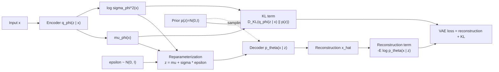

# Autoencoders and Variational Autoencoders

Source: `DL_exam.pdf`, Question 54

Original question:

> Autoencoders и VAE. Reconstruction, bottleneck, latent space, ELBO, KL-divergence, reparameterization trick.

## Интуиция

`Autoencoder` учится сжимать объект $x$ в скрытое представление $z$ и восстанавливать из него $\hat{x}$. Если сеть просто копирует вход, пользы мало; поэтому вводят `bottleneck`, шум, регуляризацию или другие ограничения, заставляющие модель оставить в $z$ только существенные факторы вариации данных.

Обычный autoencoder в первую очередь решает задачу представления: получить компактный `latent space`, полезный для denoising, сжатия, поиска похожих объектов или предобучения. Но он не обязан быть хорошей генеративной моделью: из произвольной точки latent space декодер может выдавать мусор, потому что распределение кодов не задано явно.

`Variational Autoencoder` решает это вероятностно. Encoder не выдает одну точку $z$, а задает распределение $q_\phi(z \mid x)$, обычно гауссово. Decoder задает likelihood $p_\theta(x \mid z)$, а prior $p(z)$, обычно $\mathcal{N}(0, I)$, делает latent space непрерывным и пригодным для генерации: можно взять $z \sim p(z)$ и декодировать новый объект.

## Что нужно сказать на экзамене

- Autoencoder: encoder $f_\phi$, decoder $g_\theta$, код $z=f_\phi(x)$, реконструкция $\hat{x}=g_\theta(z)$.
- `Reconstruction loss` измеряет, насколько $\hat{x}$ близка к $x$: MSE для непрерывных данных, binary cross-entropy или negative log-likelihood для вероятностной постановки.
- `Bottleneck` ограничивает пропускную способность: малая размерность $z$, разреженность, denoising, weight decay, dropout, contractive regularization.
- Latent space должен хранить факторы вариации данных, но у обычного AE он может быть неупорядоченным и не иметь удобного prior.
- VAE задает генеративную модель $p_\theta(x,z)=p(z)p_\theta(x \mid z)$ и приближенный posterior $q_\phi(z \mid x)$.
- Оптимизируется `ELBO`:

$$
\log p_\theta(x) \ge
\mathbb{E}_{q_\phi(z \mid x)}[\log p_\theta(x \mid z)]
-D_{\mathrm{KL}}(q_\phi(z \mid x)\|p(z)).
$$

- Первый член ELBO отвечает за reconstruction, второй регуляризует latent distribution к prior.
- `KL-divergence` измеряет расхождение распределений и не является симметричной метрикой.
- `Reparameterization trick`: вместо sampling $z \sim \mathcal{N}(\mu_\phi(x), \operatorname{diag}(\sigma_\phi^2(x)))$ пишем $z=\mu_\phi(x)+\sigma_\phi(x)\odot\epsilon$, где $\epsilon \sim \mathcal{N}(0,I)$; это позволяет пропускать градиенты через $\mu_\phi,\sigma_\phi$.
- Основные компромиссы VAE: гладкий latent space и явная генерация против более размытых реконструкций по сравнению с GAN/диффузионными моделями; риск posterior collapse при слишком сильном декодере.

## Подробный ответ

Пусть данные $x \sim p_{\text{data}}(x)$. Обычный autoencoder состоит из двух частей:

$$
z=f_\phi(x), \qquad \hat{x}=g_\theta(z).
$$

Параметры $\phi,\theta$ обучаются минимизировать ошибку реконструкции:

$$
\min_{\phi,\theta}\ \mathbb{E}_{x \sim p_{\text{data}}}
\left[\mathcal{L}_{\text{rec}}(x, g_\theta(f_\phi(x)))\right].
$$

Если $x$ вещественный и предполагается гауссов likelihood с фиксированной дисперсией, то естественная loss эквивалентна MSE:

$$
\mathcal{L}_{\text{rec}}(x,\hat{x})=\|x-\hat{x}\|_2^2.
$$

Если $x$ бинарный или нормирован в $[0,1]$, часто используют binary cross-entropy:

$$
\mathcal{L}_{\text{BCE}}(x,\hat{x})
=-\sum_i \left[x_i\log \hat{x}_i+(1-x_i)\log(1-\hat{x}_i)\right].
$$

`Bottleneck` нужен, чтобы autoencoder не выучил тождественное отображение. Самый простой bottleneck - размерность $z$ меньше размерности $x$, но ограничение может быть и другим: добавление шума во вход (`denoising autoencoder`), штраф за плотный код (`sparse autoencoder`), штраф за чувствительность encoder к входу (`contractive autoencoder`). Важная мысль: хороший AE не просто восстанавливает пиксели, а учит представление, в котором близкие по смыслу объекты имеют близкие коды.

Однако обычный AE не задает распределение $p(z)$, из которого удобно сэмплировать. Область latent space, где лежат реальные коды $f_\phi(x)$, может быть разорванной или искривленной. Поэтому случайный $z$ из простого распределения может попасть в область, которую decoder никогда не видел.

VAE вводит вероятностную модель. Предполагается prior:

$$
p(z)=\mathcal{N}(0,I),
$$

и decoder likelihood:

$$
p_\theta(x \mid z).
$$

Тогда marginal likelihood объекта:

$$
p_\theta(x)=\int p_\theta(x \mid z)p(z)\,dz.
$$

Прямо максимизировать $\log p_\theta(x)$ трудно, потому что интеграл по $z$ обычно не считается аналитически. VAE вводит variational posterior $q_\phi(z \mid x)$, который приближает истинный posterior $p_\theta(z \mid x)$. Обычно encoder выдает параметры диагонального гауссова распределения:

$$
q_\phi(z \mid x)=\mathcal{N}
\left(z;\mu_\phi(x),\operatorname{diag}(\sigma_\phi^2(x))\right).
$$

Вывод ELBO строится из тождества:

$$
\log p_\theta(x)
= \mathcal{L}_{\text{ELBO}}(x;\theta,\phi)
+D_{\mathrm{KL}}(q_\phi(z \mid x)\|p_\theta(z \mid x)).
$$

Так как KL-divergence неотрицательна, ELBO является нижней оценкой лог-правдоподобия:

$$
\mathcal{L}_{\text{ELBO}}
=
\mathbb{E}_{q_\phi(z \mid x)}[\log p_\theta(x \mid z)]
-D_{\mathrm{KL}}(q_\phi(z \mid x)\|p(z))
\le \log p_\theta(x).
$$

В форме loss обычно минимизируют отрицательный ELBO:

$$
\mathcal{L}_{\text{VAE}}
=
-\mathbb{E}_{q_\phi(z \mid x)}[\log p_\theta(x \mid z)]
+D_{\mathrm{KL}}(q_\phi(z \mid x)\|p(z)).
$$

Первый член - reconstruction term. Он заставляет $z$ сохранять информацию о конкретном $x$. Второй член - KL regularization. Он заставляет $q_\phi(z \mid x)$ быть близким к prior $p(z)$, чтобы latent space был гладким, интерполируемым и пригодным для генерации.

Для диагонального gaussian posterior и standard normal prior KL считается аналитически. Если
$q_\phi(z \mid x)=\mathcal{N}(\mu,\operatorname{diag}(\sigma^2))$ и $p(z)=\mathcal{N}(0,I)$, то

$$
D_{\mathrm{KL}}(q_\phi(z \mid x)\|p(z))
=\frac{1}{2}\sum_{j=1}^{d}
\left(\mu_j^2+\sigma_j^2-\log \sigma_j^2-1\right).
$$

Важно не перепутать знак: в ELBO KL вычитается, а в loss отрицательного ELBO добавляется.

Главная техническая проблема: sampling из $q_\phi(z \mid x)$ кажется недифференцируемым по параметрам encoder. `Reparameterization trick` переносит случайность во внешнюю переменную:

$$
\epsilon \sim \mathcal{N}(0,I), \qquad
z=\mu_\phi(x)+\sigma_\phi(x)\odot\epsilon.
$$

Теперь $z$ является дифференцируемой функцией $\mu_\phi(x)$ и $\sigma_\phi(x)$ при фиксированном $\epsilon$, поэтому можно использовать обычный backpropagation. На практике сеть часто предсказывает $\log \sigma^2$ или `logvar`, чтобы дисперсия была положительной и обучение было численно устойчивее:

$$
\sigma=\exp\left(\frac{1}{2}\log\sigma^2\right).
$$

После обучения VAE можно использовать двумя способами: для реконструкции берут $x \to q_\phi(z \mid x) \to p_\theta(x \mid z)$, для генерации берут $z \sim \mathcal{N}(0,I)$ и затем $x \sim p_\theta(x \mid z)$ или используют mean/mode decoder output.

Сравнение AE и VAE:

| Свойство | Autoencoder | Variational Autoencoder |
|---|---|---|
| Encoder | Точка $z=f_\phi(x)$ | Распределение $q_\phi(z \mid x)$ |
| Decoder | $\hat{x}=g_\theta(z)$ | Likelihood $p_\theta(x \mid z)$ |
| Цель | Reconstruction loss | ELBO = reconstruction - KL |
| Prior на $z$ | Обычно нет | Обычно $\mathcal{N}(0,I)$ |
| Генерация | Не гарантирована | Естественная: $z \sim p(z)$ |
| Latent space | Может быть разорванным | Регуляризован и более гладкий |

Ограничения VAE: при сильном KL реконструкции ухудшаются; при слишком мощном decoder возможен `posterior collapse`, когда $q_\phi(z \mid x) \approx p(z)$ и модель игнорирует latent code; при простом gaussian decoder изображения часто выглядят сглаженными, потому что likelihood и MSE усредняют допустимые варианты.

## Формулы / алгоритмы

Цель обычного autoencoder:

$$
\min_{\phi,\theta}\ \mathbb{E}_{x}
\left[\mathcal{L}_{\text{rec}}(x,g_\theta(f_\phi(x)))\right].
$$

Генеративная модель VAE:

$$
p_\theta(x,z)=p(z)p_\theta(x \mid z), \qquad
p(z)=\mathcal{N}(0,I).
$$

ELBO:

$$
\mathcal{L}_{\text{ELBO}}(x)
=
\mathbb{E}_{q_\phi(z \mid x)}[\log p_\theta(x \mid z)]
-D_{\mathrm{KL}}(q_\phi(z \mid x)\|p(z)).
$$

Loss для минимизации:

$$
\mathcal{L}_{\text{VAE}}
=\mathcal{L}_{\text{rec}}+\mathcal{L}_{\text{KL}}
=-\mathbb{E}_{q_\phi(z \mid x)}[\log p_\theta(x \mid z)]
+D_{\mathrm{KL}}(q_\phi(z \mid x)\|p(z)).
$$

KL для diagonal Gaussian против $\mathcal{N}(0,I)$:

$$
\mathcal{L}_{\text{KL}}
=\frac{1}{2}\sum_j
\left(\mu_j^2+\sigma_j^2-\log\sigma_j^2-1\right).
$$

Алгоритм обучения VAE:

1. Вход: batch объектов $x$, encoder $q_\phi(z \mid x)$, decoder $p_\theta(x \mid z)$.
2. Encoder вычисляет $\mu_\phi(x)$ и $\log\sigma_\phi^2(x)$.
3. Сэмплируем $\epsilon \sim \mathcal{N}(0,I)$.
4. Применяем reparameterization: $z=\mu+\sigma\odot\epsilon$.
5. Decoder вычисляет параметры $p_\theta(x \mid z)$ или реконструкцию $\hat{x}$.
6. Считаем reconstruction loss и analytic KL.
7. Минимизируем $-\text{ELBO}$ через backpropagation.

Практические замечания:

- Complexity одного шага примерно как у прямого и обратного прохода encoder-decoder; дополнительная стоимость KL мала.
- Для изображений decoder likelihood выбирают под тип данных: Bernoulli/BCE для бинаризованных пикселей, Gaussian/MSE для непрерывных, discretized logistic для более точного моделирования интенсивностей.
- В $\beta$-VAE используют $\mathcal{L}_{\text{rec}}+\beta\mathcal{L}_{\text{KL}}$: при $\beta>1$ latent factors могут стать более disentangled, но реконструкция обычно хуже.
- KL annealing постепенно увеличивает вес KL, чтобы уменьшить риск posterior collapse.

## Диаграмма или изображение

Внешние изображения не использовались; схема сделана в Mermaid.

## Быстрая устная версия

Autoencoder - это encoder-decoder модель, которая сжимает $x$ в latent code $z$ и восстанавливает $\hat{x}$. Чтобы модель не просто копировала вход, нужен bottleneck: малая размерность, шум или регуляризация. Loss обычно reconstruction loss, например MSE или BCE.

VAE делает autoencoder вероятностным. Encoder задает $q_\phi(z \mid x)$, decoder задает $p_\theta(x \mid z)$, а prior обычно $p(z)=\mathcal{N}(0,I)$. Мы максимизируем ELBO: reconstruction term минус KL-divergence между posterior encoder и prior. KL делает latent space гладким и позволяет генерировать новые объекты сэмплированием $z \sim p(z)$.

Sampling дифференцируют через reparameterization trick: $z=\mu+\sigma\odot\epsilon$, где $\epsilon \sim \mathcal{N}(0,I)$. Поэтому случайность не зависит от параметров encoder, а градиенты проходят через $\mu$ и $\sigma$.

## Возможные уточняющие вопросы

- Зачем нужен bottleneck в autoencoder? Чтобы ограничить пропускную способность и заставить код хранить существенные признаки, а не реализовывать identity mapping.
- Почему обычный AE не является хорошей генеративной моделью? Потому что у него нет явного prior на $z$, и случайные точки latent space могут не соответствовать реальным данным.
- Что означает reconstruction term в VAE? Это expected log-likelihood $\mathbb{E}_{q_\phi(z \mid x)}[\log p_\theta(x \mid z)]$ или его отрицание в loss.
- Что делает KL term? Прижимает $q_\phi(z \mid x)$ к $p(z)$, регуляризует latent space и делает возможным sampling из prior.
- Почему ELBO является нижней оценкой? Потому что $\log p_\theta(x)=\text{ELBO}+D_{\mathrm{KL}}(q_\phi(z \mid x)\|p_\theta(z \mid x))$, а KL неотрицательна.
- Почему нужен reparameterization trick? Он превращает stochastic sampling в дифференцируемую функцию параметров encoder и независимого шума.
- Что такое posterior collapse? Ситуация, когда $q_\phi(z \mid x)$ почти равен prior и decoder игнорирует latent code.
- Чем $\beta$-VAE отличается от VAE? В loss KL умножают на $\beta$, управляя компромиссом между reconstruction и regularization/disentanglement.

## Частые ошибки

- Говорить, что autoencoder всегда генеративная модель. Без prior и регуляризованного latent space это не гарантировано.
- Путать deterministic code AE и distribution $q_\phi(z \mid x)$ в VAE.
- Забывать, что в ELBO KL вычитается, а в loss отрицательного ELBO добавляется.
- Называть KL-divergence расстоянием в строгом смысле: она несимметрична и не удовлетворяет всем свойствам метрики.
- Считать, что bottleneck - только малая размерность. Шум и регуляризация тоже ограничивают информацию.
- Сэмплировать $z$ напрямую и ожидать обычный backpropagation без reparameterization trick.
- Неверно писать KL для diagonal Gaussian: нужно учитывать $\mu^2$, $\sigma^2$, $-\log\sigma^2$ и $-1$.
- Не связывать reconstruction loss с выбором likelihood $p_\theta(x \mid z)$.
- Игнорировать trade-off: сильный KL улучшает latent space, но может ухудшить реконструкции.
