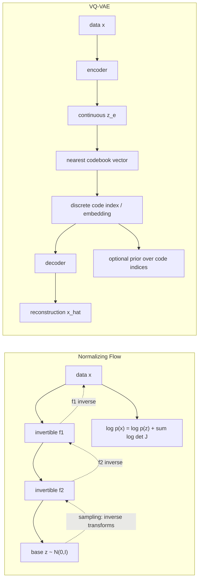

# Normalizing Flows and Discrete Latent Models

Source: `DL_exam.pdf`, Question 55

Original question:

> Normalizing Flows и дискретные латентные модели. Обратимые преобразования, change of variables, exact likelihood, идея VQ-VAE.

## Интуиция

`Normalizing flow` строит генеративную модель как цепочку обратимых преобразований. Мы начинаем с простого распределения $p_Z(z)$, например стандартного гауссовского, и учимся обратимо переводить его в сложное распределение данных $p_X(x)$. Если преобразование обратимо и дифференцируемо, то плотность объекта $x$ можно посчитать точно через формулу `change of variables`: базовая плотность в latent space плюс поправка на изменение объема через якобиан.

Главная привлекательность flow-моделей - `exact likelihood`. В отличие от GAN, где likelihood не задан явно, и VAE, где оптимизируется нижняя оценка ELBO, normalizing flow позволяет прямо максимизировать $\log p_\theta(x)$. Цена за это - жесткие архитектурные ограничения: слои должны быть обратимыми, размерность $x$ и $z$ обычно совпадает, а determinant Jacobian должен считаться эффективно.

Дискретные латентные модели идут другим путем. Вместо непрерывного $z$ они кодируют объект через индекс из конечного словаря latent codes. В `VQ-VAE` encoder выдает непрерывный вектор, затем он квантуется до ближайшего вектора из codebook. Это дает дискретное, сжимающее и часто семантически удобное представление, а затем отдельный prior можно обучить моделировать последовательности кодов.

## Что нужно сказать на экзамене

- Normalizing flow задает биекцию между данными $x$ и latent-переменной $z$: $z=f_\theta(x)$, $x=f_\theta^{-1}(z)$.
- Базовое распределение $p_Z(z)$ выбирают простым: $\mathcal{N}(0,I)$, logistic distribution или factorized distribution.
- Формула `change of variables`:

$$
p_X(x)=p_Z(f_\theta(x))\left|\det \frac{\partial f_\theta(x)}{\partial x}\right|.
$$

- Для композиции $f=f_K \circ \dots \circ f_1$ log-likelihood раскладывается в сумму:

$$
\log p_X(x)=\log p_Z(z_K)+\sum_{k=1}^{K}\log\left|\det J_{f_k}(z_{k-1})\right|.
$$

- `Exact likelihood` означает, что $\log p_\theta(x)$ считается напрямую, без variational lower bound и без adversarial surrogate objective.
- Чтобы flow был практичным, нужны слои с обратимостью и дешевым determinant: coupling layers, autoregressive flows, invertible $1 \times 1$ convolution, actnorm, squeeze/split operations.
- Примеры: NICE, RealNVP, Glow, Masked Autoregressive Flow, Inverse Autoregressive Flow, Neural Spline Flows.
- Ограничения flows: высокая память из-за обратимых вычислений, равная размерность данных и latent space, сложность дискретных данных, архитектурные ограничения ради tractable Jacobian.
- Дискретная latent-модель использует конечный набор кодов $\{e_1,\dots,e_K\}$ и представляет объект индексами этих кодов.
- В VQ-VAE encoder $z_e(x)$ квантуется: $z_q(x)=e_k$, где $k=\arg\min_j \|z_e(x)-e_j\|_2$.
- VQ-VAE обучается через reconstruction loss, codebook loss и commitment loss; через квантование используют `straight-through estimator`.
- VQ-VAE сама по себе не является normalizing flow и не дает exact likelihood для исходных данных в том же смысле; генерация требует prior над дискретными кодами, например autoregressive Transformer.

## Подробный ответ

Пусть $x \in \mathbb{R}^D$ - объект данных, а $z \in \mathbb{R}^D$ - latent-переменная с простой плотностью $p_Z(z)$. Normalizing flow задает обратимое дифференцируемое отображение:

$$
z=f_\theta(x), \qquad x=f_\theta^{-1}(z).
$$

Предположения для формулы `change of variables`: пространства имеют одинаковую размерность, $f_\theta$ является биекцией, $f_\theta$ дифференцируема почти всюду, а determinant Jacobian не равен нулю почти всюду. Тогда вероятность должна сохраняться при замене переменных:

$$
p_X(x)\,dx = p_Z(z)\,dz.
$$

Локальное изменение объема задается якобианом:

$$
dz = \left|\det \frac{\partial f_\theta(x)}{\partial x}\right| dx.
$$

Отсюда:

$$
p_X(x)=p_Z(f_\theta(x))
\left|\det \frac{\partial f_\theta(x)}{\partial x}\right|.
$$

В log-space:

$$
\log p_X(x)=\log p_Z(f_\theta(x))
+\log\left|\det \frac{\partial f_\theta(x)}{\partial x}\right|.
$$

Если flow состоит из нескольких обратимых блоков,

$$
z_0=x,\quad z_k=f_k(z_{k-1}),\quad z_K=z,
$$

то determinant Jacobian композиции равен произведению determinants, а log-determinant превращается в сумму:

$$
\log p_X(x)
=\log p_Z(z_K)
+\sum_{k=1}^{K}
\log\left|\det \frac{\partial z_k}{\partial z_{k-1}}\right|.
$$

Обучение идет через maximum likelihood:

$$
\max_\theta \sum_{i=1}^{N}\log p_\theta(x_i),
$$

или, что эквивалентно, минимизацию negative log-likelihood:

$$
\mathcal{L}_{\text{NLL}}(\theta)
=-\frac{1}{N}\sum_{i=1}^{N}\log p_\theta(x_i).
$$

Генерация выполняется в обратном направлении: сэмплируем $z \sim p_Z(z)$ и считаем $x=f_\theta^{-1}(z)$. Оценка likelihood выполняется в прямом направлении: берем $x$, считаем $z=f_\theta(x)$ и сумму log-determinants.

Ключевой инженерный вопрос - как сделать преобразование выразительным, но сохранить дешевый determinant. У произвольной dense-сети Jacobian имеет размер $D \times D$, и вычисление determinant стоит $O(D^3)$, что непрактично для изображений. Поэтому используют специальные обратимые блоки.

`Coupling layer` разбивает вход на две части $x_a,x_b$:

$$
y_a=x_a,
$$

$$
y_b=x_b \odot \exp(s_\theta(x_a)) + t_\theta(x_a).
$$

Обратное преобразование:

$$
x_a=y_a,
$$

$$
x_b=(y_b-t_\theta(y_a))\odot \exp(-s_\theta(y_a)).
$$

Jacobian такого слоя треугольный, поэтому determinant равен произведению диагональных элементов:

$$
\log|\det J|=\sum_j s_{\theta,j}(x_a).
$$

Это идея RealNVP и Glow: одна часть переменных управляет масштабом и сдвигом другой части, затем применяются перестановки или invertible $1 \times 1$ convolutions, чтобы все координаты постепенно влияли друг на друга.

`Autoregressive flow` использует факторизацию:

$$
p(x)=\prod_{i=1}^{D}p(x_i \mid x_{<i}).
$$

Преобразование строится так, чтобы $y_i$ зависел только от $x_{\le i}$ или $x_{<i}$. Jacobian получается triangular, и log-determinant снова считается как сумма диагональных log-scales. У Masked Autoregressive Flow быстрый likelihood, но sampling последовательный; у Inverse Autoregressive Flow наоборот часто быстрее sampling.

Сильная сторона normalizing flows - честная плотностная модель. Можно сравнивать модели по bits per dimension, вычислять likelihood, делать out-of-distribution анализ с оговорками, сэмплировать и интерполировать. Но высокая likelihood не всегда означает хорошее семантическое качество изображений: likelihood чувствителен к низкоуровневой статистике, фону и локальным корреляциям.

Дискретные латентные модели вводят latent-переменные из конечного множества. Вместо $z \in \mathbb{R}^d$ используется индекс $k \in \{1,\dots,K\}$ или сетка индексов. Это похоже на learned vector quantization: модель хранит codebook

$$
E=\{e_1,\dots,e_K\}, \qquad e_k \in \mathbb{R}^d.
$$

В VQ-VAE encoder выдает непрерывное представление:

$$
z_e(x)=\operatorname{Enc}_\phi(x).
$$

Затем выполняется nearest-neighbor quantization:

$$
k^*=\arg\min_{k}\|z_e(x)-e_k\|_2,
$$

$$
z_q(x)=e_{k^*}.
$$

Decoder восстанавливает объект по квантованному коду:

$$
\hat{x}=\operatorname{Dec}_\theta(z_q(x)).
$$

Проблема в том, что операция $\arg\min$ недифференцируема. В VQ-VAE обычно используют `straight-through estimator`: в forward pass decoder получает квантованный вектор $z_q$, а в backward pass градиент от decoder приблизительно копируется в $z_e$, как будто квантования не было. Codebook обновляется либо градиентом через специальную loss, либо EMA-обновлением.

Стандартная VQ-VAE loss:

$$
\mathcal{L}
=
\underbrace{-\log p_\theta(x \mid z_q(x))}_{\text{reconstruction}}
+
\underbrace{\|\operatorname{sg}[z_e(x)]-e\|_2^2}_{\text{codebook loss}}
+
\beta
\underbrace{\|z_e(x)-\operatorname{sg}[e]\|_2^2}_{\text{commitment loss}}.
$$

Здесь $\operatorname{sg}[\cdot]$ означает `stop-gradient`: значение используется в forward pass, но градиент через него не идет. Codebook loss двигает выбранный код $e$ к encoder output, а commitment loss заставляет encoder не прыгать произвольно между кодами и "commit" к выбранным embeddings. Коэффициент $\beta$ регулирует силу commitment.

После обучения VQ-VAE можно обучить prior над дискретными кодами:

$$
p(k_1,\dots,k_M)=\prod_{m=1}^{M}p(k_m \mid k_{<m}),
$$

например PixelCNN или Transformer. Генерация тогда состоит из двух этапов: сначала сэмплируются дискретные индексы из prior, затем codebook превращает их в embeddings, а decoder строит объект. Такая схема отделяет локальное восстановление от глобального моделирования структуры.

Важно различать exact likelihood у flows и likelihood в VQ-VAE. Flow дает точную плотность $p_\theta(x)$ благодаря обратимой замене переменных. VQ-VAE использует недифференцируемую квантизацию и reconstruction objective; если обучить отдельный prior над кодами, можно оценивать вероятность дискретных кодов, но это не то же самое, что exact continuous likelihood исходного $x$ через обратимую биекцию.

Сравнение:

| Свойство | Normalizing Flows | VQ-VAE / discrete latent models |
|---|---|---|
| Latent space | Непрерывный, обычно той же размерности | Дискретные индексы codebook |
| Основное отображение | Обратимая биекция $x \leftrightarrow z$ | Encoder + quantization + decoder |
| Likelihood | Exact likelihood через change of variables | Обычно reconstruction objective; prior над кодами обучается отдельно |
| Sampling | $z \sim p_Z$, затем inverse flow | Сэмплировать индексы из prior, затем decoder |
| Архитектурное ограничение | Нужны invertible layers и tractable determinant | Нужны codebook, quantization, straight-through gradients |
| Сильная сторона | Точная density estimation | Компактные дискретные представления, удобные для autoregressive prior |
| Ограничение | Ограниченная гибкость слоев, равная размерность | Недостаточно точная likelihood-постановка, риск codebook collapse |

## Формулы / алгоритмы

Change of variables для одного flow-блока:

$$
z=f_\theta(x),
\qquad
p_X(x)=p_Z(z)\left|\det J_{f_\theta}(x)\right|.
$$

Log-likelihood:

$$
\log p_X(x)
=
\log p_Z(f_\theta(x))
+
\log\left|\det J_{f_\theta}(x)\right|.
$$

Композиция flow-блоков:

$$
z_0=x,\quad z_k=f_k(z_{k-1}),\quad z_K=z.
$$

$$
\log p_X(x)
=
\log p_Z(z_K)
+
\sum_{k=1}^{K}\log\left|\det J_{f_k}(z_{k-1})\right|.
$$

Affine coupling layer:

$$
y_a=x_a,\qquad
y_b=x_b \odot \exp(s_\theta(x_a))+t_\theta(x_a).
$$

$$
\log|\det J|=\sum_j s_{\theta,j}(x_a).
$$

Алгоритм обучения normalizing flow:

1. Вход: batch данных $x$, base density $p_Z$, обратимые блоки $f_1,\dots,f_K$.
2. Прямой проход: $z_0=x$, затем $z_k=f_k(z_{k-1})$.
3. Для каждого блока посчитать $\log|\det J_{f_k}|$.
4. Посчитать $\log p_Z(z_K)$.
5. Максимизировать $\log p_Z(z_K)+\sum_k \log|\det J_{f_k}|$ или минимизировать NLL.
6. Для генерации сэмплировать $z_K \sim p_Z$ и применить обратные блоки $f_K^{-1},\dots,f_1^{-1}$.

VQ-VAE quantization:

$$
k^*=\arg\min_k\|z_e(x)-e_k\|_2,
\qquad
z_q(x)=e_{k^*}.
$$

VQ-VAE objective:

$$
\mathcal{L}
=-\log p_\theta(x \mid z_q(x))
+\|\operatorname{sg}[z_e(x)]-e\|_2^2
+\beta\|z_e(x)-\operatorname{sg}[e]\|_2^2.
$$

Алгоритм VQ-VAE:

1. Вход: объект $x$, encoder, codebook $E$, decoder.
2. Encoder строит $z_e(x)$.
3. Для каждой позиции latent grid выбирается ближайший codebook vector.
4. Decoder получает квантованный $z_q(x)$ и восстанавливает $\hat{x}$.
5. Считаются reconstruction, codebook и commitment losses.
6. Backpropagation использует straight-through estimator для пути через quantization.
7. После обучения можно обучить autoregressive prior над индексами codebook и генерировать новые индексы.

Практические caveats:

- Для изображений continuous likelihood требует аккуратной обработки дискретных пикселей: dequantization или discrete logistic likelihood.
- В flows determinant должен быть не просто теоретически определен, а вычислим за разумное время.
- В VQ-VAE возможен `codebook collapse`, когда используется малая часть кодов; помогают EMA updates, balanced usage, entropy/usage monitoring.
- Большой codebook повышает емкость, но усложняет обучение prior; маленький codebook сильнее сжимает, но может ухудшить reconstruction.

## Диаграмма или изображение

Внешние изображения не использовались; диаграмма встроена в заметку как Mermaid.

## Быстрая устная версия

Normalizing flows - это генеративные модели с обратимым преобразованием между данными $x$ и простым latent $z$. Благодаря формуле change of variables можно точно посчитать likelihood: $\log p(x)=\log p(z)+\log|\det J|$, а для цепочки flow-блоков log-determinants суммируются. Обучение - maximum likelihood, генерация - сэмплировать $z$ из base distribution и применить inverse flow. Главные требования: обратимость и эффективно вычислимый determinant Jacobian, поэтому используют coupling layers, autoregressive flows, invertible convolutions.

Дискретные latent-модели, например VQ-VAE, кодируют объект не непрерывным вектором, а индексами из codebook. Encoder выдает $z_e(x)$, затем выбирается ближайший codebook vector $e_k$, decoder восстанавливает объект. Из-за недифференцируемого выбора используют straight-through estimator и losses на reconstruction, codebook и commitment. VQ-VAE полезен для компактных дискретных представлений и дальнейшего обучения prior над кодами, но это не exact likelihood model в смысле normalizing flows.

## Возможные уточняющие вопросы

- Почему в flow требуется одинаковая размерность $x$ и $z$? Потому что стандартная формула change of variables для density использует биекцию между пространствами одинаковой размерности и квадратный Jacobian.
- Что означает determinant Jacobian? Он показывает, во сколько раз локально растягивается или сжимается объем при преобразовании.
- Почему log-determinants суммируются? Determinant композиции Jacobians перемножается, а log переводит произведение в сумму.
- Чем exact likelihood отличается от ELBO? Exact likelihood - прямое значение $\log p_\theta(x)$; ELBO - нижняя оценка $\log p_\theta(x)$, потому что true posterior обычно недоступен.
- Почему coupling layer удобен? Он обратим в closed form, а его Jacobian triangular, поэтому determinant считается как произведение диагональных элементов.
- Что такое dequantization в flows для изображений? Добавление шума или специальная вероятностная обработка дискретных пикселей, чтобы моделировать continuous density без некорректного присваивания плотности дискретным значениям.
- Зачем VQ-VAE нужен commitment loss? Он заставляет encoder output оставаться около выбранного codebook vector и стабилизирует использование кодов.
- Что такое straight-through estimator? Forward pass использует дискретное квантованное значение, а backward pass приблизительно пропускает градиент так, будто операция была identity.
- Как генерировать через VQ-VAE? Сначала обучить prior над дискретными индексами, затем сэмплировать индексы, заменить их embeddings из codebook и декодировать.
- Может ли VQ-VAE давать likelihood? Prior над кодами дает likelihood последовательности кодов, но это не exact continuous likelihood исходного объекта через обратимую замену переменных.

## Частые ошибки

- Говорить, что любая generative latent-модель является flow. Flow требует именно обратимой биекции и tractable Jacobian.
- Забывать модуль determinant: в change of variables используется $\left|\det J\right|$.
- Путать направление формулы: если $z=f(x)$, то $\log p_X(x)=\log p_Z(z)+\log|\det \partial z/\partial x|$.
- Утверждать, что VAE и flow оба оптимизируют exact likelihood. VAE обычно оптимизирует ELBO, flow - exact likelihood.
- Игнорировать стоимость determinant для произвольной сети: без специальных слоев вычисление determinant непрактично.
- Считать VQ-VAE полностью дифференцируемым без оговорок. Quantization через nearest neighbor недифференцируема, поэтому нужен straight-through estimator или похожая аппроксимация.
- Называть codebook vectors вероятностями. Это embeddings; вероятностный prior обучается отдельно над индексами.
- Забывать про codebook collapse: если часть кодов не используется, дискретное представление теряет емкость.
- Смешивать reconstruction quality и density estimation quality: хороший likelihood не всегда означает лучшие визуальные samples, а хорошие reconstructions не гарантируют корректный likelihood.
