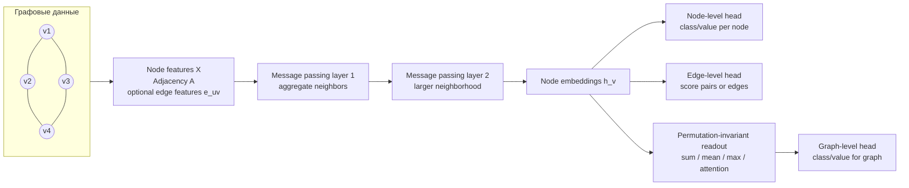

# Graph Data and Graph Neural Networks

Source: `DL_exam.pdf`, Question 56

Original question:

> Графы как данные и GNN. Node/edge/graph-level задачи, message passing, агрегация соседей, примеры GCN/GraphSAGE/GAT.

## Интуиция

Граф нужен, когда объект нельзя удобно описать как независимый вектор, последовательность или регулярную картинку: важны сущности и связи между ними. Вершины могут быть пользователями, атомами, словами, страницами или станциями; ребра - дружбой, химической связью, зависимостью, ссылкой или дорогой. У графа нет фиксированного порядка вершин, поэтому модель должна работать одинаково при любой перенумерации узлов.

`Graph Neural Network` учит представления вершин, ребер или всего графа, многократно обмениваясь информацией между соседями. Центральная идея - `message passing`: каждая вершина собирает сообщения от соседних вершин, агрегирует их инвариантной к порядку операцией, обновляет свое состояние и после нескольких слоев содержит информацию из локальной окрестности.

После $L$ слоев представление вершины обычно зависит от ее $L$-hop neighborhood. Поэтому GNN можно понимать как обобщение сверточной сети на нерегулярные структуры: вместо фиксированного окна пикселей используется множество соседей в графе.

## Что нужно сказать на экзамене

- Граф задается как $G=(V,E)$, где $V$ - вершины, $E$ - ребра; часто есть матрица признаков вершин $X \in \mathbb{R}^{N \times F}$, adjacency matrix $A \in \{0,1\}^{N \times N}$ и, возможно, признаки ребер $e_{ij}$.
- Графы могут быть directed/undirected, weighted/unweighted, homogeneous/heterogeneous, static/dynamic.
- Основные уровни задач:
  - `node-level`: предсказать метку или значение для вершины;
  - `edge-level`: предсказать наличие, тип или вес ребра;
  - `graph-level`: предсказать свойство всего графа.
- GNN должна уважать симметрии графа: node embeddings должны быть permutation equivariant, а graph embedding - permutation invariant.
- Общая схема message passing:

$$
m_v^{(l)}=\operatorname{AGG}^{(l)}\left(\left\{
\phi^{(l)}(h_v^{(l)},h_u^{(l)},e_{uv}) : u \in \mathcal{N}(v)
\right\}\right),
$$

$$
h_v^{(l+1)}=\psi^{(l)}(h_v^{(l)},m_v^{(l)}).
$$

- Агрегация соседей должна не зависеть от порядка: sum, mean, max, attention-weighted sum.
- `GCN` использует нормализованное усреднение соседей:

$$
H^{(l+1)}=\sigma\left(\tilde{D}^{-\frac{1}{2}}\tilde{A}\tilde{D}^{-\frac{1}{2}}H^{(l)}W^{(l)}\right),
$$

где $\tilde{A}=A+I$.

- `GraphSAGE` делает inductive learning: агрегирует признаки sampled neighbors и может применяться к новым вершинам/графам.
- `GAT` использует attention coefficients $\alpha_{ij}$, чтобы разные соседи имели разные веса.
- Для graph-level задачи после GNN нужен `readout`: $h_G=\operatorname{READOUT}(\{h_v^{(L)}:v\in V\})$.
- Ограничения: локальность, oversmoothing при большой глубине, oversquashing, трудность heterophily, стоимость на больших графах.

## Подробный ответ

Граф как данные описывает набор объектов и отношений между ними. Пусть $N=|V|$ - число вершин. В простом случае вход GNN:

$$
G=(V,E), \qquad X=[x_1,\dots,x_N]^T \in \mathbb{R}^{N \times F}, \qquad A \in \mathbb{R}^{N \times N}.
$$

Если ребро $(i,j)$ существует, то $A_{ij}=1$ или $A_{ij}=w_{ij}$ для weighted graph. Для undirected graph обычно $A=A^T$, для directed graph направления хранятся явно. В молекулярных графах могут быть признаки атомов $x_i$ и признаки связей $e_{ij}$; в социальных сетях - признаки пользователей и типы взаимодействий; в knowledge graphs - типизированные relation edges.

Ключевая особенность графов - отсутствие канонического порядка вершин. Если перенумеровать вершины permutation matrix $P$, то adjacency и признаки станут $PAP^T$ и $PX$. Корректная node-level модель должна давать соответственно перенумерованные embeddings:

$$
f(PAP^T,PX)=P f(A,X).
$$

Это свойство называется `permutation equivariance`. Для graph-level предсказания порядок вершин вообще не должен влиять на результат:

$$
g(PAP^T,PX)=g(A,X),
$$

то есть нужен `permutation invariant` readout.

### Уровни задач

| Уровень | Что предсказываем | Примеры | Типичный выход |
|---|---|---|---|
| Node-level | Метку/значение для каждой вершины | классификация документов в citation network, роль пользователя, тип атома | $\hat{y}_v=f(h_v)$ |
| Edge-level | Метку, вес или вероятность ребра | link prediction, рекомендация, тип связи | $\hat{y}_{uv}=f(h_u,h_v,e_{uv})$ |
| Graph-level | Свойство всего графа | токсичность молекулы, класс программы, свойство сцены | $\hat{y}_G=f(h_G)$ |

В node classification часто часть вершин размечена, а граф известен целиком. Это `semi-supervised transductive` постановка: модель использует структуру всего графа, но loss считается только по размеченным вершинам. В `inductive` постановке модель должна обобщаться на новые вершины или новые графы, которых не было при обучении.

### Message passing

Большинство GNN можно записать как последовательность message passing слоев. Начальное состояние вершины:

$$
h_v^{(0)}=x_v.
$$

На слое $l$ вершина $v$ получает сообщения от соседей $u \in \mathcal{N}(v)$:

$$
m_{uv}^{(l)}=\phi^{(l)}(h_v^{(l)},h_u^{(l)},e_{uv}),
$$

агрегирует их:

$$
m_v^{(l)}=\operatorname{AGG}^{(l)}(\{m_{uv}^{(l)}:u\in\mathcal{N}(v)\}),
$$

и обновляет свое представление:

$$
h_v^{(l+1)}=\psi^{(l)}(h_v^{(l)},m_v^{(l)}).
$$

Функции $\phi$ и $\psi$ обычно являются линейными слоями, MLP, gated update или attention mechanism. Операция $\operatorname{AGG}$ должна работать с множеством соседей, а не с последовательностью, поэтому используют `sum`, `mean`, `max` или attention-weighted sum. `Sum` часто выразительнее, потому что сохраняет информацию о числе соседей; `mean` стабилизирует масштаб при разных степенях; `max` выбирает наиболее сильные признаки; attention учит веса соседей.

После одного слоя вершина знает о своих непосредственных соседях. После двух слоев - о соседях соседей. После $L$ слоев receptive field равен примерно $L$-hop neighborhood. Это полезно, но создает компромисс: большая глубина расширяет контекст, но может приводить к oversmoothing и вычислительным проблемам.

### GCN

`Graph Convolutional Network` - базовый пример GNN, в котором сообщения от соседей усредняются с нормировкой по степеням. Добавляют self-loops, чтобы вершина сохраняла собственные признаки:

$$
\tilde{A}=A+I.
$$

Пусть $\tilde{D}$ - diagonal degree matrix для $\tilde{A}$:

$$
\tilde{D}_{ii}=\sum_j \tilde{A}_{ij}.
$$

Тогда слой GCN:

$$
H^{(l+1)}=\sigma\left(\tilde{D}^{-\frac{1}{2}}\tilde{A}\tilde{D}^{-\frac{1}{2}}H^{(l)}W^{(l)}\right).
$$

Здесь $H^{(l)} \in \mathbb{R}^{N \times d_l}$ - матрица embeddings всех вершин, $W^{(l)}$ - обучаемая матрица, $\sigma$ - нелинейность. Симметричная нормировка $\tilde{D}^{-\frac{1}{2}}\tilde{A}\tilde{D}^{-\frac{1}{2}}$ нужна, чтобы вершины с большой степенью не доминировали и чтобы масштаб признаков был устойчивее.

Для node classification после последнего слоя получают logits:

$$
Z=\operatorname{softmax}(H^{(L)}W_{\text{out}}),
$$

и минимизируют cross-entropy по размеченным вершинам:

$$
\mathcal{L}_{\text{node}}=-\sum_{v\in V_{\text{train}}}\sum_c y_{vc}\log \hat{y}_{vc}.
$$

GCN хорошо подходит для homophily graphs, где связанные вершины часто имеют похожие метки или признаки. Слабость: фиксированная нормировка и одинаковый тип усреднения для всех соседей; модель не различает важность соседей так гибко, как attention.

### GraphSAGE

`GraphSAGE` делает акцент на inductive learning. Вместо обучения отдельного embedding для каждой вершины он учит функции агрегации, которая может применяться к новым вершинам. Общая форма:

$$
h_{\mathcal{N}(v)}^{(l)}=
\operatorname{AGG}^{(l)}(\{h_u^{(l)}:u\in\mathcal{N}(v)\}),
$$

$$
h_v^{(l+1)}=
\sigma\left(W^{(l)}\cdot
\operatorname{CONCAT}(h_v^{(l)},h_{\mathcal{N}(v)}^{(l)})\right).
$$

После обновления embeddings часто нормируют:

$$
h_v^{(l+1)} \leftarrow \frac{h_v^{(l+1)}}{\|h_v^{(l+1)}\|_2}.
$$

Агрегатор может быть mean, max-pooling через MLP, LSTM-aggregator или другой permutation-aware вариант. На больших графах GraphSAGE обычно sample-ит фиксированное число соседей на каждом слое. Это уменьшает стоимость, но добавляет sampling variance и может пропустить важные связи.

Главное отличие от классической transductive постановки: GraphSAGE не обязан хранить embedding каждой вершины как параметр. Он учит, как строить embedding из признаков и локальной структуры, поэтому может обобщаться на новые вершины при наличии их признаков и соседей.

### GAT

`Graph Attention Network` заменяет равномерное усреднение на learned attention. Сначала вершины линейно проецируются:

$$
z_i=W h_i.
$$

Для ребра $(i,j)$ вычисляется attention score:

$$
e_{ij}=\operatorname{LeakyReLU}(a^T[z_i \Vert z_j]).
$$

Затем scores нормируются softmax по соседям вершины $i$:

$$
\alpha_{ij}=
\frac{\exp(e_{ij})}
{\sum_{k\in\mathcal{N}(i)}\exp(e_{ik})}.
$$

Обновление:

$$
h_i'=\sigma\left(\sum_{j\in\mathcal{N}(i)}\alpha_{ij}W h_j\right).
$$

Часто используют `multi-head attention`: несколько attention heads независимо считают представления, затем их конкатенируют или усредняют. Преимущество GAT - модель может назначать разную важность разным соседям и не требует заранее заданной degree normalization в таком же виде, как GCN. Недостаток - attention дороже по памяти и времени на графах с большим числом ребер, а learned attention weights не всегда являются надежным объяснением.

### Readout и выходы модели

Для node-level задачи используют embeddings отдельных вершин $h_v^{(L)}$. Для edge-level задачи обычно строят признак пары:

$$
s_{uv}=f_{\text{edge}}([h_u^{(L)} \Vert h_v^{(L)} \Vert e_{uv}]),
$$

или для link prediction используют dot product:

$$
\hat{p}_{uv}=\sigma((h_u^{(L)})^T h_v^{(L)}).
$$

Для graph-level задачи нужен readout по всем вершинам:

$$
h_G=\operatorname{READOUT}(\{h_v^{(L)}:v\in V\}),
$$

где $\operatorname{READOUT}$ может быть sum/mean/max pooling, attention pooling, Set2Set или hierarchical pooling. Важно, чтобы readout был invariant к перестановке вершин.

## Формулы / алгоритмы

Общая message passing схема:

$$
h_v^{(0)}=x_v,
$$

$$
m_{uv}^{(l)}=\phi^{(l)}(h_v^{(l)},h_u^{(l)},e_{uv}),
$$

$$
m_v^{(l)}=\operatorname{AGG}^{(l)}(\{m_{uv}^{(l)}:u\in\mathcal{N}(v)\}),
$$

$$
h_v^{(l+1)}=\psi^{(l)}(h_v^{(l)},m_v^{(l)}).
$$

Алгоритм обучения GNN для node classification:

1. Вход: граф $G=(V,E)$, признаки $X$, метки $Y$ для $V_{\text{train}}$, число слоев $L$.
2. Инициализировать $H^{(0)}=X$.
3. Для каждого слоя $l=0,\dots,L-1$ собрать сообщения от соседей, агрегировать их и обновить $H^{(l+1)}$.
4. Для каждой размеченной вершины получить logits $\hat{y}_v=f_{\text{out}}(h_v^{(L)})$.
5. Минимизировать supervised loss, например cross-entropy по $V_{\text{train}}$.
6. Обновлять параметры message, aggregation/update и output head через backpropagation.

Слой GCN:

$$
H^{(l+1)}=\sigma\left(\tilde{D}^{-\frac{1}{2}}\tilde{A}\tilde{D}^{-\frac{1}{2}}H^{(l)}W^{(l)}\right),
\qquad \tilde{A}=A+I.
$$

Слой GraphSAGE с mean aggregator:

$$
h_{\mathcal{N}(v)}^{(l)}=\frac{1}{|\mathcal{N}(v)|}\sum_{u\in\mathcal{N}(v)}h_u^{(l)},
$$

$$
h_v^{(l+1)}=
\sigma\left(W^{(l)}[h_v^{(l)} \Vert h_{\mathcal{N}(v)}^{(l)}]\right).
$$

Слой GAT:

$$
\alpha_{ij}=\operatorname{softmax}_{j\in\mathcal{N}(i)}
\left(\operatorname{LeakyReLU}(a^T[Wh_i \Vert Wh_j])\right),
$$

$$
h_i'=\sigma\left(\sum_{j\in\mathcal{N}(i)}\alpha_{ij}Wh_j\right).
$$

Типичные objectives:

| Задача | Objective |
|---|---|
| Node classification | $\mathcal{L}=-\sum_{v\in V_{\text{train}}}\sum_c y_{vc}\log \hat{y}_{vc}$ |
| Edge/link prediction | binary cross-entropy для существующих и negative sampled ребер |
| Graph classification | cross-entropy по графам: $\mathcal{L}=-\sum_G\sum_c y_{Gc}\log \hat{y}_{Gc}$ |
| Graph regression | MSE/MAE по целевому свойству графа |

Сложность одного message passing слоя обычно $O(|E|d + |V|d^2)$ или $O(|E|d_{\text{in}}d_{\text{out}})$ в зависимости от реализации. На практике стоимость доминируется обработкой ребер и sampling/batching на больших графах.

## Диаграмма или изображение

Mermaid-схема показывает локальный обмен сообщениями, получение node embeddings и три основных типа выходов. Внешние изображения не использовались.

## Быстрая устная версия

Графовые данные - это вершины, ребра и их признаки, где порядок вершин не должен влиять на ответ. GNN строит embeddings через message passing: каждая вершина получает сообщения от соседей, агрегирует их permutation-invariant операцией вроде sum/mean/max/attention и обновляет свое состояние. После $L$ слоев вершина содержит информацию из $L$-hop окрестности.

Задачи бывают node-level, edge-level и graph-level. Для node-level классифицируем каждую вершину, для edge-level предсказываем связь или тип ребра, для graph-level делаем readout по вершинам и предсказываем свойство всего графа. GCN использует нормализованное усреднение соседей, GraphSAGE учит inductive aggregation и часто sample-ит соседей, GAT добавляет attention weights для соседей. Главные ограничения - локальность, oversmoothing, oversquashing, heterophily и масштабирование на больших графах.

## Возможные уточняющие вопросы

- Чем graph-level задача отличается от node-level?
  - В node-level выход делается для каждой вершины $h_v$; в graph-level сначала получают общий embedding $h_G$ через permutation-invariant readout, затем предсказывают свойство всего графа.

- Почему агрегация соседей должна быть permutation invariant?
  - У множества соседей нет естественного порядка. Если переупорядочить соседей, embedding вершины не должен измениться.

- Что значит permutation equivariance для GNN?
  - Если перенумеровать вершины во входном графе, node embeddings и node predictions должны перенумероваться тем же образом, а не измениться произвольно.

- Зачем в GCN добавляют self-loops?
  - Чтобы при обновлении вершина использовала не только признаки соседей, но и свое старое представление.

- Зачем нужна нормировка $\tilde{D}^{-\frac{1}{2}}\tilde{A}\tilde{D}^{-\frac{1}{2}}$?
  - Она стабилизирует масштаб сообщений и компенсирует разные степени вершин, чтобы high-degree вершины не доминировали неконтролируемо.

- Чем GraphSAGE отличается от GCN?
  - GraphSAGE явно учит функцию агрегации локальных признаков и рассчитан на inductive setting; также часто использует neighbor sampling.

- В чем преимущество GAT?
  - GAT учит разные веса для разных соседей через attention, поэтому не обязан усреднять всех соседей одинаково.

- Почему много GNN слоев не всегда хорошо?
  - При большой глубине embeddings соседних вершин могут стать слишком похожими (`oversmoothing`), а много информации из большой окрестности может сжиматься в фиксированный вектор (`oversquashing`).

- Что такое homophily и почему оно важно?
  - Homophily означает, что связанные вершины часто имеют похожие метки или признаки. GCN-подобные модели особенно хорошо работают в такой ситуации, потому что сглаживают представления по соседям.

## Частые ошибки

- Думать, что граф можно подавать в сеть как обычную последовательность вершин без учета permutation invariance/equivariance.
- Путать adjacency matrix $A$ и матрицу признаков $X$: $A$ задает структуру, $X$ задает признаки узлов.
- Забывать self-loops в GCN и из-за этого терять собственные признаки вершины при обновлении.
- Называть любую агрегацию сверточной, не объясняя, что на графе нет фиксированного grid-neighborhood как в CNN.
- Считать, что после одного message passing слоя вершина видит весь граф; на самом деле обычно только ближайших соседей.
- Путать transductive и inductive setting: в transductive граф известен при обучении, в inductive модель должна работать на новых вершинах или графах.
- Считать attention weights в GAT строгим объяснением причинности; это обучаемые веса агрегации, но не гарантированная интерпретация.
- Игнорировать edge features и direction, хотя для многих графов типы и направления ребер принципиальны.
- Использовать mean pooling для graph-level задачи, не замечая, что он может терять информацию о размере графа; sum сохраняет масштаб, но может хуже нормироваться.
- Не упоминать практические ограничения GNN: oversmoothing, oversquashing, heterophily и стоимость обработки больших графов.
