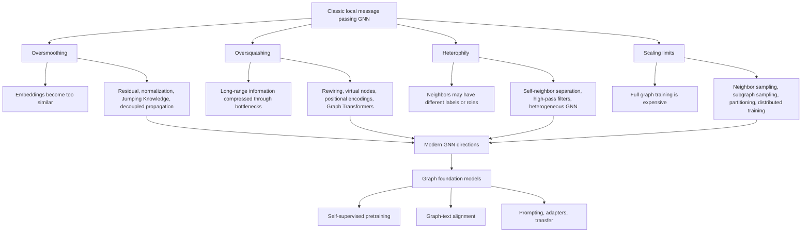

# GNN Problems and Modern Directions

Source: `DL_exam.pdf`, Question 57

Original question:

> Проблемы и современные направления GNN. Oversmoothing, oversquashing, heterophily, масштабирование и graph foundation models.

## Интуиция

Классическая GNN из [[56 - Graph Data and Graph Neural Networks]] строит представление вершины через многократный обмен сообщениями с соседями. Это хорошо работает, когда граф гомофилен: связанные вершины похожи по признакам или меткам. Но та же идея создает основные проблемы: при слишком большом числе слоев все вершины становятся похожими (`oversmoothing`), дальняя информация сжимается в вектор фиксированной размерности (`oversquashing`), а при `heterophily` сосед может быть не похож, а противоположен по смыслу.

Современные направления GNN пытаются ослабить эти ограничения: лучше контролировать распространение сообщений, добавлять структурные и позиционные признаки, использовать `Graph Transformers`, масштабировать обучение на огромные графы через sampling и partitioning, а также обучать универсальные `graph foundation models`, которые переносятся между разными графами и задачами.

## Что нужно сказать на экзамене

- `Oversmoothing`: при глубоком message passing представления вершин сходятся к похожим векторам; это связано с повторным Laplacian smoothing и смешиванием по графу.
- `Oversquashing`: экспоненциально растущая информация из дальних окрестностей сжимается в вектор фиксированной размерности через узкие graph bottlenecks.
- `Heterophily`: ребра часто соединяют вершины разных классов; простая агрегация соседей усредняет несовместимые сигналы.
- Для `oversmoothing` помогают residual/skip connections, normalization, jumping knowledge, APPNP/PPR, ограничение глубины, decoupled propagation.
- Для `oversquashing` помогают rewiring, positional/structural encodings, attention, graph transformers, виртуальные вершины, увеличение receptive field без длинных цепочек message passing.
- Для `heterophily` помогают модели с ego-features, разделением self/neighbor signals, high-pass/low-pass фильтрами, signed/relational message passing, агрегацией дальних соседей.
- Масштабирование требует mini-batch training: neighbor sampling, subgraph sampling, cluster/partition methods, sparse kernels, caching, distributed training.
- `Graph foundation models`: предобученные модели для графов через masked prediction, contrastive learning, generative objectives, instruction/prompt tuning; цель - перенос между задачами, доменами и графами.
- Главное ограничение современных GNN: нет одного универсального решения; качество сильно зависит от структуры графа, типа задачи, признаков, протокола split и утечек данных.

## Подробный ответ

Пусть есть граф $G=(V,E)$, матрица признаков $X \in \mathbb{R}^{|V| \times d}$ и GNN-слой вида:

$$
h_v^{(l+1)} = \sigma \left( W_{\text{self}} h_v^{(l)} + \operatorname{AGG}_{u \in \mathcal{N}(v)} W_{\text{msg}} h_u^{(l)} \right).
$$

После $L$ слоев вершина $v$ получает информацию из $L$-hop окрестности. Это и есть сильная сторона GNN, но почти все проблемы ниже являются побочными эффектами такого локального message passing.

### Oversmoothing

`Oversmoothing` означает, что при увеличении числа слоев эмбеддинги разных вершин становятся слишком похожими, поэтому классификатор перестает различать классы. В линейном GCN без нелинейностей и с одной и той же нормализованной матрицей распространения:

$$
H^{(L)} = \hat{A}^L X W,
$$

где $\hat{A}$ - нормализованная матрица смежности с self-loops. Повторное умножение на $\hat{A}$ похоже на сглаживание по графу: признаки усредняются с соседями. На связном графе при больших $L$ представления стремятся к низкоразмерному подпространству, связанному с ведущими собственными векторами $\hat{A}$. Интуитивно вершины теряют индивидуальность.

Важно не путать `oversmoothing` с `overfitting`. `Oversmoothing` - это деградация выразительности из-за архитектуры и распространения по графу; она может возникать даже без переобучения.

Типичные способы борьбы:

| Метод | Идея | Ограничение |
|---|---|---|
| Residual/skip connections | сохранять старые признаки | не устраняет плохую агрегацию полностью |
| Normalization, PairNorm, GraphNorm | контролировать масштаб и разброс embeddings | требует подбора и может менять геометрию признаков |
| Jumping Knowledge | объединять представления разных глубин | увеличивает память и параметры |
| APPNP/PPR propagation | decoupled prediction and propagation | сильная зависимость от коэффициента teleport |
| DropEdge | случайно удалять ребра при обучении | может ухудшить сигнал на разреженных графах |

### Oversquashing

`Oversquashing` - это сжатие большого количества информации из дальних частей графа в вектор фиксированной размерности. Даже если модель не сглаживает все признаки, дальние зависимости могут не проходить через графовые bottlenecks.

Пример: две вершины находятся далеко, но метка одной зависит от признаков другой. Чтобы сигнал дошел через message passing, он должен пройти через цепочку промежуточных вершин. Если через одну вершину проходит много путей, она становится информационным узким местом. Размер $h_v^{(l)} \in \mathbb{R}^d$ фиксирован, а число потенциально релевантных вершин в $L$-hop окрестности может расти экспоненциально.

Формально проблему связывают с чувствительностью $h_v^{(L)}$ к признакам далекой вершины $x_u$:

$$
\left\lVert \frac{\partial h_v^{(L)}}{\partial x_u} \right\rVert
$$

Эта величина часто быстро убывает с graph distance $\operatorname{dist}(u,v)$, особенно при плохой connectivity, высокой кривизне или bottleneck-структурах.

Способы борьбы:

- `Graph rewiring`: добавлять или менять ребра, чтобы уменьшить эффективные расстояния и bottlenecks.
- `Positional encodings`: добавлять Laplacian eigenvectors, random walk features, shortest-path distances или role encodings.
- `Graph Transformers`: разрешать более глобальное attention-взаимодействие, а не только локальные соседства.
- `Virtual node`: добавлять глобальную вершину, через которую граф быстро обменивается информацией.
- Иерархические модели и pooling: передавать дальнюю информацию через coarse graph.

### Heterophily

`Homophily` означает, что связанные вершины часто имеют одинаковые или близкие метки. Многие GCN-подобные модели неявно предполагают homophily: если сосед похож на меня, его признаки полезно усреднять.

`Heterophily` означает обратное: ребра часто соединяют разные классы. Например, в графе "покупатель - товар" или "слово - документ" соседняя вершина может иметь другой тип и другую метку. Простое усреднение соседей тогда смешивает несовместимые сигналы.

Уровень homophily часто оценивают как:

$$
h_{\text{edge}} = \frac{|\{(u,v)\in E : y_u = y_v\}|}{|E|}.
$$

Если $h_{\text{edge}}$ низкий, обычный GCN может ухудшать признаки. Но низкая homophily не всегда означает, что граф бесполезен: полезной может быть структура ролей, типы ребер, дальние шаблоны или соотношения классов в окрестности.

Подходы к heterophily:

- Разделять self-features и neighbor-features, чтобы не затирать собственный сигнал вершины.
- Использовать higher-order neighborhoods: вершины одного класса могут быть похожи не среди 1-hop соседей, а среди 2-hop или 3-hop соседей.
- Применять filter-based модели: не только low-pass smoothing, но и high-pass или band-pass фильтры.
- Учитывать типы вершин и ребер: heterogeneous GNN, relational GCN, metapaths.
- Использовать attention или gating, чтобы выбирать полезных соседей, а не усреднять всех.

### Масштабирование GNN

Для полного batch-обучения один GNN-слой стоит примерно:

$$
O(|E|d + |V|d^2),
$$

где $d$ - размер hidden state. Для больших графов это дорого по памяти и времени. Дополнительная проблема - neighborhood explosion: при sampling fanout $s$ и глубине $L$ число выбранных вершин для одного batch может быть порядка $O(s^L)$.

Основные техники масштабирования:

| Подход | Что делает | Пример |
|---|---|---|
| Neighbor sampling | выбирает фиксированное число соседей на слой | GraphSAGE-style training |
| Layer-wise sampling | сэмплирует вершины/ребра по слоям | FastGCN, LADIES-подходы |
| Subgraph sampling | обучает на подграфах | GraphSAINT-подобные методы |
| Cluster/partition training | разбивает граф на кластеры | Cluster-GCN |
| Cached propagation | заранее считает часть распространения | decoupled GNN |
| Distributed training | делит граф и параметры между машинами | крупные recommendation/social graphs |

Практические caveats:

- Sampling добавляет дисперсию и может терять редкие, но важные связи.
- Partitioning может разрывать межкластерные ребра.
- Для inference часто все равно нужно прогнать модель по большому графу.
- В transductive split легко получить data leakage, если признаки или ребра из test-части используются некорректно.
- На динамических графах нужно учитывать обновление ребер, признаков и embeddings.

### Graph Foundation Models

`Graph foundation model` - это большая предобученная модель для графовых данных, которую можно адаптировать к разным задачам: node classification, link prediction, graph classification, retrieval, recommendation, molecular property prediction, knowledge graph reasoning.

Типичные идеи:

- `Self-supervised pretraining`: masked node/edge/attribute prediction, reconstruction, contrastive learning между augmentations графа.
- `Generative graph modeling`: моделировать распределение графов, подграфов, молекул или последовательностей действий построения графа.
- `Graph-text alignment`: связывать графовые объекты с текстовыми описаниями, например для молекул, документов, знаний.
- `Prompting and adapters`: адаптировать предобученный backbone малым числом параметров.
- `Graph Transformer backbones`: использовать attention, structural encodings и типы ребер для более универсальной архитектуры.

Главная сложность в том, что графы менее унифицированы, чем текст: разные домены имеют разные типы вершин, ребер, признаки, масштабы, directed/undirected структуру и задачи. Поэтому "foundation" для графов обычно требует явного описания схемы, структурных признаков и аккуратной адаптации.

Современные направления также включают temporal GNN, heterogeneous GNN, neural-symbolic graph reasoning, better graph benchmarks, uncertainty calibration, объяснимость, robustness к adversarial edges и интеграцию GNN с LLM/MLLM для работы с knowledge graphs, recommender systems и научными данными.

## Формулы / алгоритмы

### Общий message passing

Вход:

- граф $G=(V,E)$;
- признаки вершин $X$ и, если есть, признаки ребер $e_{uv}$;
- число слоев $L$;
- задача: node/edge/graph-level prediction.

Один слой:

$$
m_v^{(l)} = \operatorname{AGG}_{u \in \mathcal{N}(v)} \phi_{\theta}^{(l)}(h_v^{(l)}, h_u^{(l)}, e_{uv}),
$$

$$
h_v^{(l+1)} = \psi_{\theta}^{(l)}(h_v^{(l)}, m_v^{(l)}).
$$

Выход: embeddings $h_v^{(L)}$ или graph embedding $h_G$ для downstream-предсказания.

### Диагностика проблем

1. Проверить глубину и качество по слоям: если performance падает при росте $L$, возможны `oversmoothing` или `oversquashing`.
2. Измерить similarity embeddings между вершинами разных классов. Рост cosine similarity может указывать на `oversmoothing`.
3. Оценить homophily:

$$
h_{\text{edge}} = \frac{1}{|E|}\sum_{(u,v)\in E} \mathbf{1}[y_u=y_v].
$$

4. Проверить long-range dependencies: если задача требует дальнего контекста, локальная GNN может страдать от `oversquashing`.
5. Сравнить с baselines: MLP на признаках, label propagation, simple GCN, GraphSAGE, GAT, Transformer/rewiring model.

### Мини-batch neighbor sampling

Цель: приблизить full-batch message passing без загрузки всего графа.

Вход: batch целевых вершин $B$, fanouts $s_1,\dots,s_L$, граф $G$, признаки $X$.

Процедура:

1. Начать с $S_L = B$.
2. Для слоя $l=L,L-1,\dots,1$ выбрать до $s_l$ соседей для каждой вершины из $S_l$.
3. Получить множество $S_{l-1}$, содержащее выбранных соседей и текущие вершины.
4. Выполнить forward message passing от $S_0$ к $B$.
5. Посчитать loss только на целевых вершинах batch.
6. Обновить параметры через backpropagation.

Сложность для одного batch примерно растет как $O(|B| \prod_{l=1}^{L} s_l)$ по числу sampled nodes, поэтому большие fanout и depth быстро становятся дорогими.

## Диаграмма или изображение

Внешние изображения не использованы.

## Быстрая устная версия

Главные проблемы GNN идут из локального message passing. При большой глубине возникает `oversmoothing`: вершины многократно усредняют признаки с соседями, и embeddings становятся почти одинаковыми. `Oversquashing` - другая проблема: дальняя информация должна пройти через узкие места графа и сжимается в hidden vector фиксированного размера. `Heterophily` ломает предположение GCN о том, что соседи похожи: если соседние вершины разных классов, простая агрегация вредна.

Решения: residual connections, normalization, Jumping Knowledge и decoupled propagation против oversmoothing; rewiring, positional encodings, virtual nodes и Graph Transformers против oversquashing; high-pass filters, разделение self/neighbor сигналов и heterogeneous GNN для heterophily. Для больших графов используют sampling, subgraph/cluster training, sparse и distributed вычисления. Современное направление - `graph foundation models`: предобученные графовые модели с masked/contrastive/generative objectives, graph-text alignment и адаптацией через prompts или adapters.

## Возможные уточняющие вопросы

- Чем `oversmoothing` отличается от `oversquashing`?  
  `Oversmoothing` делает представления вершин слишком похожими; `oversquashing` не дает дальним сигналам пройти через ограниченную пропускную способность графа и hidden state.

- Почему глубокая GCN может ухудшаться?  
  Каждый слой сглаживает признаки по соседям. При повторении сглаживание приближает embeddings к стационарному подпространству и стирает различия между вершинами.

- Почему heterophily сложна для GCN?  
  GCN похож на low-pass filter: он усиливает сходство соседей. При heterophily полезный сигнал может быть в различии, роли или дальнем паттерне, а не в похожести 1-hop соседей.

- Что такое graph rewiring?  
  Это изменение структуры графа: добавление, удаление или переоценка ребер, чтобы улучшить распространение информации и уменьшить bottlenecks.

- Почему Graph Transformer может помочь?  
  Attention позволяет связывать вершины не только через локальные ребра, а structural/positional encodings помогают сохранить информацию о графовой структуре.

- В чем трудность graph foundation models по сравнению с LLM?  
  У текста есть относительно единая последовательная форма, а графы сильно различаются по типам вершин, ребер, признаков, доменам и задачам.

- Как масштабировать обучение GNN на большом графе?  
  Использовать neighbor sampling, subgraph sampling, partition/cluster training, sparse kernels, caching и distributed training; важно контролировать дисперсию sampling и потери межкластерных ребер.

## Частые ошибки

- Говорить, что `oversmoothing` - это просто overfitting. Это архитектурная проблема сглаживания, а не только проблема train/test gap.
- Считать, что больше слоев всегда лучше, потому что receptive field шире. На практике глубина усиливает smoothing, squashing и computational cost.
- Путать `oversquashing` с нехваткой параметров. Даже мощная функция обновления может плохо передавать дальнюю информацию из-за bottleneck-структуры графа.
- Думать, что низкая homophily делает граф бесполезным. Граф может кодировать роли, типы отношений и higher-order patterns.
- Применять GCN к heterogeneous graph без учета типов вершин и ребер.
- Оценивать GNN без MLP baseline: иногда признаки сами решают задачу, а графовая агрегация не помогает.
- Игнорировать split protocol. В graph ML легко получить data leakage через ребра, признаки, temporal ordering или preprocessing на всем графе.
- Называть любую большую GNN `foundation model`. Важны предобучение, переносимость, адаптация и работа на множестве задач или доменов.
