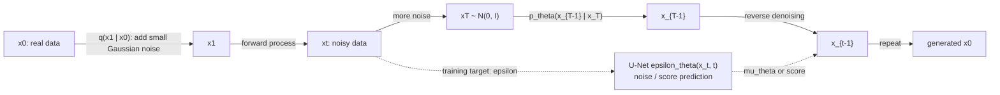

# Diffusion Models

Source: `DL_exam.pdf`, Question 58

Original question:

> Диффузионные модели. Генерация из шума, score matching, denoising diffusion, forward/reverse process, U-Net.

## Интуиция

Диффузионная модель учится генерировать данные, постепенно превращая простой шум в осмысленный объект. Во время обучения мы берем реальный пример $x_0$ и по известному `forward process` много раз добавляем к нему Gaussian noise, пока не получим почти чистый шум $x_T$. Затем нейросеть учится выполнять обратный шаг: по зашумленному $x_t$ и номеру шага $t$ предсказывать, как убрать часть шума и перейти к менее зашумленному $x_{t-1}$.

Главная идея: вместо того чтобы сразу породить сложное изображение из latent vector, модель решает последовательность более простых задач denoising. Это устойчиво обучается через supervised objective, потому что при искусственном зашумлении мы точно знаем добавленный шум. Связь со `score matching` в том, что предсказание шума эквивалентно оценке направления $\nabla_x \log p_t(x)$, то есть направления, куда надо сдвигать noisy sample, чтобы он стал более похож на данные.

## Что нужно сказать на экзамене

- Диффузионная модель задает два марковских процесса: фиксированный `forward process` $q(x_t \mid x_{t-1})$, который добавляет шум, и обучаемый `reverse process` $p_\theta(x_{t-1} \mid x_t)$, который шум убирает.
- В DDPM обычно используют расписание дисперсий $\beta_t$, $\alpha_t = 1 - \beta_t$, $\bar{\alpha}_t = \prod_{s=1}^t \alpha_s$.
- Прямое зашумление можно семплировать сразу:

$$
q(x_t \mid x_0) = \mathcal{N}(\sqrt{\bar{\alpha}_t}x_0, (1-\bar{\alpha}_t)I),
$$

$$
x_t = \sqrt{\bar{\alpha}_t}x_0 + \sqrt{1-\bar{\alpha}_t}\epsilon,\quad \epsilon \sim \mathcal{N}(0,I).
$$

- Нейросеть $\epsilon_\theta(x_t,t)$ часто учится предсказывать добавленный шум $\epsilon$:

$$
L_{\text{simple}}(\theta) = \mathbb{E}_{x_0,t,\epsilon}\left[\lVert \epsilon - \epsilon_\theta(x_t,t)\rVert_2^2\right].
$$

- Генерация начинается с $x_T \sim \mathcal{N}(0,I)$ и итеративно применяет reverse denoising до $x_0$.
- `Score matching`: score есть $\nabla_x \log p_t(x)$; для Gaussian corruption он связан с шумом:

$$
\nabla_{x_t}\log q(x_t \mid x_0) = -\frac{x_t-\sqrt{\bar{\alpha}_t}x_0}{1-\bar{\alpha}_t}
= -\frac{\epsilon}{\sqrt{1-\bar{\alpha}_t}}.
$$

Поэтому предсказывать шум значит предсказывать score с масштабным коэффициентом.
- В изображениях backbone обычно `U-Net`: encoder-decoder, skip connections, time embeddings, residual blocks, normalization, attention/self-attention на некоторых разрешениях.
- Плюсы: высокое качество и стабильное обучение. Минусы: медленный sampling при большом числе шагов, чувствительность к noise schedule, высокая вычислительная стоимость.

## Подробный ответ

Пусть данные имеют распределение $q_{\text{data}}(x_0)$. Диффузионная модель строит вероятностную генеративную модель с latent variables $x_1,\dots,x_T$. Прямой процесс не обучается: это заранее заданная цепочка, которая постепенно разрушает структуру данных:

$$
q(x_{1:T}\mid x_0)=\prod_{t=1}^{T} q(x_t\mid x_{t-1}),
$$

$$
q(x_t\mid x_{t-1})=\mathcal{N}(\sqrt{1-\beta_t}x_{t-1},\beta_t I).
$$

Если $\beta_t$ малы и $T$ достаточно велико, то $x_T$ близок к стандартному Gaussian noise. Удобное свойство DDPM: благодаря композиции Gaussian transitions можно получить $x_t$ из $x_0$ за один шаг через $\bar{\alpha}_t$. Это делает обучение эффективным: не нужно явно проходить все промежуточные состояния.

Обратный процесс моделируется нейросетью:

$$
p_\theta(x_{0:T}) = p(x_T)\prod_{t=1}^{T}p_\theta(x_{t-1}\mid x_t),
\quad p(x_T)=\mathcal{N}(0,I),
$$

$$
p_\theta(x_{t-1}\mid x_t)=\mathcal{N}(\mu_\theta(x_t,t),\Sigma_\theta(x_t,t)).
$$

Задача reverse process: приблизить истинное обратное распределение $q(x_{t-1}\mid x_t)$, которое недоступно без знания данных. При известном $x_0$ posterior имеет аналитический Gaussian вид:

$$
q(x_{t-1}\mid x_t,x_0)=\mathcal{N}(\tilde{\mu}_t(x_t,x_0),\tilde{\beta}_t I),
$$

$$
\tilde{\mu}_t(x_t,x_0)=
\frac{\sqrt{\bar{\alpha}_{t-1}}\beta_t}{1-\bar{\alpha}_t}x_0
+\frac{\sqrt{\alpha_t}(1-\bar{\alpha}_{t-1})}{1-\bar{\alpha}_t}x_t,
$$

$$
\tilde{\beta}_t=\frac{1-\bar{\alpha}_{t-1}}{1-\bar{\alpha}_t}\beta_t.
$$

На практике нейросеть может параметризовать reverse step несколькими способами:

| Параметризация | Что предсказывает сеть | Комментарий |
|---|---|---|
| $\epsilon$-prediction | шум $\epsilon$ | классический DDPM objective, простая supervised-регрессия |
| $x_0$-prediction | чистый sample $x_0$ | удобно для интерпретации и некоторых samplers |
| $v$-prediction | смешанную переменную $v$ | часто стабильнее при разных уровнях шума |
| score prediction | $\nabla_x \log p_t(x)$ | ближе к score-based generative modeling |

В классическом DDPM сеть предсказывает $\epsilon_\theta(x_t,t)$. Из этого можно восстановить оценку чистого изображения:

$$
\hat{x}_0(x_t,t)=\frac{x_t-\sqrt{1-\bar{\alpha}_t}\epsilon_\theta(x_t,t)}{\sqrt{\bar{\alpha}_t}}.
$$

После этого mean обратного Gaussian step можно записать через предсказанный шум:

$$
\mu_\theta(x_t,t)=
\frac{1}{\sqrt{\alpha_t}}
\left(
x_t-\frac{\beta_t}{\sqrt{1-\bar{\alpha}_t}}\epsilon_\theta(x_t,t)
\right).
$$

Один stochastic reverse step:

$$
x_{t-1} = \mu_\theta(x_t,t) + \sigma_t z,\quad z\sim\mathcal{N}(0,I),
$$

где обычно $\sigma_t^2$ берут равной $\tilde{\beta}_t$ или обучают/настраивают отдельно. На последнем шаге шум часто не добавляют.

### Связь с score matching

`Score matching` учит модель оценивать score распределения:

$$
s_\theta(x,t)\approx \nabla_x \log p_t(x).
$$

Обычный score matching для реального распределения неудобен, потому что неизвестна нормировочная константа и нет явной плотности данных. `Denoising score matching` решает это через известное зашумление: берем $x_0\sim q_{\text{data}}$, получаем $x_t$ из известного Gaussian kernel и учим сеть предсказывать score условного распределения $q(x_t\mid x_0)$ или эквивалентный шум.

Для DDPM:

$$
x_t-\sqrt{\bar{\alpha}_t}x_0=\sqrt{1-\bar{\alpha}_t}\epsilon,
$$

поэтому

$$
s_\theta(x_t,t)\approx -\frac{\epsilon_\theta(x_t,t)}{\sqrt{1-\bar{\alpha}_t}}.
$$

Интуитивно score показывает направление увеличения log-density noisy data distribution. В sampling это направление помогает двигаться от случайного Gaussian noise к областям пространства, где лежат реальные данные.

### Denoising diffusion и вариационная нижняя оценка

DDPM можно вывести как variational latent-variable model. Оптимизируется отрицательная ELBO:

$$
-\log p_\theta(x_0) \leq
\mathbb{E}_q\left[
D_{KL}(q(x_T\mid x_0)\Vert p(x_T))
+\sum_{t=2}^{T}D_{KL}(q(x_{t-1}\mid x_t,x_0)\Vert p_\theta(x_{t-1}\mid x_t))
-\log p_\theta(x_0\mid x_1)
\right].
$$

При фиксированных дисперсиях и Gaussian assumptions KL-термы сводятся к регрессии mean, а после перепараметризации получается простой loss на предсказание шума. Поэтому на экзамене важно сказать: простой MSE loss не произволен, а является практической упрощенной формой variational training objective.

### Роль U-Net

Для изображений $\epsilon_\theta(x_t,t)$ обычно реализуют как `U-Net`, потому что нужно предсказывать шум той же размерности, что и входное изображение. Архитектура сохраняет пространственную структуру:

- encoder постепенно уменьшает разрешение и увеличивает число каналов;
- bottleneck обрабатывает глобальный контекст;
- decoder восстанавливает разрешение;
- skip connections передают локальные детали из encoder в decoder;
- time embedding добавляется в residual blocks, чтобы сеть знала уровень шума $t$;
- attention/self-attention помогает учитывать дальние зависимости, особенно на средних и низких разрешениях;
- conditional diffusion может добавлять class embedding, text embedding или cross-attention.

U-Net не является математически обязательной частью diffusion, но это практический backbone, хорошо подходящий для dense prediction: на входе noisy image, на выходе pixel-wise/noise-wise prediction.

### Практические особенности

Noise schedule определяет, как быстро данные разрушаются. Если шум добавляется слишком резко, reverse task становится сложной; если слишком медленно, растет число шагов. Sampling может быть stochastic, как в DDPM, или более детерминированным/ускоренным, как в DDIM и других samplers. Качество обычно растет при большем числе шагов и более сильной модели, но inference становится дороже.

Диффузионные модели хорошо подходят для изображений, аудио, видео и других continuous/high-dimensional domains, потому что denoising objective локален и стабилен. Но они требуют много вычислений на обучении и генерации, а likelihood/качество/скорость зависят от параметризации, schedule и sampler.

## Формулы / алгоритмы

### Обучение DDPM

Цель: обучить $\epsilon_\theta(x_t,t)$ предсказывать шум, добавленный к реальному примеру.

Входы: dataset $x_0\sim q_{\text{data}}$, расписание $\{\beta_t\}_{t=1}^{T}$, модель $\epsilon_\theta$.

Выход: параметры $\theta$ denoising model.

Алгоритм:

1. Сэмплировать mini-batch реальных объектов $x_0$.
2. Сэмплировать шаги $t\sim \text{Uniform}\{1,\dots,T\}$.
3. Сэмплировать шум $\epsilon\sim\mathcal{N}(0,I)$.
4. Получить noisy sample:

$$
x_t=\sqrt{\bar{\alpha}_t}x_0+\sqrt{1-\bar{\alpha}_t}\epsilon.
$$

5. Посчитать loss:

$$
L(\theta)=\lVert \epsilon-\epsilon_\theta(x_t,t)\rVert_2^2.
$$

6. Обновить $\theta$ через backpropagation и optimizer, например Adam/AdamW.

Практическая сложность одного training step примерно как один forward/backward pass U-Net. Обучение устойчивое, потому что target $\epsilon$ известен точно.

### Генерация из шума

Цель: получить sample $x_0$ из learned reverse process.

Входы: trained $\epsilon_\theta$, schedule, начальный шум $x_T\sim\mathcal{N}(0,I)$.

Выход: сгенерированный объект $\hat{x}_0$.

Алгоритм:

1. Сэмплировать $x_T\sim\mathcal{N}(0,I)$.
2. Для $t=T,T-1,\dots,1$:
   - предсказать шум $\epsilon_\theta(x_t,t)$;
   - вычислить mean $\mu_\theta(x_t,t)$;
   - если $t>1$, сэмплировать $z\sim\mathcal{N}(0,I)$, иначе взять $z=0$;
   - получить $x_{t-1}=\mu_\theta(x_t,t)+\sigma_t z$.
3. Вернуть $x_0$ или декодированное/denormalized изображение.

Основная цена generation: нужно много последовательных вызовов U-Net. Поэтому ускорение sampling является отдельной важной темой.

## Диаграмма или изображение

Внешние изображения не использовались; схема создана как встроенная Mermaid-диаграмма.

## Быстрая устная версия

Диффузионная модель задает прямой процесс, который постепенно превращает данные $x_0$ в Gaussian noise $x_T$, и обучает обратный процесс, который из шума восстанавливает данные. В DDPM forward process фиксирован: $q(x_t\mid x_{t-1})=\mathcal{N}(\sqrt{1-\beta_t}x_{t-1},\beta_t I)$, а $x_t$ можно получить сразу как $\sqrt{\bar{\alpha}_t}x_0+\sqrt{1-\bar{\alpha}_t}\epsilon$. Нейросеть, обычно U-Net, получает $x_t$ и $t$ и учится предсказывать добавленный шум $\epsilon$ через MSE. При генерации начинаем с $x_T\sim\mathcal{N}(0,I)$ и много раз применяем reverse denoising. Связь со score matching: предсказание шума эквивалентно оценке score $\nabla_x\log p_t(x)$ с масштабом $-1/\sqrt{1-\bar{\alpha}_t}$.

## Возможные уточняющие вопросы

- Что такое score?  
  Score -- это градиент log-density по входу: $s(x)=\nabla_x\log p(x)$. Он показывает направление, в котором sample становится более вероятным.

- Почему можно обучаться с MSE на шум?  
  Потому что при искусственном forward corruption добавленный шум $\epsilon$ известен, а variational objective DDPM при Gaussian assumptions сводится к регрессии параметров reverse Gaussian, которую удобно переписать как $\epsilon$-prediction.

- Почему $x_T$ становится Gaussian noise?  
  На каждом шаге данные умножаются на $\sqrt{\alpha_t}<1$ и добавляется Gaussian noise. При большом $T$ и подходящем schedule вклад $x_0$ через $\sqrt{\bar{\alpha}_T}$ почти исчезает.

- Чем forward process отличается от reverse process?  
  Forward process фиксирован и известен: он добавляет шум. Reverse process обучается: он приближает неизвестное распределение удаления шума.

- Зачем U-Net нужны skip connections?  
  Они передают локальные spatial details из encoder в decoder, чтобы сеть могла восстанавливать мелкие структуры при предсказании шума.

- Что будет, если убрать time embedding?  
  Сеть не будет знать уровень шума. Одинаковый $x_t$-формат на разных $t$ требует разного denoising behavior, поэтому качество резко ухудшится.

- Диффузия обязательно stochastic?  
  Классический DDPM sampling stochastic, но есть deterministic или partially deterministic samplers, например DDIM-style sampling.

- В чем отличие от GAN?  
  GAN учит generator через adversarial loss и сразу генерирует sample, а diffusion учит последовательное denoising с likelihood/ELBO-интерпретацией и обычно более стабильным обучением, но более медленной генерацией.

## Частые ошибки

- Говорить, что модель "учится добавлять шум". Forward noise process обычно фиксирован; модель учится обратному denoising.
- Путать $\beta_t$, $\alpha_t$ и $\bar{\alpha}_t$: $\alpha_t=1-\beta_t$, а $\bar{\alpha}_t$ -- произведение $\alpha_s$ от $1$ до $t$.
- Забывать, что $x_t$ можно получить напрямую из $x_0$, без последовательного применения всех forward steps.
- Называть U-Net частью определения diffusion model. Это популярный backbone, но не обязательная математическая конструкция.
- Считать, что score и noise prediction буквально одно и то же без масштабного коэффициента. Для DDPM $s_\theta(x_t,t)\approx-\epsilon_\theta(x_t,t)/\sqrt{1-\bar{\alpha}_t}$.
- Не объяснять, почему generation идет из $x_T\sim\mathcal{N}(0,I)$: именно к такому простому prior приводит forward process.
- Пропускать роль time conditioning: denoising на малом и большом уровне шума -- разные задачи.
- Описывать reverse process как детерминированный всегда. В DDPM он Gaussian и обычно stochastic; deterministic sampling -- отдельная модификация.
