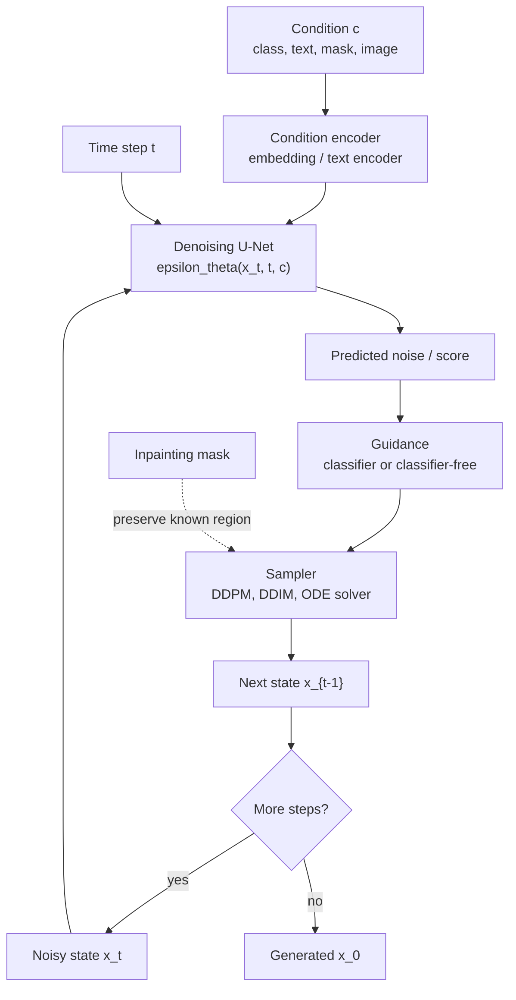

# Conditional and Accelerated Diffusion

Source: `DL_exam.pdf`, Question 59

Original question:

> Условная и ускоренная диффузия. Guidance, text-to-image, DDIM/solvers/distillation, inpainting.

## Интуиция

Обычная diffusion model учится превращать шум в sample из распределения данных. Условная диффузия делает то же самое, но не просто "порождает картинку", а порождает картинку, совместимую с условием $c$: классом, текстом, маской, исходным изображением, depth map, segmentation map, pose и т.д.

`Guidance` нужен, чтобы во время sampling усилить соответствие условию. Модель знает два направления: как сделать sample реалистичным и как сделать его подходящим под условие. Guidance сдвигает denoising trajectory в сторону условия, но слишком сильный guidance ухудшает разнообразие и может давать артефакты.

Ускоренная диффузия решает главный практический недостаток diffusion models: классический DDPM sampling требует сотни или тысячи denoising steps. `DDIM`, ODE/SDE solvers и distillation позволяют получать хорошие samples за десятки, единицы или даже один шаг, но обычно требуют компромисса между скоростью, качеством, разнообразием и устойчивостью к большим guidance scales.

## Что нужно сказать на экзамене

- Условная diffusion model аппроксимирует $p_\theta(x_0 \mid c)$ через denoising network $\epsilon_\theta(x_t,t,c)$ или аналогичную параметризацию $x_0$/$v$/score.
- Обучающий loss почти такой же, как в DDPM, но сеть получает условие:

$$
L(\theta)=\mathbb{E}_{x_0,c,t,\epsilon}\left[\lVert \epsilon-\epsilon_\theta(x_t,t,c)\rVert_2^2\right].
$$

- Условие можно вводить через class embedding, concatenation channels, cross-attention, adapters/ControlNet-like branches или conditioning encoder.
- `Classifier guidance`: использовать внешний классификатор $p_\phi(c\mid x_t,t)$ и добавлять к score градиент $\nabla_{x_t}\log p_\phi(c\mid x_t,t)$.
- `Classifier-free guidance` (`CFG`): обучить одну модель и с условием, и без условия, случайно зануляя $c$; на sampling смешивать conditional и unconditional predictions:

$$
\epsilon_{\text{CFG}}=\epsilon_\theta(x_t,t,\varnothing)+w\left(\epsilon_\theta(x_t,t,c)-\epsilon_\theta(x_t,t,\varnothing)\right).
$$

При такой конвенции $w=0$ дает unconditional sampling, $w=1$ примерно обычный conditional prediction, $w>1$ усиливает условие.
- `Text-to-image`: текст кодируется text encoder, затем token embeddings обычно подаются в U-Net через cross-attention; в latent diffusion denoising идет не в pixel space, а в latent space VAE.
- `DDIM` делает non-Markovian reverse process и позволяет deterministic sampling при $\eta=0$, часто за меньшее число шагов.
- `Solvers` рассматривают reverse process как SDE или probability-flow ODE и применяют численные методы высокого порядка, например predictor-corrector, DPM-Solver-like методы, Euler/Heun.
- `Distillation` обучает student model имитировать многошаговый teacher sampler за меньшее число шагов: progressive distillation, consistency distillation, adversarial/score distillation variants.
- `Inpainting`: часть изображения фиксируется маской, а неизвестная область генерируется условно; на каждом шаге известные пиксели согласуют с зашумленной версией исходного изображения.

## Подробный ответ

### Условная диффузия

Пусть $c$ -- условие: class label, text prompt, image condition, mask, sketch, pose, segmentation map. Прямой процесс обычно не зависит от $c$:

$$
q(x_t\mid x_0)=\mathcal{N}(\sqrt{\bar{\alpha}_t}x_0,(1-\bar{\alpha}_t)I),
$$

$$
x_t=\sqrt{\bar{\alpha}_t}x_0+\sqrt{1-\bar{\alpha}_t}\epsilon,\quad \epsilon\sim\mathcal{N}(0,I).
$$

Условие входит в обратный процесс:

$$
p_\theta(x_{0:T}\mid c)=p(x_T)\prod_{t=1}^{T}p_\theta(x_{t-1}\mid x_t,c).
$$

Если используется $\epsilon$-prediction, сеть учится предсказывать шум:

$$
\epsilon_\theta(x_t,t,c)\approx \epsilon.
$$

Формально условие меняет score:

$$
\nabla_x \log p_t(x\mid c)=\nabla_x \log p_t(x)+\nabla_x \log p_t(c\mid x),
$$

где первое слагаемое отвечает за реалистичность sample, а второе -- за соответствие условию. Эта формула объясняет идею guidance: sampling можно направлять дополнительным градиентом совместимости с условием.

### Способы conditioning

| Условие | Как подать в модель | Где применяется |
|---|---|---|
| Class label | embedding класса добавляется к time embedding | class-conditional generation |
| Text prompt | text encoder + cross-attention в U-Net | text-to-image |
| Mask/inpainting | concatenation маски и masked image, плюс принудительное сохранение known region | inpainting |
| Low-level image signal | concatenation channels или отдельная conditioning branch | super-resolution, depth/edge/pose conditioning |
| Reference image | image encoder, cross-attention, adapters | image variation, style/reference conditioning |

Важный принцип: denoising network должна видеть и уровень шума $t$, и условие $c$. Иначе она не знает, насколько агрессивно убирать шум и к какому conditional distribution двигаться.

### Classifier guidance

В `classifier guidance` отдельно обучают noisy classifier $p_\phi(c\mid x_t,t)$, который умеет классифицировать зашумленные samples. Если базовая diffusion model оценивает unconditional score $s_\theta(x_t,t)\approx\nabla_{x_t}\log p_t(x_t)$, то guided score:

$$
s_{\text{guided}}(x_t,t,c)=s_\theta(x_t,t)+\gamma\nabla_{x_t}\log p_\phi(c\mid x_t,t),
$$

где $\gamma$ -- guidance strength.

В $\epsilon$-prediction это соответствует примерно:

$$
\epsilon_{\text{guided}}=\epsilon_\theta(x_t,t)-\gamma\sqrt{1-\bar{\alpha}_t}\nabla_{x_t}\log p_\phi(c\mid x_t,t).
$$

Плюс: можно усилить соответствие классу без переобучения diffusion model. Минусы: нужен отдельный classifier на noisy inputs, требуется backpropagation по $x_t$ на каждом sampling step, classifier может давать adversarial gradients и артефакты.

### Classifier-free guidance

`Classifier-free guidance` убирает внешний classifier. Во время обучения условие случайно заменяют пустым condition $\varnothing$:

$$
c'=
\begin{cases}
c, & \text{с вероятностью } 1-p_{\text{drop}},\\
\varnothing, & \text{с вероятностью } p_{\text{drop}}.
\end{cases}
$$

Модель учится и conditional, и unconditional denoising:

$$
L_{\text{CFG}}=\mathbb{E}\left[\lVert \epsilon-\epsilon_\theta(x_t,t,c')\rVert_2^2\right].
$$

На sampling считают два предсказания:

$$
\epsilon_{\text{uncond}}=\epsilon_\theta(x_t,t,\varnothing),
\quad
\epsilon_{\text{cond}}=\epsilon_\theta(x_t,t,c),
$$

и смешивают:

$$
\epsilon_{\text{CFG}}=\epsilon_{\text{uncond}}+w(\epsilon_{\text{cond}}-\epsilon_{\text{uncond}}).
$$

Разность $\epsilon_{\text{cond}}-\epsilon_{\text{uncond}}$ приближенно кодирует направление, в котором sample лучше соответствует условию. Большой $w$ повышает prompt adherence, но снижает diversity и может ломать цвета, текстуры, анатомию или глобальную композицию. Поэтому CFG -- это trade-off, а не бесплатное улучшение.

### Text-to-image

В text-to-image условие $c$ -- это текстовый prompt. Типичный pipeline:

1. Текст токенизируется.
2. Text encoder строит embeddings токенов.
3. Denoising U-Net получает noisy image или noisy latent $x_t/z_t$, time embedding и text embeddings.
4. Text embeddings входят в U-Net через cross-attention: spatial features выступают как queries, text tokens -- как keys/values.
5. Sampler итеративно убирает шум, часто с CFG.
6. Если модель latent diffusion, финальный latent декодируется VAE decoder в изображение.

Cross-attention важен, потому что он позволяет разным пространственным позициям изображения обращаться к разным словам prompt. Например, область объекта может сильнее attend к noun token, а стиль и атрибуты -- к descriptive tokens. Однако text-to-image не гарантирует логическое выполнение всех условий: возможны ошибки счета, пространственных отношений, текста на изображении и редких понятий.

### DDIM

`DDIM` ускоряет sampling, сохраняя ту же обученную DDPM model. Идея: построить non-Markovian reverse process, у которого training objective совместим с DDPM, но sampling можно делать по разреженному набору timesteps.

Сначала из предсказанного шума восстанавливают оценку clean sample:

$$
\hat{x}_0=\frac{x_t-\sqrt{1-\bar{\alpha}_t}\epsilon_\theta(x_t,t,c)}{\sqrt{\bar{\alpha}_t}}.
$$

DDIM step из $t$ в $t-1$:

$$
x_{t-1}=
\sqrt{\bar{\alpha}_{t-1}}\hat{x}_0
+\sqrt{1-\bar{\alpha}_{t-1}-\sigma_t^2}\epsilon_\theta(x_t,t,c)
+\sigma_t z,
$$

$$
z\sim\mathcal{N}(0,I),
$$

где

$$
\sigma_t=\eta
\sqrt{\frac{1-\bar{\alpha}_{t-1}}{1-\bar{\alpha}_t}}
\sqrt{1-\frac{\bar{\alpha}_t}{\bar{\alpha}_{t-1}}}.
$$

Параметр $\eta$ управляет stochasticity. При $\eta=0$ sampling deterministic: один и тот же начальный шум и prompt дают один и тот же результат. При $\eta>0$ добавляется случайность, ближе к DDPM-style sampling. DDIM часто позволяет использовать 20-100 шагов вместо 1000, но слишком маленькое число шагов может ухудшить детали.

### Solvers для ускоренного sampling

Score-based diffusion можно записать как reverse-time SDE:

$$
dx=\left[f(x,t)-g(t)^2\nabla_x\log p_t(x)\right]dt+g(t)d\bar{w},
$$

или как probability-flow ODE:

$$
dx=\left[f(x,t)-\frac{1}{2}g(t)^2\nabla_x\log p_t(x)\right]dt.
$$

Если модель дает score/noise prediction, sampling становится численным решением SDE/ODE. Поэтому можно применять solvers:

| Метод | Идея | Компромисс |
|---|---|---|
| DDPM sampler | stochastic ancestral steps | качественный, но медленный |
| DDIM | deterministic или semi-stochastic non-Markovian steps | быстрее, меньше diversity при $\eta=0$ |
| Euler / ancestral Euler | простой первый порядок | быстро, но чувствителен к шагу |
| Heun / predictor-corrector | предсказание + коррекция | лучше точность, дороже на step |
| DPM-Solver-like ODE solvers | используют структуру diffusion ODE и multi-step/high-order updates | хорошее качество за малое число steps, но чувствительны к schedule и guidance |

Ускорение достигается не тем, что модель "меньше думает", а тем, что trajectory аппроксимируется крупными и более точными шагами. При очень больших шагах возникает numerical error: sample отклоняется от learned reverse trajectory.

### Distillation

`Diffusion distillation` обучает student model генерировать за меньшее число шагов, имитируя teacher model или ее sampling trajectory.

Основные варианты:

- `Progressive distillation`: teacher делает два шага, student учится делать эквивалентный один шаг; процесс повторяют, уменьшая число steps $T\to T/2\to T/4\to \dots$.
- `Consistency distillation`: модель учится отображать разные noisy states одной ODE trajectory в один и тот же clean output, что позволяет few-step или one-step sampling.
- `Score distillation`: используется score/guidance pretrained diffusion model как обучающий сигнал для другой генеративной модели или параметрического представления.
- `Adversarial/few-step distillation`: добавляют perceptual/adversarial losses, чтобы улучшить визуальное качество при малом числе steps.

Плюс distillation -- радикальное ускорение inference. Минусы -- дополнительное обучение, возможная потеря diversity, хуже покрытие сложных prompts, накопление bias teacher model и чувствительность к выбранному sampler.

### Inpainting

В `inpainting` есть исходное изображение $x_{\text{orig}}$ и binary mask $m$, где обычно $m=1$ означает известную область, которую надо сохранить, а $m=0$ -- область для генерации. Задача:

$$
p_\theta(x_{\text{missing}}\mid x_{\text{known}},m,c).
$$

Практический reverse step часто выглядит так:

1. Сделать обычный denoising step и получить candidate $x_{t-1}^{\text{gen}}$.
2. Зашумить известную часть исходного изображения до того же уровня:

$$
x_{t-1}^{\text{known}}=\sqrt{\bar{\alpha}_{t-1}}x_{\text{orig}}+\sqrt{1-\bar{\alpha}_{t-1}}\epsilon,\quad \epsilon\sim\mathcal{N}(0,I).
$$

3. Смешать known и generated regions:

$$
x_{t-1}=m\odot x_{t-1}^{\text{known}}+(1-m)\odot x_{t-1}^{\text{gen}}.
$$

Так модель генерирует только missing region, а известная область остается согласованной с исходным изображением на каждом noise level. Для хорошего inpainting важно не только заполнить дыру, но и согласовать границы, перспективу, освещение, семантику и prompt.

## Формулы / алгоритмы

### Алгоритм обучения classifier-free conditional diffusion

Цель: обучить denoising model, которую можно использовать и с условием, и без условия.

Входы: dataset пар $(x_0,c)$, noise schedule $\bar{\alpha}_t$, drop probability $p_{\text{drop}}$, модель $\epsilon_\theta$.

Выход: параметры $\theta$.

1. Сэмплировать mini-batch $(x_0,c)$.
2. Сэмплировать $t\sim \text{Uniform}\{1,\dots,T\}$ и $\epsilon\sim\mathcal{N}(0,I)$.
3. Получить noisy sample:

$$
x_t=\sqrt{\bar{\alpha}_t}x_0+\sqrt{1-\bar{\alpha}_t}\epsilon.
$$

4. С вероятностью $p_{\text{drop}}$ заменить $c$ на $\varnothing$.
5. Предсказать шум $\epsilon_\theta(x_t,t,c')$.
6. Минимизировать:

$$
L=\lVert \epsilon-\epsilon_\theta(x_t,t,c')\rVert_2^2.
$$

Сложность одного шага обучения примерно равна обычному DDPM training step с дополнительной стоимостью condition encoder/cross-attention.

### Алгоритм CFG sampling

Цель: получить sample, лучше соответствующий условию $c$.

Входы: trained $\epsilon_\theta$, guidance scale $w$, timesteps $\tau_K>\dots>\tau_0$, sampler update rule.

Выход: sample $\hat{x}_0$.

1. Сэмплировать $x_{\tau_K}\sim\mathcal{N}(0,I)$.
2. Для $k=K,\dots,1$:
   - вычислить $\epsilon_{\text{uncond}}=\epsilon_\theta(x_{\tau_k},\tau_k,\varnothing)$;
   - вычислить $\epsilon_{\text{cond}}=\epsilon_\theta(x_{\tau_k},\tau_k,c)$;
   - смешать $\epsilon_{\text{CFG}}=\epsilon_{\text{uncond}}+w(\epsilon_{\text{cond}}-\epsilon_{\text{uncond}})$;
   - выполнить DDPM/DDIM/solver step из $\tau_k$ в $\tau_{k-1}$, используя $\epsilon_{\text{CFG}}$.
3. Вернуть $x_{\tau_0}$ или decoded image, если sampling идет в latent space.

Практические caveats: большой $w$ повышает соответствие prompt, но может пересветить изображение, уменьшить diversity и ухудшить fine details. При малом числе steps оптимальный $w$ часто отличается от оптимального $w$ для длинного sampler.

### Алгоритм inpainting

Цель: заполнить неизвестную область изображения, сохранив известные пиксели.

Входы: исходное изображение $x_{\text{orig}}$, mask $m$, условие $c$, trained model, sampler.

Выход: изображение с заполненной областью.

1. Инициализировать $x_T\sim\mathcal{N}(0,I)$ или noisy version изображения.
2. Для $t=T,\dots,1$:
   - выполнить conditional denoising step и получить $x_{t-1}^{\text{gen}}$;
   - получить noisy known image $x_{t-1}^{\text{known}}$ из $x_{\text{orig}}$ на уровне $t-1$;
   - смешать через mask:

$$
x_{t-1}=m\odot x_{t-1}^{\text{known}}+(1-m)\odot x_{t-1}^{\text{gen}}.
$$

3. Вернуть $x_0$.

Если модель специально обучалась на masked inputs, маска и masked image также подаются в U-Net как condition. Если модель не обучалась на inpainting, простое masked resampling может работать хуже, особенно на границах.

## Диаграмма или изображение

Внешние изображения не использовались.

## Быстрая устная версия

Условная диффузия моделирует $p(x_0\mid c)$: denoising network получает noisy sample $x_t$, step $t$ и condition $c$, например класс, текст или маску. Guidance усиливает движение к условию. В classifier guidance добавляют к score градиент noisy classifier $\nabla_x\log p(c\mid x_t,t)$. В classifier-free guidance одну модель обучают с condition dropout и на sampling смешивают unconditional и conditional predictions: $\epsilon_{\text{uncond}}+w(\epsilon_{\text{cond}}-\epsilon_{\text{uncond}})$.

Text-to-image обычно использует text encoder и cross-attention в U-Net; в latent diffusion denoising идет в latent space, затем VAE decoder строит изображение. Ускорение нужно, потому что DDPM sampling медленный. DDIM делает deterministic или semi-stochastic sampling с меньшим числом шагов, solvers решают reverse SDE/probability-flow ODE более крупными шагами, distillation обучает student выполнять trajectory teacher model за меньшее число steps. Inpainting фиксирует известную область через mask и генерирует только missing region, согласуя известные пиксели на каждом noise level.

## Возможные уточняющие вопросы

- Чем classifier guidance отличается от classifier-free guidance?  
  Classifier guidance требует отдельный noisy classifier и градиент по $x_t$; CFG использует одну diffusion model, обученную с condition dropout, и смешивает conditional/unconditional predictions.

- Почему CFG может ухудшать качество?  
  Большой guidance scale слишком сильно толкает sample к условию, уменьшая diversity и нарушая естественную denoising trajectory.

- Почему text-to-image использует cross-attention?  
  Cross-attention позволяет spatial features изображения выбирать релевантные text tokens, поэтому разные области могут зависеть от разных слов prompt.

- Что означает deterministic DDIM?  
  При $\eta=0$ в DDIM step не добавляется новый Gaussian noise, поэтому при фиксированном начальном шуме trajectory детерминирована.

- Чем solver отличается от DDIM?  
  DDIM задает конкретный implicit/non-Markovian sampler, а solver рассматривает sampling как численное решение reverse SDE или probability-flow ODE и применяет методы интегрирования.

- Зачем нужна distillation?  
  Чтобы перенести качество многошагового teacher sampler в student, который генерирует за меньшее число steps.

- Как diffusion делает inpainting?  
  Модель denoise-ит все изображение или latent, но известная область на каждом шаге заменяется зашумленной версией исходного изображения, а неизвестная область остается сгенерированной.

- Почему latent diffusion быстрее pixel diffusion?  
  Denoising выполняется в более низкоразмерном latent space, поэтому U-Net работает с меньшими пространственными картами.

## Частые ошибки

- Путать conditioning и guidance: conditioning -- вход модели, guidance -- способ изменить sampling trajectory.
- Говорить, что CFG требует классификатор. Наоборот, classifier-free guidance специально избегает внешнего classifier.
- Забывать, что при CFG обычно нужны два forward pass на step: conditional и unconditional.
- Считать, что большой guidance scale всегда лучше. Он повышает соответствие prompt, но снижает diversity и может давать артефакты.
- Называть DDIM "другим обучением". Часто DDIM использует ту же обученную DDPM/noise-prediction model, меняется sampler.
- Путать stochastic DDPM sampling и deterministic DDIM при $\eta=0$.
- Утверждать, что solvers гарантированно улучшают качество. Они ускоряют sampling, но при слишком малом числе steps или плохом schedule могут ухудшить sample.
- Описывать inpainting как простую вставку патча в конце. Корректнее согласовывать known region на каждом noise level.
- Забывать про trade-off distillation: fewer steps обычно требуют дополнительного обучения и могут ухудшить diversity или сложные условия.
- В text-to-image сводить все к text encoder и забывать, что связь текста с пространственными features обычно реализуется через cross-attention.
