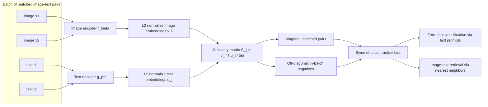

# Multimodal Tasks and CLIP

Source: `DL_exam.pdf`, Question 60

Original question:

> Мультимодальные задачи и CLIP. Image-text retrieval, zero-shot classification, contrastive learning, общее пространство изображений и текста.

## Интуиция

Мультимодальная модель учится связывать разные типы данных: изображение, текст, аудио, видео, табличные признаки. В вопросе главное - пара `image-text`: картинка и подпись описывают один и тот же объект или сцену, но живут в разных пространствах. Идея CLIP состоит в том, чтобы обучить два encoder-а так, чтобы похожие изображение и текст оказывались рядом в общем embedding space, а непохожие - далеко.

После такого обучения можно решать задачи без отдельного классификатора под каждую разметку. Для retrieval мы ищем ближайший текст к изображению или ближайшее изображение к тексту. Для zero-shot classification мы превращаем названия классов в текстовые prompt-ы, кодируем их text encoder-ом и выбираем тот prompt, чей embedding ближе всего к embedding изображения.

## Что нужно сказать на экзамене

- Мультимодальная задача использует несколько modality: например, изображение $x_i$ и текст $t_i$.
- CLIP обучается на парах `image-caption` с двумя encoder-ами: image encoder и text encoder.
- Оба encoder-а проецируют входы в общее пространство размерности $d$:
  $$
  v_i = \frac{f_\theta(x_i)}{\|f_\theta(x_i)\|_2}, \qquad
  u_i = \frac{g_\phi(t_i)}{\|g_\phi(t_i)\|_2}.
  $$
- Сходство обычно считается через cosine similarity, потому что embeddings нормированы:
  $$
  s_{ij} = \frac{v_i^\top u_j}{\tau},
  $$
  где $\tau$ - temperature.
- Обучение - symmetric contrastive learning: правильная пара $(x_i, t_i)$ притягивается, все остальные тексты и изображения в batch выступают как negatives.
- Loss обычно записывают как сумму image-to-text и text-to-image cross-entropy:
  $$
  \mathcal{L} = \frac{1}{2}\left(\mathcal{L}_{I \to T} + \mathcal{L}_{T \to I}\right).
  $$
- Image-text retrieval: ранжировать кандидатов по $v^\top u$; метрики - Recall@K, median rank, mAP.
- Zero-shot classification: создать prompt-ы вида `"a photo of a {class}"`, закодировать их, сравнить с изображением и выбрать максимальное сходство.
- Сильная сторона CLIP - перенос на новые классы без supervised fine-tuning; слабые стороны - зависимость от prompt engineering, bias датасета, слабая локализация объектов, ошибки на fine-grained и compositional reasoning.

## Подробный ответ

Мультимодальное обучение связывает данные из разных modality. В задаче `image-text` есть пары $(x_i, t_i)$, где $x_i$ - изображение, а $t_i$ - текстовое описание, подпись, alt-text или запрос. Цель - получить представления, в которых семантически соответствующие объекты близки независимо от modality. Это называется общее пространство изображений и текста, или shared image-text embedding space.

CLIP, Contrastive Language-Image Pretraining, использует two-tower architecture:

| Компонент | Роль |
|---|---|
| Image encoder $f_\theta$ | Превращает изображение в вектор; часто CNN или Vision Transformer |
| Text encoder $g_\phi$ | Превращает токенизированный текст в вектор; обычно Transformer |
| Projection heads | Проецируют выходы encoder-ов в одну размерность $d$ |
| Normalization | Делает embeddings единичной длины, чтобы dot product был cosine similarity |
| Contrastive loss | Притягивает matched пары и отталкивает unmatched пары в batch |

В batch из $N$ пар строится матрица сходств $S \in \mathbb{R}^{N \times N}$:

$$
S_{ij} = \frac{v_i^\top u_j}{\tau}.
$$

Диагональные элементы $S_{ii}$ соответствуют правильным парам. Остальные элементы $S_{ij}, i \ne j$ считаются отрицательными примерами внутри batch. Поэтому большой batch полезен: он дает много negatives и делает contrastive задачу информативнее.

Для направления image-to-text модель должна по изображению $x_i$ выбрать правильный текст $t_i$ среди всех текстов batch:

$$
\mathcal{L}_{I \to T}
= -\frac{1}{N}\sum_{i=1}^{N}
\log \frac{\exp(S_{ii})}{\sum_{j=1}^{N}\exp(S_{ij})}.
$$

Для направления text-to-image аналогично:

$$
\mathcal{L}_{T \to I}
= -\frac{1}{N}\sum_{i=1}^{N}
\log \frac{\exp(S_{ii})}{\sum_{j=1}^{N}\exp(S_{ji})}.
$$

Итоговая функция потерь:

$$
\mathcal{L}
= \frac{1}{2}(\mathcal{L}_{I \to T} + \mathcal{L}_{T \to I}).
$$

Это похоже на классификацию внутри batch: для каждой строки матрицы сходств правильный класс - соответствующий текст на диагонали, а для каждого столбца правильный класс - соответствующее изображение на диагонали. Temperature $\tau$ управляет резкостью softmax: маленькая $\tau$ сильнее штрафует близкие negatives и делает распределение более острым.

### Image-text retrieval

Retrieval использует уже обученное общее пространство. Есть два типичных направления:

| Задача | Запрос | Кандидаты | Что ранжируем |
|---|---|---|---|
| Image-to-text retrieval | изображение | подписи или документы | $v^\top u_j$ |
| Text-to-image retrieval | текстовый запрос | изображения | $v_i^\top u$ |

Пайплайн:

1. Закодировать все кандидаты и сохранить embeddings.
2. Закодировать запрос.
3. Посчитать cosine similarity между запросом и кандидатами.
4. Отсортировать кандидатов по убыванию similarity.
5. Оценить качество через Recall@K: правильный объект должен попасть в top-$K$.

Retrieval отличается от classification тем, что не требует фиксированного набора классов. Кандидатами могут быть изображения, подписи, документы, кадры видео или результаты поиска.

### Zero-shot classification

CLIP можно использовать как zero-shot классификатор, потому что классы задаются текстом. Пусть есть классы $c_1, \dots, c_K$. Для каждого класса строятся prompt-ы, например:

```text
a photo of a dog
a photo of a car
a photo of a microscope
```

Text encoder получает embeddings классов:

$$
u_k = \frac{g_\phi(\text{prompt}(c_k))}{\|g_\phi(\text{prompt}(c_k))\|_2}.
$$

Для изображения:

$$
v = \frac{f_\theta(x)}{\|f_\theta(x)\|_2}.
$$

Вероятность класса можно получить softmax-ом по сходствам:

$$
p(y=k \mid x)
= \frac{\exp(v^\top u_k / \tau)}
{\sum_{\ell=1}^{K}\exp(v^\top u_\ell / \tau)}.
$$

Предсказание:

$$
\hat{y} = \arg\max_k v^\top u_k.
$$

Качество zero-shot classification сильно зависит от формулировки prompt-а. Например, для датасета с птицами лучше может работать не общий prompt `"a photo of a {class}"`, а более доменный `"a photo of a bird, a {class}"`. Часто используют prompt ensembling: несколько шаблонов для одного класса кодируются отдельно, затем их embeddings усредняются и нормируются.

### Почему общее пространство работает

Contrastive learning не требует ручной разметки каждого изображения классом. Достаточно большого числа пар `image-caption`. Если текст описывает визуальное содержание, модель получает слабый supervision signal: какие слова, объекты, стили и сцены соответствуют изображению. Общее пространство позволяет заменить task-specific head на сравнение embeddings.

Важно понимать ограничение: CLIP обычно хорошо улавливает глобальную семантику изображения, но не гарантирует точное понимание отношений, счета объектов, пространственных условий и локализации. Например, запросы `"red cube left of blue sphere"` и `"blue cube left of red sphere"` могут быть трудными, потому что contrastive objective обучает соответствие целой картинки и целого текста, а не явную сценовую структуру.

## Формулы / алгоритмы

### Обучение CLIP

**Цель:** обучить image encoder $f_\theta$ и text encoder $g_\phi$, чтобы matched пары были ближе, чем unmatched пары.

**Вход:** batch из $N$ пар $(x_i, t_i)$.

**Выход:** encoder-ы, которые строят сопоставимые image и text embeddings.

Алгоритм:

1. Получить ненормированные признаки:
   $$
   \tilde{v}_i = f_\theta(x_i), \qquad \tilde{u}_i = g_\phi(t_i).
   $$
2. Нормировать embeddings:
   $$
   v_i = \frac{\tilde{v}_i}{\|\tilde{v}_i\|_2}, \qquad
   u_i = \frac{\tilde{u}_i}{\|\tilde{u}_i\|_2}.
   $$
3. Построить матрицу logits:
   $$
   S_{ij} = \frac{v_i^\top u_j}{\tau}.
   $$
4. Применить cross-entropy по строкам: image-to-text.
5. Применить cross-entropy по столбцам: text-to-image.
6. Усреднить две потери и обновить параметры через backpropagation.

Практические замечания:

- Сложность построения матрицы сходств в batch: $O(N^2 d)$.
- Большие batch-и дают больше in-batch negatives, но требуют больше памяти.
- Если в batch есть несколько корректных подписей к похожим изображениям, они могут ошибочно считаться negatives; это называют false negatives.
- Temperature может быть фиксированной или обучаемой; она критична для масштаба logits.

### Image-text retrieval

Для text-to-image retrieval:

$$
\text{rank}(x_i \mid t) \text{ определяется по } \operatorname{sim}(x_i,t)=v_i^\top u.
$$

Recall@K:

$$
\operatorname{Recall@K}
= \frac{1}{Q}\sum_{q=1}^{Q}\mathbb{1}\{\text{релевантный объект есть в top-}K\}.
$$

### Zero-shot classification

Построить текстовые prototypes классов:

$$
p_k = \operatorname{normalize}\left(
\frac{1}{M}\sum_{m=1}^{M}
\operatorname{normalize}(g_\phi(\text{template}_m(c_k)))
\right).
$$

Предсказать класс изображения:

$$
\hat{y} = \arg\max_k f_\theta(x)^\top p_k,
$$

где $f_\theta(x)$ подразумевает нормированный image embedding.

## Диаграмма или изображение



Внешние изображения не использовались.

## Быстрая устная версия

CLIP - это contrastive image-text модель с двумя encoder-ами: один кодирует изображение, другой текст. Оба выхода нормируются и попадают в общее embedding space. В batch строится матрица cosine similarity между всеми изображениями и всеми текстами; правильные пары находятся на диагонали. Loss - symmetric contrastive cross-entropy: image-to-text и text-to-image. После pretraining можно делать retrieval, ранжируя кандидатов по dot product, и zero-shot classification: превратить классы в текстовые prompt-ы, закодировать их и выбрать класс с максимальным сходством с изображением. Ограничения: чувствительность к prompt-ам, bias данных, слабая локализация и ошибки на сложных отношениях.

## Возможные уточняющие вопросы

**Что такое contrastive learning в CLIP?**  
Это обучение, где matched image-text пары притягиваются в embedding space, а unmatched пары из batch отталкиваются через softmax cross-entropy.

**Почему CLIP поддерживает zero-shot classification?**  
Потому что классы можно описать текстом. Модель сравнивает embedding изображения с embedding prompt-а каждого класса, не обучая новый linear classifier.

**Чем image-text retrieval отличается от zero-shot classification?**  
В retrieval нужно найти ближайший объект среди произвольных кандидатов. В zero-shot classification кандидаты - это текстовые описания фиксированных классов.

**Зачем нужна L2 normalization?**  
Она делает длины embeddings одинаковыми, поэтому dot product становится cosine similarity и сравнение зависит от угла между векторами, а не от масштаба.

**Что делает temperature $\tau$?**  
Она масштабирует logits перед softmax. Меньшая $\tau$ делает распределение более резким и усиливает различие между positive и hard negative примерами.

**Почему большие batch-и важны?**  
В contrastive learning остальные элементы batch являются negatives. Чем больше batch, тем больше отрицательных примеров и тем богаче сигнал обучения.

**Что такое false negative?**  
Это пример, который считается отрицательным из-за устройства batch, хотя семантически он тоже подходит. Например, два разных изображения одной и той же сцены или две корректные подписи.

**Можно ли использовать CLIP для генерации изображений?**  
Сам CLIP не является generative model: он оценивает совместимость изображения и текста. Но его embeddings или score могут использоваться как сигнал в других генеративных системах.

## Частые ошибки

- Говорить, что CLIP обучается как обычный supervised classifier по классам. На самом деле он обучается на парах image-text через contrastive objective.
- Путать image-text retrieval и image captioning: retrieval выбирает существующий текст или изображение, а captioning генерирует новую подпись.
- Забывать симметричность loss: важно обучать и image-to-text, и text-to-image направления.
- Называть все непарные элементы batch абсолютно неправильными negatives: в реальных данных возможны false negatives.
- Считать zero-shot classification полностью независимой от prompt-а. Формулировка prompt-а и набор шаблонов могут заметно менять качество.
- Утверждать, что общее embedding space гарантирует понимание всех отношений на изображении. CLIP часто хорошо ловит глобальную семантику, но может ошибаться в счете, порядке объектов и fine-grained различиях.
- Использовать ненормированные dot products без объяснения масштаба. В CLIP обычно сравнивают L2-normalized embeddings, поэтому dot product равен cosine similarity.
