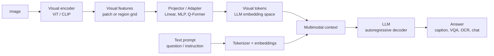

# Vision Language Models and MLLM

Source: `DL_exam.pdf`, Question 61

Original question:

> Vision-Language Models и MLLM. Captioning, VQA, OCR, BLIP/LLaVA-подходы, visual encoder, projector, LLM, visual tokens.

## Интуиция

`Vision-Language Model` соединяет зрение и язык: модель должна не только распознать объекты на изображении, но и выразить результат в тексте, ответить на вопрос, прочитать надпись или использовать изображение как контекст для рассуждения. Идея в том, чтобы превратить картинку в набор векторных представлений, совместимых с языковой моделью, а затем генерировать текст так же, как обычная `LLM` генерирует продолжение промпта.

В современных `MLLM` картинка обычно проходит через `visual encoder`, например ViT/CLIP-encoder. Его признаки преобразуются через `projector` в пространство эмбеддингов `LLM`. Полученные `visual tokens` вставляются в текстовый контекст рядом с инструкцией пользователя. После этого `LLM` видит последовательность вида "текстовые токены + визуальные токены + текстовые токены" и авторегрессивно отвечает.

## Что нужно сказать на экзамене

- `VLM` решает задачи на стыке изображения и текста: `image captioning`, `VQA`, `OCR`, visual grounding, image-text retrieval, document understanding.
- `MLLM` обычно означает мультимодальную большую языковую модель, где центральным генератором ответа является `LLM`, дополненная входами из других модальностей.
- Базовая архитектура: изображение $\to$ `visual encoder` $\to$ визуальные признаки $\to$ `projector`/adapter $\to$ `visual tokens` в размерности `LLM` $\to$ `LLM` $\to$ текстовый ответ.
- `visual encoder` извлекает семантические и пространственные признаки; часто он предварительно обучен на CLIP-подобной image-text задаче.
- `projector` согласует размерности и распределения признаков: linear layer, MLP, Q-Former, cross-attention adapter, resampler.
- `visual tokens` могут соответствовать patch-токенам ViT, pooled-токенам, query-токенам или токенам с более высоким разрешением для OCR и мелких деталей.
- Captioning оптимизирует вероятность описания изображения: $p(y \mid x)$.
- VQA оптимизирует ответ на вопрос с условием на изображение и текст вопроса: $p(a \mid x, q)$.
- OCR требует сохранения мелких визуальных деталей, пространственного порядка и часто высокого разрешения; обычный CLIP-encoder может быть недостаточен.
- BLIP-подходы совмещают image-text pretraining, captioning/filtering данных и генерацию; BLIP-2 использует `Q-Former` как мост между frozen visual encoder и frozen LLM.
- LLaVA-подход: берут pretrained visual encoder, проектируют признаки в пространство LLM, обучают сначала projector на image-text pairs, затем instruction tuning на мультимодальных диалогах.
- Ограничения: hallucinations, слабая точность счета и пространственных отношений, зависимость от разрешения, ошибки OCR, bias из данных, высокая стоимость длинных visual-token последовательностей.

## Подробный ответ

`Vision-Language Model` - это модель, которая связывает визуальный вход $x$ и текстовый вход/выход $y$. В классических VLM это может быть модель для retrieval или captioning, а в современных `MLLM` чаще всего есть мощная `LLM`, которая принимает визуальную информацию как часть контекста и генерирует ответ авторегрессивно.

Типовой вход для `MLLM`:

$$
x = \text{image}, \quad t = \text{text prompt}, \quad y = \text{target answer}.
$$

Модель строит визуальные признаки:

$$
V = E_{\text{vis}}(x), \quad V \in \mathbb{R}^{n_v \times d_v},
$$

где $E_{\text{vis}}$ - `visual encoder`, $n_v$ - число визуальных токенов, $d_v$ - размерность визуального признака. Затем признаки переводятся в размерность токенов LLM:

$$
Z = P(V), \quad Z \in \mathbb{R}^{n_z \times d_{\text{llm}}},
$$

где $P$ - `projector`, `adapter` или `Q-Former`. Текстовый prompt токенизируется и превращается в эмбеддинги:

$$
T = \operatorname{Emb}_{\text{llm}}(t).
$$

После этого `LLM` получает объединенную последовательность:

$$
H_0 = [T_{\text{prefix}}; Z; T_{\text{suffix}}],
$$

и генерирует ответ:

$$
p(y \mid x, t) = \prod_{i=1}^{m} p(y_i \mid y_{<i}, Z, t).
$$

### Задачи

| Задача | Вход | Выход | Что проверяет |
|---|---|---|---|
| `Image captioning` | изображение | описание | распознавание объектов, сцен, действий |
| `VQA` | изображение + вопрос | ответ | привязку текста вопроса к визуальным фактам |
| `OCR` | изображение с текстом | распознанный текст или ответ | мелкие детали, порядок символов, layout |
| `Document VQA` | документ + вопрос | ответ | OCR, layout, таблицы, чтение |
| `Visual grounding` | изображение + текст | область/координаты | соответствие фразы объекту |
| `Multimodal chat` | изображение + инструкция | свободный ответ | instruction following и reasoning |

`Captioning` обычно обучается как sequence-to-sequence задача: по изображению сгенерировать описание. В encoder-decoder вариантах decoder обращается к визуальным признакам через `cross-attention`. В LLM-based вариантах визуальные токены вставляются в контекст, а ответ генерируется как обычный текст.

`VQA` сложнее captioning, потому что вопрос выбирает релевантную часть изображения. Например, вопрос "какого цвета машина слева?" требует не общего описания, а поиска объекта, пространственного уточнения и ответа в нужном формате. Для VQA важны alignment между словами вопроса и визуальными регионами, а также способность LLM не додумывать ответ.

`OCR` в MLLM требует более осторожной архитектуры. CLIP-подобные энкодеры хорошо извлекают семантику изображения, но могут терять мелкий текст из-за низкого разрешения и patch pooling. Поэтому для OCR используют более высокое разрешение, дополнительные crop-стратегии, document encoders, region features или специализированные OCR-модули. В устном ответе важно сказать, что "видеть картинку" не равно "надежно читать текст".

### Архитектурные блоки

`Visual encoder` кодирует изображение. Частый выбор - ViT, CLIP ViT или другой pretrained image encoder. Он разбивает изображение на patch-и, добавляет positional embeddings и получает последовательность визуальных признаков. Если нужен spatial reasoning, лучше сохранять сетку patch-токенов, а не только один pooled embedding.

`Projector` согласует визуальные признаки с LLM. Простейший вариант:

$$
z_i = W v_i + b.
$$

Более мощный вариант - MLP:

$$
z_i = W_2 \sigma(W_1 v_i + b_1) + b_2.
$$

Еще один вариант - `Q-Former` или resampler: небольшое число обучаемых query-токенов attends к визуальным признакам и возвращает компактный набор токенов для LLM. Это уменьшает длину контекста и стоимость, но может потерять детали.

`LLM` принимает визуальные токены как prefix, interleaved tokens или специальные placeholder-токены (`<image>`). Обычно сама `LLM` уже обучена на языке, поэтому мультимодальное обучение старается не разрушить ее языковые способности: часто замораживают часть весов или используют LoRA.

`Visual tokens` - это не слова, а векторы в той же размерности, что и текстовые embeddings LLM. Они могут быть:

- patch-токенами ViT;
- усредненными image embeddings;
- выходами `Q-Former`;
- region-токенами от детектора;
- multi-scale токенами для больших изображений;
- interleaved токенами для нескольких картинок или видео.

### BLIP и BLIP-2 подход

Семейство BLIP строит модели через image-text pretraining. Важная идея BLIP - использовать captioning и filtering для улучшения noisy image-text данных: модель может генерировать synthetic captions и фильтровать плохие пары. BLIP совмещает понимание изображения и генерацию текста.

BLIP-2 делает мост между уже сильными frozen компонентами: frozen image encoder и frozen LLM. Между ними стоит `Q-Former`, который обучаемыми query-токенами извлекает из изображения компактную информацию, полезную для языка. Это снижает стоимость обучения: не нужно полностью дообучать огромную LLM и visual encoder.

Схематично:

$$
\text{image} \xrightarrow{E_{\text{vis}} \text{ frozen}} V
\xrightarrow{\text{Q-Former}} Z
\xrightarrow{\text{LLM frozen or tuned}} \text{text}.
$$

### LLaVA подход

LLaVA-подход проще и хорошо объясняется как instruction-tuned MLLM:

1. Берут pretrained visual encoder, часто CLIP ViT.
2. Берут pretrained LLM.
3. Добавляют projector, который переводит visual features в пространство LLM.
4. На первом этапе обучают projector на image-caption или image-text pairs, чтобы LLM начала понимать визуальные токены.
5. На втором этапе проводят multimodal instruction tuning на данных вида "изображение + инструкция + ответ".

В LLaVA-подобных моделях визуальные токены часто вставляются вместо специального `<image>` placeholder в prompt. Главная практическая сила подхода - использование уже готовой языковой модели и обучение относительно небольшого моста плюс instruction tuning.

### Обучение и потери

Для генеративных MLLM основная функция потерь - autoregressive cross-entropy по целевому ответу:

$$
\mathcal{L}_{\text{gen}} =
- \sum_{i=1}^{m} \log p_\theta(y_i \mid y_{<i}, x, t).
$$

Для pretraining могут добавлять:

- image-text contrastive loss, как в CLIP, чтобы сближать пары изображение-текст;
- image-text matching loss для классификации "соответствует / не соответствует";
- language modeling loss для captioning;
- instruction tuning loss для диалоговых ответов;
- OCR/document losses, если требуется чтение текста и layout.

Contrastive objective для batch из $N$ пар можно записать так:

$$
\mathcal{L}_{i2t}
= -\frac{1}{N}\sum_{i=1}^{N}
\log
\frac{\exp(\operatorname{sim}(u_i, r_i)/\tau)}
{\sum_{j=1}^{N}\exp(\operatorname{sim}(u_i, r_j)/\tau)},
$$

где $u_i$ - embedding изображения, $r_i$ - embedding текста, $\tau$ - temperature. Обычно есть симметричная часть text-to-image.

### Практические trade-offs

Количество visual tokens влияет на качество и стоимость. Если $n_z$ велико, LLM получает больше деталей, но self-attention стоит примерно $O((n_t+n_z)^2)$ по длине последовательности. Если $n_z$ мало, модель быстрее, но может потерять мелкие объекты, текст и spatial layout.

Заморозка pretrained модулей снижает стоимость и риск catastrophic forgetting, но ограничивает адаптацию. Полный fine-tuning дает больше гибкости, но требует больше данных, памяти и аккуратной регуляризации.

Важное ограничение MLLM - hallucination: модель может уверенно назвать объект, которого нет, или ответить по языковым prior-ам вместо визуальных фактов. Это связано с тем, что LLM обучена продолжать текст, а визуальный сигнал может быть слабым, сжатым или плохо выровненным.

## Формулы / алгоритмы

### Inference pipeline

Вход: изображение $x$, текстовая инструкция $t$.  
Выход: текстовый ответ $\hat{y}$.

1. Предобработать изображение: resize/crop/normalization, иногда split на tiles для высокого разрешения.
2. Получить визуальные признаки: $V = E_{\text{vis}}(x)$.
3. Преобразовать признаки: $Z = P(V)$, где $Z$ имеет размерность embeddings LLM.
4. Собрать prompt: `[system instruction; user text; visual tokens; answer prefix]`.
5. Передать последовательность в LLM.
6. Сгенерировать ответ autoregressive decoding: greedy, beam search, sampling, temperature/top-p.
7. При необходимости применить postprocessing: извлечь координаты, нормализовать OCR-строку, проверить формат ответа.

### Обучение LLaVA-подобной модели

1. Инициализировать $E_{\text{vis}}$ из CLIP/ViT, $D_{\text{llm}}$ из pretrained LLM, $P$ случайно или из небольшой pretrained модели.
2. Этап alignment: заморозить $E_{\text{vis}}$ и часто $D_{\text{llm}}$, обучать $P$ на image-text pairs:

$$
\min_{\theta_P}
-\sum_i \log p(y_i \mid y_{<i}, P(E_{\text{vis}}(x)), t).
$$

3. Этап instruction tuning: обучать $P$ и часть LLM или LoRA-адаптеры на мультимодальных инструкциях:

$$
\min_{\theta_P, \theta_{\text{adapt}}}
\mathcal{L}_{\text{gen}}.
$$

4. Проверять качество на captioning, VQA, OCR/document VQA, hallucination benchmarks и ручных примерах.

Сложность attention в LLM для одной последовательности длины $L=n_t+n_z+n_y$:

$$
O(L^2 d_{\text{llm}}).
$$

Поэтому рост числа visual tokens напрямую увеличивает стоимость inference.

## Диаграмма или изображение

Внешние изображения не использовались.

## Быстрая устная версия

Vision-Language Models связывают изображение и текст, а MLLM обычно строится вокруг LLM, которая получает изображение как набор visual tokens. Картинка кодируется visual encoder-ом, например CLIP ViT, затем projector переводит признаки в размерность LLM, и эти токены вставляются в prompt. После этого LLM генерирует caption, ответ на VQA-вопрос, OCR-строку или диалоговый ответ через обычную autoregressive cross-entropy. BLIP-подходы важны image-text pretraining и Q-Former мостом, а LLaVA-подход - это CLIP encoder + projector + LLM + multimodal instruction tuning. Главные ограничения: hallucinations, ошибки OCR, потеря мелких деталей, дорогой attention при большом числе visual tokens.

## Возможные уточняющие вопросы

**Чем VLM отличается от MLLM?**  
VLM - общий термин для моделей изображение-текст, включая retrieval и captioning. MLLM - обычно большая генеративная LLM, расширенная визуальными или другими модальными входами.

**Зачем нужен projector?**  
Он переводит признаки visual encoder-а из размерности $d_v$ в embedding space LLM $d_{\text{llm}}$ и помогает выровнять распределение визуальных признаков с текстовыми токенами.

**Почему нельзя просто подать картинку в LLM?**  
LLM работает с последовательностями embeddings. Изображение сначала нужно превратить в признаки, а затем в токены, совместимые с входом LLM.

**Что такое visual tokens?**  
Это векторы, полученные из изображения и вставленные в контекст LLM как токены. Они не имеют дискретных словарных id, но имеют ту же embedding dimension, что и текстовые токены.

**Почему OCR сложен для MLLM?**  
Текст на изображении требует высокого разрешения, точного порядка символов и layout. Семантический visual encoder может сжимать или терять такие детали.

**Что делает Q-Former в BLIP-2?**  
Он использует обучаемые query-токены, которые через attention извлекают из визуальных признаков компактное представление для LLM.

**Что обучается в LLaVA-подобной схеме?**  
Сначала projector для alignment изображения и языка, затем projector и иногда LoRA/часть LLM на multimodal instruction tuning.

**Почему MLLM hallucinate?**  
Генерация управляется языковыми prior-ами LLM, а визуальный сигнал может быть неполным или плохо выровненным; модель поэтому может уверенно отвечать не по изображению.

## Частые ошибки

- Считать, что CLIP сам по себе является полноценной диалоговой MLLM. CLIP обычно дает contrastive image-text embeddings, но не генерирует развернутые ответы как LLM.
- Путать `projector` с `visual encoder`: encoder извлекает признаки изображения, projector переводит их в пространство LLM.
- Говорить, что visual tokens - это обычные слова. Это непрерывные embeddings, совместимые с входом LLM.
- Игнорировать длину visual-token последовательности: больше токенов повышает детализацию, но резко увеличивает стоимость attention.
- Утверждать, что VQA - это просто captioning. В VQA вопрос задает, какие visual facts нужны для ответа.
- Считать OCR автоматическим следствием мультимодальности. Для OCR нужны разрешение, layout и часто специализированные данные или модули.
- Не упоминать hallucinations и языковые prior-ы как ключевое ограничение MLLM.
- Описывать BLIP-2 как полный fine-tuning всех компонентов. Его важная идея - использовать frozen pretrained encoder/LLM и обучаемый мост, например Q-Former.
- Забывать, что instruction tuning учит модель следовать пользовательским мультимодальным запросам, а не только описывать изображение.
