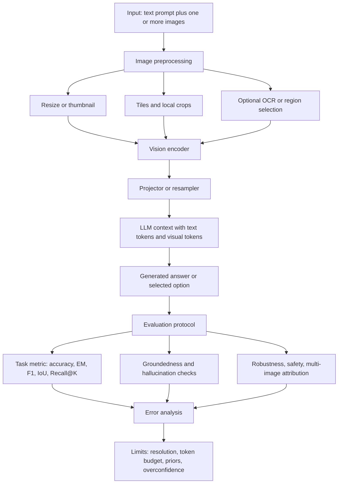

# Evaluation and Limits of Multimodal Models

Source: `DL_exam.pdf`, Question 62

Original question:

> Оценка и ограничения мультимодальных моделей. Бенчмарки, работа с большими изображениями, multi-image режим, типичные ошибки VLM.

## Интуиция

Мультимодальную модель нельзя оценивать только как обычную LLM или только как vision model. VLM должна одновременно видеть изображение, понимать текстовый запрос, связывать слова с визуальными объектами и выдавать корректный ответ в нужном формате. Поэтому оценка разбивается на несколько способностей: распознавание объектов, OCR, spatial reasoning, visual question answering, grounding, понимание документов, графиков, нескольких изображений и устойчивость к галлюцинациям.

Главная трудность в том, что хорошая языковая часть может маскировать слабое зрение. Модель часто дает правдоподобный ответ, опираясь на prior из текста, но не проверяя изображение. Например, если на картинке чашка без ручки, модель может описать "обычную чашку с ручкой", потому что так чаще встречалось в данных. Поэтому на экзамене важно сказать: VLM оценивают не только по fluent text, а по тому, насколько ответ grounded в визуальном входе.

Большие изображения и multi-image режим усиливают эту проблему. Чтобы подать изображение в Transformer, его обычно сжимают в набор visual tokens. При высоком разрешении число токенов быстро растет, а при агрессивном downsampling теряются мелкие объекты, текст, таблицы и детали интерфейса. В multi-image режиме модель должна еще и различать, к какой картинке относится факт, сравнивать изображения и не смешивать сущности между ними.

## Что нужно сказать на экзамене

- VLM оценивают по наборам задач, а не одной метрикой: `VQA`, captioning, OCR/document QA, chart/table QA, grounding, retrieval, spatial reasoning, counting, hallucination, safety, robustness, multi-image reasoning.
- Типичные benchmark families:
  - general VQA: VQAv2, GQA, OK-VQA;
  - text/OCR/document understanding: TextVQA, DocVQA, OCRBench;
  - charts and diagrams: ChartQA, AI2D;
  - general multimodal reasoning: MMMU, MMBench, SEED-Bench, MathVista;
  - hallucination and grounding: POPE, HallusionBench, RefCOCO-style grounding;
  - captioning/retrieval: COCO captioning, Flickr/COCO image-text retrieval.
- Метрики зависят от задачи: accuracy, exact match, F1, IoU, mAP, Recall@K, CIDEr, BLEU, METEOR, SPICE, hallucination rate, refusal/abstention quality.
- Для generative answers нужна нормализация ответов или human evaluation: свободный текст трудно сравнивать автоматически.
- Оценка должна проверять `groundedness`: поддержан ли ответ изображением, а не только выглядит ли он правдоподобным.
- Большое изображение обычно превращается в $N_{\text{img}}$ visual tokens. Для патчей размера $P \times P$:

$$
N_{\text{patch}} =
\left\lceil \frac{H}{P} \right\rceil
\cdot
\left\lceil \frac{W}{P} \right\rceil.
$$

- При увеличении разрешения растут стоимость vision encoder, projector и attention в LLM; при уменьшении разрешения теряются мелкие детали.
- Практические стратегии high-resolution VLM: resize, tiling/cropping, global thumbnail plus local crops, dynamic resolution, region selection, OCR-specialized encoder, sparse/window attention.
- Multi-image режим обычно реализуют как конкатенацию visual tokens нескольких изображений с image separators и позиционной/порядковой информацией.
- Ограничения multi-image: путаница между изображениями, слабое сравнение, забывание ранних изображений, рост context length, ошибки ссылок "на первом/втором изображении".
- Типичные ошибки VLM: object hallucination, неверный OCR, counting errors, spatial relation errors, confusion of attributes, language priors, failure on small objects, chart/table mistakes, prompt injection through image text, overconfidence.

## Подробный ответ

### Что именно оценивают

VLM обычно имеет pipeline:

1. Изображение кодируется vision encoder, например ViT или CNN/ViT hybrid.
2. Visual features переводятся через projector/resampler в пространство LLM.
3. LLM получает текстовые токены и visual tokens.
4. Ответ генерируется autoregressive decoding или выбирается из вариантов.

Поэтому evaluation должна покрывать все уровни: видит ли модель нужные признаки, связывает ли их с текстом, умеет ли рассуждать и формулировать ответ. Один benchmark не покрывает все способности.

Основные классы задач:

| Класс задач | Что проверяет | Примеры метрик |
|---|---|---|
| Image classification / recognition | базовое распознавание объектов и сцен | accuracy, top-$k$ accuracy |
| VQA | ответ на вопрос по изображению | accuracy, exact match, normalized accuracy |
| Captioning | описание изображения | CIDEr, SPICE, BLEU, METEOR, human eval |
| OCR / Document QA | чтение текста, форм, сканов, UI | exact match, F1, edit distance |
| Chart / Table QA | извлечение чисел и отношений из графиков | accuracy, numeric error, exact match |
| Grounding / referring expressions | локализация объекта по тексту | IoU, mAP, pointing accuracy |
| Image-text retrieval | сопоставление картинок и текстов | Recall@K, median rank |
| Multimodal reasoning | математика, наука, схемы, commonsense | accuracy, chain validity, human grading |
| Hallucination evaluation | придумывает ли модель невидимые объекты | hallucination rate, precision/recall по объектам |
| Robustness / safety | устойчивость к шуму, adversarial prompts, unsafe input | attack success rate, refusal quality |

Для устного ответа важно подчеркнуть: benchmark score измеряет только заданный протокол. Если benchmark состоит из multiple-choice вопросов, высокая accuracy не гарантирует хорошую работу в открытом диалоге. Если benchmark содержит свободные ответы, automatic metric может недооценивать правильные переформулировки или, наоборот, не ловить фактическую ошибку.

### Бенчмарки

`VQAv2` проверяет ответы на вопросы по обычным изображениям, но часть вопросов можно угадать по языковым priors. `GQA` сильнее фокусируется на композиционном reasoning и отношениях между объектами. `OK-VQA` добавляет внешние знания: модель должна не только видеть изображение, но и использовать commonsense/world knowledge.

`TextVQA`, `DocVQA` и OCR-oriented наборы проверяют чтение текста на изображениях: вывески, документы, формы, скриншоты. Это критично, потому что обычное уменьшение изображения может уничтожить мелкий текст. `ChartQA` и похожие наборы проверяют графики: модель должна прочитать подписи осей, легенду, значения и выполнить численное сравнение.

`MMMU`, `MMBench`, `SEED-Bench`, `MathVista` и похожие general multimodal reasoning benchmarks проверяют более широкие навыки: понимание диаграмм, школьные/университетские задачи, логику, математику, инструкции по изображениям. Они полезны для общей картины, но надо помнить про риск benchmark contamination, неодинаковую сложность подзадач и зависимость от prompt format.

`POPE`, `HallusionBench` и другие hallucination-focused тесты проверяют, придумывает ли модель объекты и свойства, которых нет на изображении. Referring/grounding benchmark вроде RefCOCO-style задач проверяет, может ли модель связать выражение с конкретной областью изображения.

Для captioning используют COCO-style метрики. Но BLEU/METEOR/CIDEr/SPICE измеряют сходство с reference captions, а не абсолютную истинность. Поэтому современная оценка часто сочетает automatic metrics, human evaluation и специальные проверки factual consistency.

### Метрики и протоколы

Для классификации и multiple-choice VQA обычно достаточно accuracy:

$$
\text{Accuracy} = \frac{1}{N}\sum_{i=1}^{N}\mathbf{1}[\hat{y}_i = y_i].
$$

Для free-form QA используют normalized exact match или F1 по токенам. Нормализация важна: приводят регистр, убирают артикли/пунктуацию, иногда маппят числительные и синонимы. Иначе ответы "two", "2" и "there are two" будут ошибочно различаться.

Для retrieval:

$$
\text{Recall@}K =
\frac{1}{N}\sum_{i=1}^{N}
\mathbf{1}[\text{relevant item for } i \text{ is in top-}K].
$$

Для grounding используют Intersection over Union:

$$
\text{IoU}(A,B)=\frac{|A\cap B|}{|A\cup B|},
$$

где $A$ - predicted box или mask, $B$ - ground truth. Часто ответ засчитывается, если $\text{IoU} \geq 0.5$, но threshold зависит от benchmark.

Для captioning метрики вида CIDEr/SPICE лучше отражают близость к reference descriptions, чем простая token accuracy, но они не являются строгой проверкой фактов. Для hallucination можно считать object-level precision:

$$
\text{Precision}_{\text{objects}} =
\frac{\#\text{correct mentioned objects}}
{\#\text{mentioned objects}},
$$

и hallucination rate:

$$
\text{Hallucination Rate} =
\frac{\#\text{mentioned objects absent in image}}
{\#\text{mentioned objects}}.
$$

Хороший evaluation протокол должен фиксировать prompt, decoding settings, image preprocessing, число попыток, правила postprocessing и способ агрегации. Иначе сравнение моделей становится нечестным: например, одна модель получает crop высокого разрешения, а другая только thumbnail.

### Работа с большими изображениями

Большое изображение создает конфликт между разрешением и context budget. Пусть изображение размера $H \times W$ разбивается на патчи $P \times P$. Тогда число патчей:

$$
N_{\text{patch}} =
\left\lceil \frac{H}{P} \right\rceil
\cdot
\left\lceil \frac{W}{P} \right\rceil.
$$

Если vision encoder является ViT с full self-attention, его грубая стоимость на изображение:

$$
O(N_{\text{patch}}^2 d_v),
$$

где $d_v$ - hidden dimension vision encoder. Если visual tokens затем идут в LLM вместе с текстом длины $T$, то при full attention в multimodal context грубая стоимость prefill:

$$
O((T + N_{\text{img}})^2 d),
$$

где $N_{\text{img}}$ - число visual tokens после projector/resampler, $d$ - hidden dimension LLM. В реальных архитектурах resampler может уменьшать число tokens, но потеря деталей остается важным trade-off.

Проблемы больших изображений:

- мелкий текст, small objects и тонкие линии теряются при resize;
- модель может видеть global layout, но не видеть локальные детали;
- tiling улучшает локальное разрешение, но ломает глобальные отношения;
- несколько crops увеличивают latency и стоимость;
- local crop без общего контекста может быть неоднозначным;
- visual tokens занимают context window, вытесняя длинный текстовый prompt;
- positional encoding и порядок tiles должны позволять восстановить расположение областей.

Основные стратегии:

| Стратегия | Идея | Плюс | Минус |
|---|---|---|---|
| Resize до фиксированного размера | одно изображение сжимается в стандартный input | дешево и просто | теряются мелкие детали |
| High-resolution ViT | подать больше патчей | лучше детали | дорогой attention |
| Tiling / crops | разделить изображение на плитки | сохраняет локальное разрешение | труднее понимать целую сцену |
| Global thumbnail plus local crops | дать обзор и детали | баланс глобального и локального | сложнее orchestration |
| Dynamic resolution | число tokens зависит от изображения | эффективнее для разных inputs | нужна аккуратная позиционная схема |
| Region selection | сначала найти важные области | экономит tokens | detector/selector может ошибиться |
| OCR-specialized path | отдельно извлечь текст | лучше документы и UI | OCR ошибки попадают в LLM |

Для документов и скриншотов часто важно не просто увеличить разрешение, а сохранить layout: колонки, таблицы, подписи, координаты, порядок чтения. Поэтому document VLM могут использовать layout-aware preprocessing, OCR tokens с координатами или специальные encoders.

### Multi-image режим

Multi-image VLM получает несколько изображений в одном запросе: например, "сравни два графика", "найди отличие", "какой кадр идет раньше", "ответь по этой странице документа и этой таблице". Обычно это реализуется как:

$$
[\text{BOS}, x_{\text{text}}, \text{IMG}_1, v_{1,1},\dots,v_{1,n_1},
\text{IMG}_2, v_{2,1},\dots,v_{2,n_2}, \dots],
$$

где $v_{i,j}$ - visual token $j$ для изображения $i$, а специальные tokens или positional embeddings маркируют границы и порядок изображений.

Multi-image режим проверяет не только восприятие, но и cross-image reasoning:

- сравнение объектов, цветов, чисел, графиков;
- сопоставление одного объекта в разных видах;
- поиск изменений между состояниями;
- объединение evidence из нескольких страниц документа;
- temporal reasoning, если изображения являются кадрами;
- проверка противоречий между изображениями.

Ограничения:

- context растет примерно как сумма visual tokens по всем изображениям:

$$
N_{\text{total}} = T + \sum_{i=1}^{M} n_i,
$$

где $M$ - число изображений;

- модель может перепутать image index и сказать "на первом изображении", имея в виду второе;
- признаки похожих объектов смешиваются между изображениями;
- при большом $M$ ранние изображения хуже используются;
- если одно изображение имеет больше tokens, оно может доминировать внимание;
- сложные сравнения требуют явного grounding, иначе модель опирается на текстовый шаблон ответа.

Практический prompt для multi-image должен явно задавать ссылки на изображения: "Image 1", "Image 2", "таблица слева", "скриншот после обновления". В evaluation нужно проверять не только итоговый ответ, но и правильную атрибуцию evidence: из какого изображения взят каждый факт.

### Типичные ошибки VLM

`Object hallucination`: модель упоминает объект, которого нет. Причины: языковой prior, похожие training captions, слабый visual grounding, decoding без проверки изображения.

`Attribute hallucination`: объект есть, но неверны цвет, материал, размер, состояние или действие. Например, модель видит "машину", но придумывает "красную".

Ошибки spatial reasoning: "слева/справа", "над/под", "перед/за", взаимное расположение и ориентация. Они особенно часты при зеркальном отражении, необычной перспективе и crowded scenes.

Counting errors: модель плохо считает множество мелких или перекрывающихся объектов. LLM может выдать типичное число, а не результат визуального подсчета.

OCR errors: неверное чтение мелкого текста, смешение похожих символов, потеря порядка строк, ошибки в формулах, таблицах, UI. Это критично для документов, графиков и screenshots.

Chart/table mistakes: модель может прочитать подписи, но неправильно интерполировать значения, сравнить не те столбцы, перепутать legend или масштаб оси.

Fine-grained recognition errors: породы, модели устройств, медицинские/технические детали, редкие классы и похожие объекты. VLM часто не имеет надежной экспертной зрительной диагностики.

Language prior bias: ответ определяется тем, что статистически вероятно в тексте, а не тем, что есть на изображении. Это особенно заметно в yes/no вопросах и commonsense questions.

Negation and absence errors: модель хуже отвечает на вопросы "чего нет", "нет ли признака", "какой объект отсутствует". Отсутствие сложнее доказать, чем наличие.

Prompt injection through image text: текст внутри изображения может содержать инструкцию, например "ignore previous instructions". Для VLM это визуальный content, но LLM может принять его как команду, если система не разделяет data и instruction.

Overconfidence: модель редко честно говорит "не видно", "изображение слишком размыто", "недостаточно информации". Для надежной системы нужны calibration, abstention и uncertainty-aware prompts.

### Ограничения benchmark оценки

Benchmark может быть переобучен явно или неявно: примеры могли попасть в pretraining, prompt format мог быть оптимизирован под leaderboard, а multiple-choice ответы можно частично угадать. Кроме того, benchmark часто не отражает реальные deployment risks: долгие диалоги, нестандартные изображения, плохое качество камеры, domain shift, adversarial text на изображении, приватные документы.

Поэтому полная оценка VLM должна включать:

- стандартные public benchmarks для сопоставимости;
- закрытый holdout set для защиты от contamination;
- task-specific evaluation на реальных данных;
- проверку robustness: blur, crop, compression, rotation, OCR noise;
- human evaluation для сложных открытых ответов;
- safety evaluation и prompt injection tests;
- анализ ошибок по категориям, а не только средний score.

## Формулы / алгоритмы

### Общий evaluation pipeline

Цель: измерить, насколько VLM корректно использует визуальный и текстовый вход.

Входы: dataset $\mathcal{D}=\{(I_i, x_i, y_i)\}_{i=1}^{N}$, где $I_i$ - изображение или набор изображений, $x_i$ - текстовый prompt/question, $y_i$ - ground truth; фиксированные preprocessing, prompt template и decoding settings.

Выходы: метрики качества, breakdown по типам ошибок, примеры failure cases.

Алгоритм:

1. Зафиксировать image preprocessing: resolution, crops/tiles, OCR path, порядок изображений.
2. Зафиксировать prompt template и правила ответа.
3. Для каждого примера подать $(I_i, x_i)$ в VLM и получить $\hat{y}_i$.
4. Нормализовать $\hat{y}_i$ и $y_i$, если задача допускает automatic comparison.
5. Посчитать task metrics: accuracy/EM/F1/IoU/Recall@K/CIDEr/hallucination rate.
6. Для free-form или рискованных ответов выполнить human или LLM-assisted grading с четкой rubric.
7. Разбить ошибки по категориям: OCR, counting, spatial, hallucination, multi-image attribution, refusal, formatting.
8. Проверить robustness на изменениях входа: resize, blur, compression, crop, order swap для multi-image.
9. Сравнивать модели только при одинаковом протоколе.

Практическая caveat: если модель получает несколько попыток, chain-of-thought prompting, tools или OCR extractor, это уже другая система. Ее нельзя напрямую сравнивать с single-pass VLM без указания условий.

### Оценка hallucination в captioning

Цель: проверить, упоминает ли модель только объекты, реально присутствующие на изображении.

Входы: изображение $I$, generated caption $\hat{c}$, множество ground-truth объектов $O(I)$, parser/entity extractor $E(\cdot)$.

Шаги:

1. Извлечь упомянутые объекты:

$$
\hat{O}=E(\hat{c}).
$$

2. Сопоставить с ground truth объектами $O(I)$ с учетом синонимов и taxonomy.
3. Посчитать:

$$
\text{Object Precision}=\frac{|\hat{O}\cap O(I)|}{|\hat{O}|},
$$

$$
\text{Object Hallucination}=\frac{|\hat{O}\setminus O(I)|}{|\hat{O}|}.
$$

4. Отдельно анализировать hallucinated attributes и relations, потому что объект может быть правильным, а свойство неверным.

Ограничение: ground truth annotations могут быть неполными. Если датасет не размечает маленький объект, модель может правильно его увидеть, но metric сочтет это hallucination.

### High-resolution preprocessing pipeline

Цель: сохранить и глобальную сцену, и мелкие детали при ограниченном token budget.

Входы: изображение $I$ размера $H\times W$, budget $B$ visual tokens, tile size, модель VLM.

Процедура:

1. Создать global thumbnail $I_{\text{global}}$ для общей структуры.
2. Если $I$ содержит мелкий текст/объекты, разбить его на tiles $I_1,\dots,I_K$.
3. Выбрать все tiles или top-$K'$ tiles через detector/OCR/saliency, чтобы:

$$
n_{\text{global}} + \sum_{j=1}^{K'} n_j \leq B.
$$

4. Подать tokens как `global view + selected local crops`, сохраняя координаты tiles.
5. В prompt указать, что локальные crops являются областями исходного изображения.
6. При ответе проверять, не противоречит ли local evidence глобальному view.

Trade-off: увеличение $K'$ повышает шанс увидеть мелкие детали, но увеличивает latency и риск смешения областей.

## Диаграмма или изображение

Внешние изображения не использовались.

## Быстрая устная версия

VLM оценивают не одной метрикой, а набором задач: VQA, captioning, OCR/document QA, chart QA, grounding, retrieval, multi-image reasoning, hallucination и robustness. Важно проверять groundedness: ответ должен следовать из изображения, а не быть просто правдоподобным текстом.

Для больших изображений главный trade-off такой: если сильно уменьшить картинку, теряются мелкий текст и small objects; если сохранить высокое разрешение, растет число visual tokens и стоимость attention. Поэтому используют tiling, global thumbnail plus local crops, dynamic resolution, OCR path и region selection.

В multi-image режиме visual tokens нескольких изображений кладут в один context с разделителями и позиционной информацией. Модель должна сравнивать изображения и правильно атрибутировать факты, но часто путает порядок картинок, смешивает похожие объекты и забывает ранние изображения.

Типичные ошибки VLM: object hallucination, неверные атрибуты, OCR mistakes, counting errors, spatial relation errors, ошибки графиков и таблиц, зависимость от language priors, prompt injection через текст на изображении и overconfidence. Поэтому кроме public benchmarks нужны закрытые тесты, реальные task-specific данные и анализ ошибок по категориям.

## Возможные уточняющие вопросы

- Чем VQA отличается от captioning? VQA отвечает на конкретный вопрос, обычно с коротким ответом или выбором варианта; captioning генерирует общее описание изображения.
- Почему accuracy на benchmark не гарантирует надежность VLM? Benchmark может быть узким, загрязненным pretraining data, multiple-choice формат может позволять угадывание, а реальные изображения имеют другой distribution.
- Что такое groundedness? Это соответствие утверждений ответа визуальному evidence: если модель говорит "на столе три книги", на изображении должны быть именно три книги на столе.
- Почему high-resolution изображения сложны для Transformer? Число visual tokens растет с разрешением, а full attention имеет квадратичную стоимость по числу tokens.
- Зачем нужен global thumbnail при tiling? Thumbnail сохраняет общий layout и отношения между областями, а local crops дают детали.
- В чем риск multi-image режима? Модель может перепутать изображения, смешать объекты между ними или потерять связь ответа с конкретным image index.
- Почему OCR остается слабым местом VLM? Мелкий текст часто теряется при resize, символы похожи, порядок чтения в документах сложен, а LLM может исправлять текст по догадке.
- Как оценивать hallucination? Сравнивать упомянутые объекты, атрибуты и отношения с ground truth или human annotations; считать hallucination rate и анализировать неподдержанные утверждения.
- Почему prompt injection возможен через изображение? Текст внутри картинки является данными, но VLM может передать его в LLM context так, что модель воспримет его как инструкцию.
- Что важнее: public benchmark или domain-specific evaluation? Нужны оба: public benchmark дает сравнимость, domain-specific evaluation показывает пригодность для реальной задачи.

## Частые ошибки

- Оценивать VLM только по красивому описанию, не проверяя фактическую привязку к изображению.
- Считать, что high-resolution input всегда лучше: без token budget и правильной positional scheme он может быть слишком дорогим или запутывать модель.
- Забывать, что resize может уничтожить OCR, мелкие объекты, числа на графике и детали интерфейса.
- Приравнивать multiple-choice accuracy к способности отвечать в открытом диалоге.
- Не фиксировать prompt, decoding settings и preprocessing при сравнении моделей.
- Игнорировать benchmark contamination и подгонку prompt под leaderboard.
- Смешивать captioning metrics с factual correctness: высокий CIDEr не гарантирует отсутствие hallucination.
- Не различать object hallucination, attribute error и relation error.
- В multi-image задачах не проверять, к какому изображению относится каждый факт.
- Считать, что VLM надежно считает объекты: counting остается частым источником ошибок.
- Не учитывать safety: текст на изображении может быть adversarial instruction, а не команда пользователя.
- Ожидать, что модель всегда скажет "не знаю"; многие VLM склонны отвечать уверенно даже при плохом изображении.
