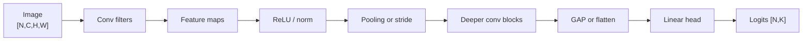

# Basic CNN for Image Classification

Source: `DL_exam.pdf`, Question 11

Original question:

> Базовая CNN для классификации изображений. Feature maps, conv, pooling, classifier head.

## Главная идея

Базовая `CNN` строит иерархию признаков: ранние слои находят края и текстуры, поздние - части объектов и class evidence. `Convolution` использует локальные фильтры и `weight sharing`: один learned detector применяется ко всем позициям. `Pooling` или stride уменьшают spatial resolution, а `classifier head` превращает признаки в logits классов.

## Минимум для ответа

- Вход: `[N, C, H, W]`; для RGB $C=3$.
- `Feature map` - карта откликов одного канала признаков на spatial grid.
- Conv-слой имеет веса $W \in \mathbb{R}^{C_{\text{out}}\times C_{\text{in}}\times K_h\times K_w}$; каждый output channel соответствует одному фильтру.
- `Local receptive field`: выход зависит от локального окна; в глубине effective receptive field растет.
- `Weight sharing`: параметры фильтра не зависят от позиции, поэтому conv дешевле fully connected по пикселям.
- После conv нужна нелинейность, обычно `ReLU`; без нее стек conv-слоев остается линейным оператором.
- `Pooling`: `max` берет максимум, `average` - среднее; downsampling снижает compute и дает частичную устойчивость к сдвигам, но теряет spatial details.
- `Classifier head`: `flatten + Linear/MLP` или `global average pooling + Linear`; выход - raw logits `[N, K]`.
- Для multi-class classification: `CrossEntropyLoss(logits, y)`, softmax перед loss в PyTorch не нужен.

## Формулы / схема

Conv:

$$
Y_{o,i,j}=b_o+\sum_c\sum_u\sum_v W_{o,c,u,v}X_{c,iS_h+u-P_h,jS_w+v-P_w}
$$

Размер выхода:

$$
H_{\text{out}}=\left\lfloor \frac{H+2P_h-K_h}{S_h}\right\rfloor+1,\quad
W_{\text{out}}=\left\lfloor \frac{W+2P_w-K_w}{S_w}\right\rfloor+1
$$

Параметры conv:

$$
\#\theta=C_{\text{out}}C_{\text{in}}K_hK_w+C_{\text{out}}
$$

Softmax/loss: $p_k=\frac{\exp z_k}{\sum_j\exp z_j}$, $L=-\log p_y$, $\hat y=\arg\max_k z_k$.

Pipeline: `input -> conv -> ReLU/norm -> pooling/stride -> deeper conv blocks -> GAP/flatten -> classifier head -> logits`.

## Диаграмма

Атрибуция: [assets/ATTRIBUTION.md](../../assets/ATTRIBUTION.md).

## Уточнения экзаменатора

- Feature map? Карта силы отклика learned-фильтра по позициям.
- Conv дает invariance? Сам conv translation equivariant; pooling, GAP и head дают частичную invariance.
- Зачем padding? Контролировать границы и spatial size.
- Pooling или strided conv? Pooling без параметров; strided conv обучаем.
- Чем плох большой flatten-head? Много параметров, риск overfitting.

## Частые ошибки

- Путать `NCHW` и `NHWC`.
- Называть logits вероятностями.
- Делать softmax перед `CrossEntropyLoss`.
- Забывать, что pooling обычно не меняет число channels.
- Считать параметры conv зависящими от $H,W$.
- Терять смысл различия между equivariance и invariance.
