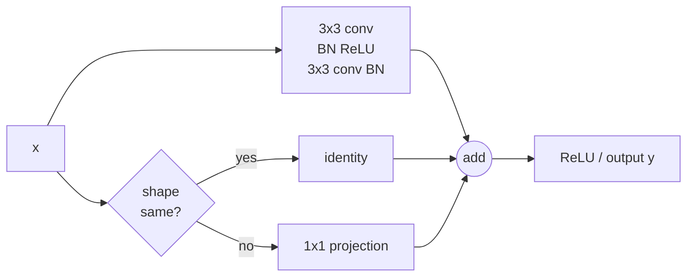

# ResNet and Modern CNN Backbones

Source: `DL_exam.pdf`, Question 14

Original question:

> ResNet и современные CNN-backbone. Skip connections, residual block, bottleneck, идеи эффективных архитектур.

## Главная идея

ResNet решает `degradation problem`: при увеличении глубины plain CNN может хуже обучаться даже на train set. Residual block учит не всю функцию $H(x)$, а поправку $F(x)=H(x)-x$, поэтому блок может стать почти тождественным при $F(x)\approx 0$. Это облегчает оптимизацию и поток градиентов.

## Минимум для ответа

- `CNN-backbone` - feature extractor: строит иерархию feature maps, а сверху ставят head для classification, detection, segmentation.
- `Skip connection` передает вход блока напрямую к выходу; сложение требует совпадения форм.
- Если форма не меняется: identity shortcut. Если меняются каналы или resolution: projection shortcut, обычно `1x1 convolution` со stride.
- Basic ResNet block: `3x3 conv -> BN -> ReLU -> 3x3 conv -> BN -> add -> ReLU`.
- Bottleneck для ResNet-50/101/152: `1x1 reduce -> 3x3 -> 1x1 expand`; дорогая $3 \times 3$ conv работает на меньшей ширине.
- Stages: внутри stage обычно фиксированы $H,W,C$, между stages делают downsampling и увеличивают число каналов.
- Современные backbone оптимизируют качество, FLOPs, latency, memory и transfer learning.
- Идеи эффективности: `1x1 bottleneck`, grouped conv, depthwise separable conv, inverted residual, squeeze-and-excitation, stochastic depth, compound scaling.
- Примеры: ResNeXt, DenseNet, MobileNet, EfficientNet, RegNet, ConvNeXt.

## Формулы / схема

Residual block:

$$
y = \sigma(F(x;W)+W_sx),
$$

где $W_s=I$ для identity shortcut или projection для согласования формы.

Градиентная интуиция без финальной нелинейности:

$$
\frac{\partial L}{\partial x}=\frac{\partial L}{\partial y}\left(I+\frac{\partial F}{\partial x}\right).
$$

В bottleneck:

$$
C \xrightarrow{1\times1} C_b \xrightarrow{3\times3} C_b \xrightarrow{1\times1} C_{out}, \quad C_b \ll C.
$$

## Диаграмма

Атрибуция: [assets/ATTRIBUTION.md](../../assets/ATTRIBUTION.md).

## Уточнения экзаменатора

- Почему ResNet глубже обучается лучше? Есть прямой путь для признаков и градиентов; блоки учат refinements.
- Skip connection всегда identity? Нет, при изменении формы нужна projection.
- Чем bottleneck полезен? Уменьшает вычисления $3 \times 3$ conv и позволяет строить глубокие сети.
- Чем ResNet отличается от DenseNet? ResNet складывает признаки, DenseNet конкатенирует и сильнее растит память.

## Частые ошибки

- Говорить, что ResNet решает только `vanishing gradients`; важен еще `degradation problem`.
- Забывать, что сложение требует одинаковых shapes.
- Путать bottleneck ResNet с inverted residual MobileNetV2.
- Считать backbone полной моделью задачи: обычно нужен task-specific head.
