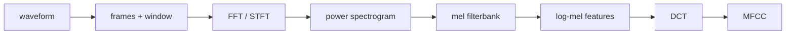

# Audio Frequency Features and Spectrograms

Source: `DL_exam.pdf`, Question 47

Original question:

> Частотное представление звука. Fourier transform, DFT/FFT, STFT, спектрограмма, mel-scale, log-mel features, MFCC.

## Главная идея

Waveform показывает амплитуду во времени, но для речи важнее, какие частоты активны и когда. Fourier transform раскладывает сигнал на синусоиды; `STFT` добавляет временную локализацию через короткие окна. Спектрограмма, log-mel и MFCC превращают звук в компактные time-frequency признаки, удобные для ASR и audio models.

## Минимум для ответа

- Частотное представление хранит magnitude и phase гармонических компонент; в speech features чаще используют magnitude/power.
- `DFT` применяется к конечному дискретному фрагменту, `FFT` - быстрый алгоритм той же DFT: $O(N\log N)$ вместо $O(N^2)$.
- Bin $k$ соответствует $f_k = k f_s/N$; для вещественного сигнала обычно берут диапазон до Nyquist frequency $f_s/2$.
- Одна DFT по всему сигналу теряет "когда"; `STFT` считает DFT по перекрывающимся окнам.
- Длинное окно: лучше frequency resolution, хуже time localization. Короткое окно: наоборот.
- Спектрограмма: матрица $|X[m,k]|$ или $|X[m,k]|^2$ по времени и частоте.
- `Mel-scale` сжимает высокие частоты, приближая слуховое восприятие.
- `Log-mel features`: power spectrum -> mel filterbank -> log; стандартный вход для CNN/RNN/Transformer в ASR.
- `MFCC`: DCT от log-mel энергий, обычно первые 12-13 коэффициентов; исторически важны для GMM-HMM и компактных систем.

## Формулы / схема

$$
X[k] = \sum_{n=0}^{N-1} x[n]e^{-j2\pi kn/N}
$$

$$
X[m,k] = \sum_{n=0}^{N-1} x[n + mH]w[n]e^{-j2\pi kn/N}
$$

$$
\operatorname{mel}(f)=2595\log_{10}\left(1+\frac{f}{700}\right)
$$

$$
L[m,r]=\log\left(\epsilon+\sum_k M_{r,k}|X[m,k]|^2\right)
$$

## Диаграмма

Атрибуция: [assets/ATTRIBUTION.md](../../assets/ATTRIBUTION.md).

## Уточнения экзаменатора

- Зачем window function? Уменьшает spectral leakage на границах кадра.
- Что делает hop size? Задает шаг между кадрами и временную плотность признаков.
- Улучшает ли zero padding реальное разрешение? Нет, он интерполирует частотную сетку; настоящее разрешение задает длина окна.
- Почему берут log? Сжимает dynamic range и делает изменения громкости ближе к additive shift.
- Log-mel или MFCC для deep learning? Чаще log-mel: сохраняет локальную структуру, а модель сама учит преобразования.

## Частые ошибки

- Называть FFT отдельным преобразованием, а не быстрым способом считать DFT.
- Путать frequency bin с физической частотой без учета $f_s$ и $N$.
- Забывать trade-off между временем и частотой в STFT.
- Считать mel-scale линейной в Hz.
- Думать, что MFCC содержит больше информации, чем log-mel; обычно он компактнее и часть деталей отбрасывает.
