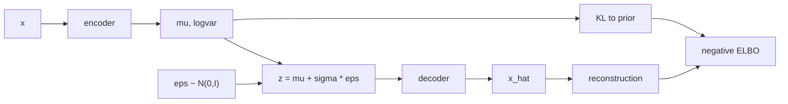

# Autoencoders and Variational Autoencoders

Source: `DL_exam.pdf`, Question 54

Original question:

> Autoencoders и VAE. Reconstruction, bottleneck, latent space, ELBO, KL-divergence, reparameterization trick.

## Главная идея

`Autoencoder` сжимает объект $x$ в код $z$ и восстанавливает $\hat{x}$, поэтому учит полезное представление. `Bottleneck` не дает просто скопировать вход. `VAE` делает это вероятностно: encoder выдает распределение $q_\phi(z \mid x)$, decoder задает $p_\theta(x \mid z)$, а prior $p(z)$ делает latent space пригодным для генерации.

## Минимум для ответа

- AE: $z=f_\phi(x)$, $\hat{x}=g_\theta(z)$, обучение по reconstruction loss.
- Reconstruction: MSE для непрерывных данных, BCE/NLL для бинарных или вероятностных выходов.
- Bottleneck: малая размерность $z$, шум, sparsity, dropout, weight decay, denoising; цель - ограничить capacity.
- У обычного AE нет явного prior на $z$, поэтому случайная точка latent space может не декодироваться в реалистичный объект.
- VAE: $p_\theta(x,z)=p(z)p_\theta(x \mid z)$, обычно $p(z)=\mathcal{N}(0,I)$.
- Encoder VAE обычно предсказывает $\mu_\phi(x)$ и $\log\sigma_\phi^2(x)$ для диагонального Gaussian posterior.
- KL term регуляризует $q_\phi(z \mid x)$ к prior; слишком большой KL ухудшает reconstruction, слишком слабый KL портит генерацию.

## Формулы / схема

AE:

$$
\min_{\phi,\theta}\mathbb{E}_x\mathcal{L}_{rec}(x,g_\theta(f_\phi(x))).
$$

ELBO:

$$
\log p_\theta(x)\ge
\mathbb{E}_{q_\phi(z \mid x)}[\log p_\theta(x \mid z)]
-D_{KL}(q_\phi(z \mid x)\|p(z)).
$$

Loss VAE:

$$
\mathcal{L}_{VAE}=\mathcal{L}_{rec}+D_{KL}(q_\phi(z \mid x)\|p(z)).
$$

Reparameterization trick:

$$
\epsilon\sim\mathcal{N}(0,I),\quad z=\mu_\phi(x)+\sigma_\phi(x)\odot\epsilon.
$$

## Диаграмма

Атрибуция: [assets/ATTRIBUTION.md](../../assets/ATTRIBUTION.md).

## Уточнения экзаменатора

- Зачем bottleneck? Чтобы код хранил существенные факторы, а не identity mapping.
- Почему ELBO нижняя оценка? Потому что разница с $\log p_\theta(x)$ равна неотрицательной KL к истинному posterior.
- Что дает KL? Гладкий, сэмплируемый latent space, близкий к $\mathcal{N}(0,I)$.
- Зачем reparameterization? Переносит случайность в $\epsilon$, сохраняя backpropagation через $\mu$ и $\sigma$.
- Что такое posterior collapse? Decoder игнорирует $z$, а $q_\phi(z \mid x)\approx p(z)$.

## Частые ошибки

- Путать знак KL: в ELBO он вычитается, в loss добавляется.
- Называть обычный AE полноценной генеративной моделью без оговорки про отсутствие prior.
- Думать, что KL-divergence симметрична.
- Забывать, что выбор reconstruction loss соответствует likelihood модели.
