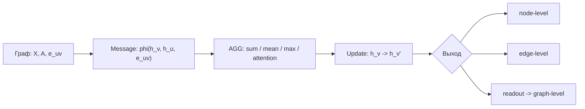

# Graph Data and Graph Neural Networks

Source: `DL_exam.pdf`, Question 56

Original question:

> Графы как данные и GNN. Node/edge/graph-level задачи, message passing, агрегация соседей, примеры GCN/GraphSAGE/GAT.

## Главная идея

Граф используют, когда важны не только признаки объектов, но и связи между ними: вершины - сущности, ребра - отношения. У графа нет естественного порядка вершин, поэтому GNN должна быть permutation equivariant для node/edge-level выходов и permutation invariant для graph-level выхода. Основной механизм - `message passing`: вершина собирает информацию от соседей, агрегирует ее порядконезависимой операцией и обновляет embedding.

## Минимум для ответа

- Граф: $G=(V,E)$, признаки вершин $X \in \mathbb{R}^{N \times F}$, adjacency $A$, иногда признаки ребер $e_{uv}$.
- Типы графов: directed/undirected, weighted/unweighted, homogeneous/heterogeneous, static/dynamic.
- `node-level`: классификация/регрессия для вершины, например роль пользователя или класс документа.
- `edge-level`: link prediction, тип/вес ребра, рекомендация.
- `graph-level`: свойство всего графа, например класс молекулы.
- После $L$ слоев embedding вершины обычно зависит от $L$-hop neighborhood.
- Агрегация соседей должна быть инвариантна к порядку: `sum`, `mean`, `max`, attention-weighted sum.
- Ограничения: oversmoothing при большой глубине, oversquashing дальнего контекста, слабость на heterophily-графах, стоимость на больших $|E|$.

## Формулы / схема

Общая схема слоя:

$$
m_v^{(l)}=\operatorname{AGG}^{(l)}(\{\phi^{(l)}(h_v^{(l)},h_u^{(l)},e_{uv}):u\in\mathcal{N}(v)\})
$$

$$
h_v^{(l+1)}=\psi^{(l)}(h_v^{(l)},m_v^{(l)})
$$

`GCN`:

$$
H^{(l+1)}=\sigma(\tilde{D}^{-\frac12}\tilde{A}\tilde{D}^{-\frac12}H^{(l)}W^{(l)}), \quad \tilde{A}=A+I
$$

`GraphSAGE`: агрегирует sampled neighbors и учит inductive-функцию, применимую к новым вершинам/графам:

$$
h_v'=\sigma(W\,[h_v \Vert \operatorname{AGG}(\{h_u:u\in\mathcal{N}(v)\})])
$$

`GAT`: учит веса соседей:

$$
\alpha_{ij}=\operatorname{softmax}_{j\in\mathcal{N}(i)}(a^T[Wh_i\Vert Wh_j]), \quad h_i'=\sigma(\sum_j \alpha_{ij}Wh_j)
$$

Для graph-level задач нужен readout:

$$
h_G=\operatorname{READOUT}(\{h_v^{(L)}:v\in V\})
$$

## Диаграмма

Атрибуция: [assets/ATTRIBUTION.md](../../assets/ATTRIBUTION.md).

## Уточнения экзаменатора

- Почему не обычная MLP? MLP не учитывает структуру ребер и симметрию перестановки вершин.
- Зачем self-loops в GCN? Чтобы вершина сохраняла собственные признаки при смешивании с соседями.
- Чем GraphSAGE отличается от GCN? Он явно ориентирован на inductive learning и neighbor sampling.
- Что дает GAT? Разные соседи получают разные learned attention weights.

## Частые ошибки

- Путать permutation equivariance и invariance.
- Считать attention weights надежным объяснением важности ребер.
- Забывать, что глубина GNN расширяет receptive field, но усиливает oversmoothing.
- Использовать неинвариантную агрегацию, зависящую от порядка соседей.
